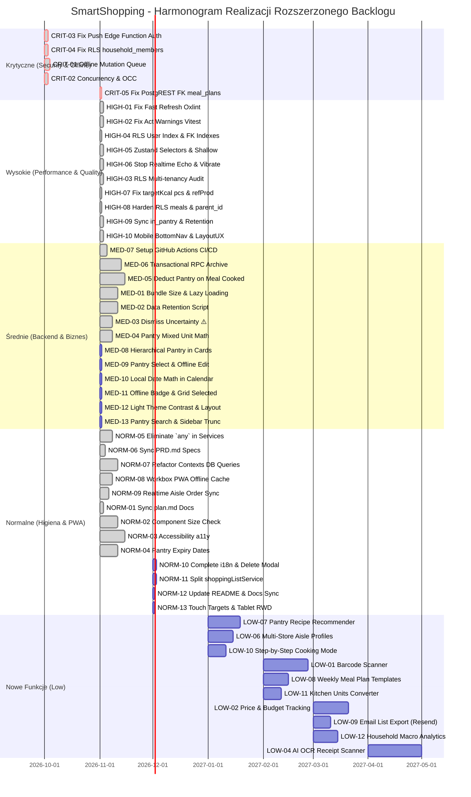

# SmartShopping - Kompleksowa Mapa Drogowa (Roadmap & Backlog)

> **Status dokumentu:** Aktywny / Żywy backlog techniczno-biznesowy  
> **Data utworzenia:** Październik 2026  
> **Źródło:** Audyt całościowy kodu, architektury, testów, bezpieczeństwa oraz spójności z [PRD](./PRD.md) i [plan.md](./plan.md)  
> **Konstytucja projektu:** [AGENTS.md](../AGENTS.md) | [.agents/rules/](../.agents/rules/)

---

## 1. Wstęp i Metodologia Kategoryzacji

Niniejszy dokument stanowi jednolity rejestr zadań naprawczych, optymalizacyjnych oraz rozwojowych dla aplikacji **SmartShopping**. Zgłoszenia zostały podzielone na 5 ustandaryzowanych kategorii priorytetu:

| Poziom Priorytetu | Znaczenie i Kryteria Kwalifikacji |
| :--- | :--- |
| 🔴 **Critical** | Błędy krytyczne, ryzyko utraty danych (np. utrata odhaczeń w markecie offline), dziury w bezpieczeństwie, awarie blokujące kluczowe procesy użytkownika. |
| 🟠 **High** | Istotne długi techniczne, błędy lintera psujące dewelopment (Fast Refresh), wycieki w testach (`act(...)`), weryfikacja szczelności RLS i multi-tenancy. |
| 🟡 **Medium** | Optymalizacje wydajności (Bundle Size / Code Splitting), higiena bazy danych (retencja danych w Supabase), istotne usprawnienia UX/biznesowe (np. wyciszanie niepewności w kalendarzu). |
| 🟢 **Normal** | Standardowe ulepszenia jakościowe: czyszczenie dokumentacji, dbałość o rozmiar komponentów (<250-300 linii), podstawy dostępności cyfrowej (a11y/WCAG), rozszerzenia spiżarni. |
| 🔵 **Low** | Nowe innowacyjne moduły i funkcjonalności (Skaner kodów kreskowych, śledzenie cen i budżetu, AI OCR paragonów, tryb gościa, aplikacje na zegarki). |

---

## 2. 🔴 Kategoria CRITICAL (Najwyższy Priorytet)

### CRIT-01: Offline Mutation Queue & Background Sync w Markecie (Zero-Connectivity Resilience)
* **Status:** ✅ **Zrealizowane (Październik 2026)**
* **Obszar:** Frontend / State Management (`Zustand`, `localStorage`, `PWA Background Sync`)
* **Pliki implementacji:** [offlineMutationQueue.ts](file:///d:/08_Git/SmartShopping/SmartShopping/src/lib/offline/offlineMutationQueue.ts), [useOfflineSync.ts](file:///d:/08_Git/SmartShopping/SmartShopping/src/hooks/useOfflineSync.ts), [ActiveListView.tsx](file:///d:/08_Git/SmartShopping/SmartShopping/src/components/views/ActiveListView.tsx), [DesktopActiveListView.tsx](file:///d:/08_Git/SmartShopping/SmartShopping/src/components/layout/desktop/views/DesktopActiveListView.tsx), [AppLayoutRouter.tsx](file:///d:/08_Git/SmartShopping/SmartShopping/src/components/layout/AppLayoutRouter.tsx)
* **Pliki testów:** [offlineMutationQueue.test.ts](file:///d:/08_Git/SmartShopping/SmartShopping/src/lib/offline/__tests__/offlineMutationQueue.test.ts), [ActiveListView.test.tsx](file:///d:/08_Git/SmartShopping/SmartShopping/src/components/views/__tests__/ActiveListView.test.tsx)
* **Problem / Uzasadnienie:**
  * W supermarketach i podziemnych halach zasięg sieci komórkowej ulega częstemu zerwaniu.
  * Dotychczasowy mechanizm przy odhaczaniu (`toggleItemChecked`) przy błędzie sieciowym natychmiast wywoływał `rollbackState()`.
  * Skutek: Użytkownik odhacza 5-10 kupionych artykułów, po czym z powodu utraty łączności aplikacja cofała zaznaczenia, wywołując dezorientację i powtórne zakupy.
* **Wdrożone Rozwiązanie:**
  1. Wprowadzono moduł kolejki mutacji offline ([offlineMutationQueue.ts](file:///d:/08_Git/SmartShopping/SmartShopping/src/lib/offline/offlineMutationQueue.ts)) oparty o `localStorage` z odpornością na restarty przeglądarki.
  2. W przypadku braku połączenia lub błędu zapytania sieciowego stan w UI **nie jest cofany** (brak rollbacku) – mutacja trafia do kolejki ze statusem oczekiwania na synchronizację.
  3. Zarejestrowano nasłuchiwanie zdarzenia `window.addEventListener('online')` w hooku [useOfflineSync.ts](file:///d:/08_Git/SmartShopping/SmartShopping/src/hooks/useOfflineSync.ts) podpiętym w głównym routerze aplikacji ([AppLayoutRouter.tsx](file:///d:/08_Git/SmartShopping/SmartShopping/src/components/layout/AppLayoutRouter.tsx)).
  4. Po powrocie połączenia kolejka jest sekwencyjnie opróżniana z mechanizmem retry i aktualizacją bazodanową w Supabase.
* **Definition of Done (DoD) - Rezultat:**
  - ✅ Wyłączenie sieci (Chrome DevTools: Offline / `navigator.onLine = false`) i odhaczenie pozycji nie wywołuje rollbacku.
  - ✅ Włączenie sieci automatycznie przesyła mutacje do Supabase bez konieczności odświeżania strony.
  - ✅ Pełne pokrycie testami jednostkowymi i integracyjnymi w `offlineMutationQueue.test.ts` oraz `ActiveListView.test.tsx`.

---

### CRIT-02: Optymistyczna Kontrola Współbieżności i Rozwiązywanie Konfliktów Realtime (OCC)
* **Status:** ✅ **Zrealizowane (Październik 2026)**
* **Obszar:** Backend / Baza Danych / Realtime
* **Pliki implementacji:** [20261026151000_shopping_list_items_occ.sql](file:///d:/08_Git/SmartShopping/SmartShopping/supabase/migrations/20261026151000_shopping_list_items_occ.sql), [shoppingItemConflict.ts](file:///d:/08_Git/SmartShopping/SmartShopping/src/lib/calculations/shoppingItemConflict.ts), [shoppingListService.ts](file:///d:/08_Git/SmartShopping/SmartShopping/src/services/shoppingListService.ts), [supabase.ts](file:///d:/08_Git/SmartShopping/SmartShopping/src/types/supabase.ts)
* **Pliki testów:** [shoppingItemConflict.test.ts](file:///d:/08_Git/SmartShopping/SmartShopping/src/lib/calculations/__tests__/shoppingItemConflict.test.ts)
* **Problem / Uzasadnienie:**
  * Gdy dwóch domowników robi zakupy jednocześnie w różnych alejkach, może dojść do sytuacji Last-Write-Wins bez walidacji znacznika czasu.
  * Zdarzenie WebSocket z opóźnionego telefonu mogło nadpisać nowszy stan pozycji na serwerze i odznaczyć kupiony produkt.
* **Wdrożone Rozwiązanie:**
  1. Dodano kolumnę `updated_at TIMESTAMPTZ DEFAULT NOW()` oraz automatyczny trigger aktualizujący `set_shopping_list_item_updated_at` w migracji [20261026151000_shopping_list_items_occ.sql](file:///d:/08_Git/SmartShopping/SmartShopping/supabase/migrations/20261026151000_shopping_list_items_occ.sql).
  2. Wdrożono algorytm scalania konfliktów ([shoppingItemConflict.ts](file:///d:/08_Git/SmartShopping/SmartShopping/src/lib/calculations/shoppingItemConflict.ts)) z kluczową regułą biznesową: jeśli którykolwiek z partnerów oznaczył produkt jako kupiony (`is_checked = true`), stan ten pozostaje nadrzędny i nie ulega cofnięciu przez opóźniony pakiet.
  3. Zaktualizowano metodę `toggleItemChecked` w [shoppingListService.ts](file:///d:/08_Git/SmartShopping/SmartShopping/src/services/shoppingListService.ts) o weryfikację współbieżną `clientTimestamp`.
* **Definition of Done (DoD) - Rezultat:**
  - ✅ Brak utraty stanu odhaczenia przy symulacji opóźnionego pakietu WebSocket / sieciowego z drugiego urządzenia.
  - ✅ Zestaw testów jednostkowych w `shoppingItemConflict.test.ts` weryfikujący wszystkie warianty współbieżnych edycji.

---

### CRIT-03: Zabezpieczenie Edge Function Powiadomień Push (Weryfikacja Przynależności do Household)
* **Status:** ✅ **Zrealizowane (Październik 2026)**
* **Obszar:** Backend / Bezpieczeństwo / Supabase Edge Functions
* **Pliki implementacji:** [send-push-notification/index.ts](file:///d:/08_Git/SmartShopping/SmartShopping/supabase/functions/send-push-notification/index.ts)
* **Pliki testów:** [notificationService.test.ts](file:///d:/08_Git/SmartShopping/SmartShopping/src/services/__tests__/notificationService.test.ts)
* **Problem / Uzasadnienie:**
  * W funkcji [send-push-notification/index.ts](file:///d:/08_Git/SmartShopping/SmartShopping/supabase/functions/send-push-notification/index.ts) weryfikowany był jedynie ogólny token użytkownika (`userClient.auth.getUser()`), po czym pobierano subskrypcje z tabeli `push_subscriptions` kluczem `service_role` omijającym RLS wyłącznie po `householdId` z payloadu JSON.
  * **Luka:** Zalogowany użytkownik mógł wysłać POST z cudzym `householdId` i rozsyłać powiadomienia push na obce urządzenia.
* **Wdrożone Rozwiązanie:**
  1. Wprowadzono weryfikację przynależności użytkownika do wnioskowanego gospodarstwa domowego w tabeli `household_members` przed pobraniem subskrypcji urządzeń:
     ```typescript
     const { data: member, error: memberError } = await supabaseClient
       .from('household_members')
       .select('id')
       .eq('household_id', householdId)
       .eq('user_id', user.id)
       .maybeSingle();

     if (memberError || !member) {
       return new Response(JSON.stringify({ error: "Forbidden: You are not a member of this household" }), {
         status: 403,
         headers: { ...corsHeaders, "Content-Type": "application/json" }
       });
     }
     ```
* **Definition of Done (DoD) - Rezultat:**
  - ✅ Próba wysłania powiadomienia do gospodarstwa, do którego wywołujący użytkownik nie należy, zostaje zablokowana statusem HTTP 403 Forbidden.

---

### CRIT-04: Uszczelnienie Polityki RLS w `household_members` (Blokada Samowolnego Dołączania do Gospodarstw)
* **Status:** ✅ **Zrealizowane (Październik 2026)**
* **Obszar:** Baza Danych / Bezpieczeństwo / Supabase RLS & RPC
* **Pliki implementacji:** [20261026150000_secure_household_members_rls.sql](file:///d:/08_Git/SmartShopping/SmartShopping/supabase/migrations/20261026150000_secure_household_members_rls.sql), [householdService.ts](file:///d:/08_Git/SmartShopping/SmartShopping/src/services/householdService.ts), [supabase.ts](file:///d:/08_Git/SmartShopping/SmartShopping/src/types/supabase.ts)
* **Pliki testów:** [householdService.test.ts](file:///d:/08_Git/SmartShopping/SmartShopping/src/services/__tests__/householdService.test.ts)
* **Problem / Uzasadnienie:**
  * W pierwotnej migracji polityka `INSERT` dla tabeli `household_members` zawierała warunek `WITH CHECK (user_id = auth.uid() OR ...)`.
  * Ponieważ warunek `user_id = auth.uid()` był zawsze spełniony przy wstawianiu własnego ID, **użytkownik znający UUID obcego gospodarstwa mógł samodzielnie dopisać się do niego bez zaproszenia**, zyskując natychmiastowy dostęp do wszystkich danych.
* **Wdrożone Rozwiązanie:**
  1. Usunięto podatną politykę `INSERT` i wdrożono nową, bezpieczną politykę w migracji [20261026150000_secure_household_members_rls.sql](file:///d:/08_Git/SmartShopping/SmartShopping/supabase/migrations/20261026150000_secure_household_members_rls.sql):
     - Dopisanie do gospodarstwa dozwolone jest wyłącznie przez istniejącego członka gospodarstwa LUB przez użytkownika posiadającego aktywne zaproszenie w `household_invites` powiązane z jego adresem e-mail.
  2. Dodano procedurę składowaną `public.create_household_with_member(p_name TEXT)` z klauzulą `SECURITY DEFINER`, umożliwiającą bezpieczne tworzenie nowego gospodarstwa i atomowe przypisanie twórcy jako pierwszego członka.
  3. Zintegrowano [householdService.ts](file:///d:/08_Git/SmartShopping/SmartShopping/src/services/householdService.ts) z funkcją RPC `create_household_with_member`.
* **Definition of Done (DoD) - Rezultat:**
  - ✅ Próba bezpośredniego dodania rekordu do `household_members` bez zaproszenia jest blokowana przez PostgreSQL RLS.
  - ✅ Tworzenie nowego gospodarstwa oraz dołączanie przez zaproszenia e-mail działają bez zakłóceń. Pokryte testami jednostkowymi w `householdService.test.ts`.

---

### CRIT-05: Naprawa Niejednoznacznej Relacji PostgREST (`PGRST201`) i Brakującego `reference_product` w `mealPlanService.ts` (ADR-010)
* **Status:** ✅ **Zrealizowane (Listopad 2026)**
* **Obszar:** Backend / PostgREST / Kalendarz Posiłków & Produkty Ogólne (ADR-009, ADR-010)
* **Pliki implementacji:** [mealPlanService.ts](file:///d:/08_Git/SmartShopping/SmartShopping/src/services/mealPlanService.ts)
* **Pliki testów:** [mealPlanService.test.ts](file:///d:/08_Git/SmartShopping/SmartShopping/src/services/__tests__/mealPlanService.test.ts)
* **Problem / Uzasadnienie:**
  * W migracji [20261026000000_add_product_hierarchy.sql](file:///d:/08_Git/SmartShopping/SmartShopping/supabase/migrations/20261026000000_add_product_hierarchy.sql) (ADR-010) tabela `meal_ingredients` otrzymała drugi klucz obcy wskazujący na tabelę `products` (`reference_product_id` obok `product_id`).
  * W [mealService.ts](file:///d:/08_Git/SmartShopping/SmartShopping/src/services/mealService.ts#L55-L56) zapytanie PostgREST zostało poprawnie ujednoznacznione (`product:products!meal_ingredients_product_id_fkey(*), reference_product:products!meal_ingredients_reference_product_id_fkey(*)`), natomiast w [mealPlanService.ts](file:///d:/08_Git/SmartShopping/SmartShopping/src/services/mealPlanService.ts) w metodach `getMealPlans` oraz `createMealPlan` pozostało niejednoznaczne `product:products(*)` bez pobrania `reference_product_id` i `reference_product`.
  * **Skutek:** Na instancji Supabase z obiema relacjami FK zapytanie zwracało błąd `PGRST201` (*Could not embed because more than one relationship was found for 'meal_ingredients' and 'products'*), a funkcja `calculateDayMacros` w [calendarStatus.ts](file:///d:/08_Git/SmartShopping/SmartShopping/src/lib/calculations/calendarStatus.ts#L223) wyliczała `0 kcal` dla wszystkich produktów ogólnych (`is_general = true`) w Kalendarzu.
* **Wdrożone Rozwiązanie:**
  1. Wydzielono współdzieloną projekcję `MEAL_PLAN_SELECT_QUERY` w [mealPlanService.ts](file:///d:/08_Git/SmartShopping/SmartShopping/src/services/mealPlanService.ts) dla `getMealPlans` oraz `createMealPlan` z jawnymi wskazówkami FK: `product:products!meal_ingredients_product_id_fkey(*)` oraz `reference_product:products!meal_ingredients_reference_product_id_fkey(*)` wraz z polem `reference_product_id`.
  2. Rozszerzono typ `RawMealPlanIngredientRow` oraz funkcję `mapMealPlanRow` o `reference_product_id` i `reference_product`.
  3. Dodano test regresyjny w [mealPlanService.test.ts](file:///d:/08_Git/SmartShopping/SmartShopping/src/services/__tests__/mealPlanService.test.ts) weryfikujący obecność obu jawnych wskazówek FK oraz wyliczanie makroskładników z `reference_product` przez `calculateDayMacros`.
* **Definition of Done (DoD) - Rezultat:**
  - ✅ Wyeliminowano błąd PostgREST `PGRST201` w `getMealPlans` i `createMealPlan`.
  - ✅ Kalorie i makroskładniki produktów ogólnych (`is_general = true`) w Kalendarzu są poprawnie wyliczane z `reference_product`.

---

## 3. 🟠 Kategoria HIGH (Wysoki Priorytet)

### HIGH-01: Likwidacja Ostrzeżeń Fast Refresh w Linterze (`oxlint`)
* **Status:** ✅ **Zrealizowane (Listopad 2026)**
* **Obszar:** Frontend / Tooling / Developer Experience
* **Pliki implementacji:** [button.variants.ts](file:///d:/08_Git/SmartShopping/SmartShopping/src/components/ui/button.variants.ts), [button.tsx](file:///d:/08_Git/SmartShopping/SmartShopping/src/components/ui/button.tsx), [badge.variants.ts](file:///d:/08_Git/SmartShopping/SmartShopping/src/components/ui/badge.variants.ts), [badge.tsx](file:///d:/08_Git/SmartShopping/SmartShopping/src/components/ui/badge.tsx), [authContextDef.ts](file:///d:/08_Git/SmartShopping/SmartShopping/src/context/authContextDef.ts), [AuthContext.tsx](file:///d:/08_Git/SmartShopping/SmartShopping/src/context/AuthContext.tsx), [useAuth.ts](file:///d:/08_Git/SmartShopping/SmartShopping/src/hooks/useAuth.ts)
* **Problem / Uzasadnienie:**
  * Linter `oxlint` zwracał 3 ostrzeżenia reguły `react(only-export-components)` dla `button.tsx`, `badge.tsx` i `AuthContext.tsx`.
  * Skutek: Naruszenie mechanizmu React Hot Module Replacement (HMR) i reset stanu aplikacji przy edycji plików.
* **Wdrożone Rozwiązanie:**
  1. Wydzielono warianty CVA do plików [button.variants.ts](file:///d:/08_Git/SmartShopping/SmartShopping/src/components/ui/button.variants.ts) oraz [badge.variants.ts](file:///d:/08_Git/SmartShopping/SmartShopping/src/components/ui/badge.variants.ts).
  2. Wydzielono definicję kontekstu do [authContextDef.ts](file:///d:/08_Git/SmartShopping/SmartShopping/src/context/authContextDef.ts) oraz hooka `useAuth` do [useAuth.ts](file:///d:/08_Git/SmartShopping/SmartShopping/src/hooks/useAuth.ts), aktualizując importy i mocki w całym repozytorium.
* **Definition of Done (DoD) - Rezultat:**
  - ✅ Polecenie `npm run lint` wykonuje się z wynikiem `0 warnings and 0 errors`.

---

### HIGH-02: Eliminacja Ostrzeżeń `act(...)` w Środowisku Testowym Vitest
* **Status:** ✅ **Zrealizowane (Listopad 2026)**
* **Obszar:** Testy Automatyczne / Vitest
* **Pliki:** [NotificationSettings.test.tsx](file:///d:/08_Git/SmartShopping/SmartShopping/src/components/settings/__tests__/NotificationSettings.test.tsx), [AccountDetailsTheme.test.tsx](file:///d:/08_Git/SmartShopping/SmartShopping/src/components/dialogs/__tests__/AccountDetailsTheme.test.tsx), [HouseholdsDialog.test.tsx](file:///d:/08_Git/SmartShopping/SmartShopping/src/components/dialogs/__tests__/HouseholdsDialog.test.tsx), [ActiveListView.test.tsx](file:///d:/08_Git/SmartShopping/SmartShopping/src/components/views/__tests__/ActiveListView.test.tsx)
* **Problem / Uzasadnienie:**
  * Podczas uruchamiania `npm run test` w strumieniu `stderr` pojawiały się ostrzeżenia `An update to ... inside a test was not wrapped in act(...)` (z nieoczekiwanych efektów montowania `checkStatus()`, `getHouseholdMembers()` oraz `getActiveListsSummary()` / realnego `notificationService.notify()`).
* **Wdrożone Rozwiązanie:**
  1. W testach `NotificationSettings.test.tsx` i `AccountDetailsTheme.test.tsx` zabezpieczono i spłukano wywołanie `checkStatus()` z `useEffect`.
  2. W `HouseholdsDialog.test.tsx` dodano oczekiwanie na rozwiązanie asynchronicznego `getHouseholdMembers()` przez `await waitFor(...)`.
  3. W `ActiveListView.test.tsx` zamockowano `notificationService.notify` i zaczekano na odświeżenie podsumowania po przełączeniu checkboxa.
* **Definition of Done (DoD) - Rezultat:**
  - ✅ Uruchomienie `npm run test` przechodzi całkowicie czysto bez ostrzeżeń `act(...)` na strumieniu `stderr`.

---

### HIGH-03: RLS Security Audit & Household Multi-Tenancy Cross-Leakage Tests
* **Status:** ✅ **Zrealizowane (Listopad 2026)**
* **Obszar:** Bezpieczeństwo / Supabase RLS
* **Pliki implementacji:** [20261110121000_rls_security_audit_hardening.sql](file:///d:/08_Git/SmartShopping/SmartShopping/supabase/migrations/20261110121000_rls_security_audit_hardening.sql)
* **Pliki testów:** [rlsSecurityAudit.test.ts](file:///d:/08_Git/SmartShopping/SmartShopping/src/lib/__tests__/rlsSecurityAudit.test.ts)
* **Problem / Uzasadnienie:**
  * Audyt wszystkich 18 migracji wykrył luki i braki w klauzulach RLS:
    - `push_subscriptions` UPDATE `WITH CHECK` sprawdzał wyłącznie `auth.uid() = user_id` bez weryfikacji `household_id`, umożliwiając przeniesienie własnej subskrypcji na cudze gospodarstwo i podsłuch powiadomień push.
    - `meal_ingredients` UPDATE nie posiadał jawnej klauzuli `WITH CHECK`.
    - `meal_plans` nie zawierał roli `TO authenticated` ani walidacji własności `meal_id` w `WITH CHECK`.
    - `shopping_list_items` nie weryfikował własności `meal_plan_item_id` w `WITH CHECK`.
    - `users` SELECT pozwalał na odczyt profilu przez nieaktualne pole `users.household_id` po usunięciu z `household_members`.
* **Wdrożone Rozwiązanie:**
  1. Wdrożono migrację uszczelniającą [20261110121000_rls_security_audit_hardening.sql](file:///d:/08_Git/SmartShopping/SmartShopping/supabase/migrations/20261110121000_rls_security_audit_hardening.sql).
  2. Utworzono zautomatyzowany audyt migracji i symulację izolacji multi-tenancy w [rlsSecurityAudit.test.ts](file:///d:/08_Git/SmartShopping/SmartShopping/src/lib/__tests__/rlsSecurityAudit.test.ts).
* **Definition of Done (DoD) - Rezultat:**
  - ✅ Wszystkie tabele `public` posiadają aktywne RLS, jawne polityki `TO authenticated` oraz walidację `WITH CHECK`, a testy cross-leakage przechodzą w 100%.

---

### HIGH-04: Indeksowanie Bazy Danych pod Funkcję RLS `get_user_household_ids` i Klucze Obce
* **Status:** ✅ **Zrealizowane (Listopad 2026)**
* **Obszar:** Baza Danych / Wydajność / Indeksy PostgreSQL
* **Pliki implementacji:** [20261110120000_add_rls_and_fk_indexes.sql](file:///d:/08_Git/SmartShopping/SmartShopping/supabase/migrations/20261110120000_add_rls_and_fk_indexes.sql)
* **Pliki testów:** [rlsSecurityAudit.test.ts](file:///d:/08_Git/SmartShopping/SmartShopping/src/lib/__tests__/rlsSecurityAudit.test.ts)
* **Problem / Uzasadnienie:**
  * Indeks unikalny `(household_id, user_id)` na `household_members` nie był optymalny dla `WHERE user_id = user_uuid` w funkcji `get_user_household_ids`, a klucze obce w `meal_ingredients`, `meals`, `products`, `shopping_list_items` i `pantry_items` nie miały dedykowanych indeksów B-tree.
* **Wdrożone Rozwiązanie:**
  1. Utworzono migrację [20261110120000_add_rls_and_fk_indexes.sql](file:///d:/08_Git/SmartShopping/SmartShopping/supabase/migrations/20261110120000_add_rls_and_fk_indexes.sql) dodającą `idx_household_members_user_id`, `idx_meal_ingredients_meal_id`, `idx_meal_ingredients_product_id`, `idx_meals_household_id`, `idx_products_household_id` oraz indeksy pozostałych kluczy obcych.
* **Definition of Done (DoD) - Rezultat:**
  - ✅ Migracja SQL wdrożona i zweryfikowana automatycznie w `rlsSecurityAudit.test.ts`.

---

### HIGH-05: Eliminacja Kaskadowych Przerenderowań Zustand (Selektory i `useShallow`)
* **Status:** ✅ **Zrealizowane (Listopad 2026)**
* **Obszar:** Frontend / Wydajność / React Rendering
* **Pliki implementacji:** Wszystkie widoki Mobile i Desktop, `App.tsx`, `AppLayoutRouter.tsx`, `src/i18n/index.ts`, dialogi, komponenty kalendarza oraz `Toast.tsx`
* **Pliki testów:** [zustandSelectors.test.tsx](file:///d:/08_Git/SmartShopping/SmartShopping/src/store/__tests__/zustandSelectors.test.tsx)
* **Problem / Uzasadnienie:**
  * Komponenty pobierały stan ze sklepów Zustand bez selektorów (`useShoppingStore()`, `usePantryStore()`, itd.), powodując kaskadowe przerenderowania widoków przy każdej zmianie dowolnego pola w store.
* **Wdrożone Rozwiązanie:**
  1. Zastąpiono wszystkie wywołania bez selektorów w całej warstwie UI selektorami atomowymi oraz `useShallow` z `zustand/react/shallow`.
  2. Dodano testy izolacji renderowania i automatyczną straż statyczną w [zustandSelectors.test.tsx](file:///d:/08_Git/SmartShopping/SmartShopping/src/store/__tests__/zustandSelectors.test.tsx).
* **Definition of Done (DoD) - Rezultat:**
  - ✅ Zero wywołań `use*Store()` bez selektora w całym katalogu `src/` i potwierdzony brak kaskadowych przerenderowań w testach.

---

### HIGH-06: Eliminacja Realtime Echo i Podwójnej Wibracji przy Odhaczaniu Pozycji
* **Status:** ✅ **Zrealizowane (Listopad 2026)**
* **Obszar:** Frontend / Realtime / UX
* **Pliki implementacji:** [localMutationTracker.ts](file:///d:/08_Git/SmartShopping/SmartShopping/src/lib/realtime/localMutationTracker.ts), [activeListDiff.ts](file:///d:/08_Git/SmartShopping/SmartShopping/src/lib/realtime/activeListDiff.ts), [useActiveListRealtime.ts](file:///d:/08_Git/SmartShopping/SmartShopping/src/hooks/useActiveListRealtime.ts), [shoppingListService.ts](file:///d:/08_Git/SmartShopping/SmartShopping/src/services/shoppingListService.ts), [ActiveListView.tsx](file:///d:/08_Git/SmartShopping/SmartShopping/src/components/views/ActiveListView.tsx), [DesktopActiveListView.tsx](file:///d:/08_Git/SmartShopping/SmartShopping/src/components/layout/desktop/views/DesktopActiveListView.tsx)
* **Pliki testów:** [realtimeEchoAndDiff.test.ts](file:///d:/08_Git/SmartShopping/SmartShopping/src/lib/realtime/__tests__/realtimeEchoAndDiff.test.ts)
* **Problem / Uzasadnienie:**
  * Powracające zdarzenie WebSocket `UPDATE on shopping_list_items` dla lokalnie odhaczonej pozycji wyzwalało drugą wibrację telefonu i dwa pełne zapytania `getActiveListsSummary` + `getListWithDetails`.
* **Wdrożone Rozwiązanie:**
  1. Utworzono tracker lokalnych mutacji ([localMutationTracker.ts](file:///d:/08_Git/SmartShopping/SmartShopping/src/lib/realtime/localMutationTracker.ts)) z oknem czasowym TTL 2500ms i weryfikacją zgodności zmienionych pól (aby nie tłumić równoległej zmiany partnera na tym samym produkcie).
  2. Zaktualizowano [useActiveListRealtime.ts](file:///d:/08_Git/SmartShopping/SmartShopping/src/hooks/useActiveListRealtime.ts), aby tłumił wibrację i pełne refetchowanie dla echa nadawcy, oraz wdrożono współdzielony mechanizm pojedynczego diffa w pamięci ([activeListDiff.ts](file:///d:/08_Git/SmartShopping/SmartShopping/src/lib/realtime/activeListDiff.ts)) z poszanowaniem reguł OCC (`resolveShoppingItemConflict`).
* **Definition of Done (DoD) - Rezultat:**
  - ✅ Kliknięcie checkboxa wywołuje dokładnie 1 impuls wibracyjny i 0 ponownych pobrań `getListWithDetails` na urządzeniu nadawcy.
  - ✅ Zdalne aktualizacje partnera aplikują pojedynczy diff w locie, pokryte w `realtimeEchoAndDiff.test.ts`.

---

### HIGH-07: Naprawa Błędnego Skalowania Kalorii (`targetKcal`) dla Sztuk (`pcs`) i Produktów Ogólnych w `useShoppingStore.addMealToDraft`
* **Status:** ✅ **Zrealizowane (Listopad 2026)**
* **Obszar:** Logika Biznesowa / Kalkulacje Makroskładników / Koszyk Roboczy
* **Pliki implementacji:** [useShoppingStore.ts](file:///d:/08_Git/SmartShopping/SmartShopping/src/store/useShoppingStore.ts)
* **Pliki testów:** [useShoppingStore.test.ts](file:///d:/08_Git/SmartShopping/SmartShopping/src/store/__tests__/useShoppingStore.test.ts)
* **Problem / Uzasadnienie:**
  * W metodzie `addMealToDraft` w [useShoppingStore.ts](file:///d:/08_Git/SmartShopping/SmartShopping/src/store/useShoppingStore.ts) bazowa suma kalorii posiłku (`baseKcalTotal`) wyliczana była bezpośrednio ze wzoru `(ing.base_quantity / 100) * (ing.product.kcal_per_100 || 0)`.
  * Prowadziło to do dwóch błędów biznesowych:
    1. Dla jednostek sztukowych (`unit_type === 'pcs'`) wartości odżywcze zdefiniowane są **na 1 sztukę**, a nie na 100 jednostek. Dzielenie przez 100 zaniżało kalorie składników sztukowych 100-krotnie i zawyżało wyliczony mnożnik `multiplier = targetKcal / baseKcalTotal`.
    2. Dla produktów ogólnych (`is_general = true`, ADR-010) makroskładniki znajdują się w `ing.reference_product`, a `ing.product.kcal_per_100` wynosi `null`/`0`. Pominięcie `resolveEffectiveIngredientMacros(ing.product, ing.reference_product)` powodowało błędne skalowanie gramatur przy dodawaniu przepisu z docelową kalorycznością do koszyka.
* **Wdrożone Rozwiązanie:**
  1. Zastąpiono ręczną pętlę w `useShoppingStore.addMealToDraft` wywołaniem czystych funkcji `resolveEffectiveIngredientMacros` oraz `calculateIngredientMacros` z [macroCalculations.ts](file:///d:/08_Git/SmartShopping/SmartShopping/src/lib/calculations/macroCalculations.ts).
  2. Dodano test jednostkowy w [useShoppingStore.test.ts](file:///d:/08_Git/SmartShopping/SmartShopping/src/store/__tests__/useShoppingStore.test.ts) weryfikujący skalowanie `targetKcal` posiłków zawierających produkty sztukowe (`pcs`) oraz produkty ogólne z `reference_product`.
* **Definition of Done (DoD) - Rezultat:**
  - ✅ Skalowanie `targetKcal` w `addMealToDraft` poprawnie uwzględnia przelicznik `1 szt.` dla `pcs` oraz wartości odżywcze z `reference_product`.

---

### HIGH-08: Uszczelnienie Polityk RLS `INSERT`/`UPDATE` dla Tabel `meals`, `meal_ingredients` oraz Walidacji `parent_id` w `products`
* **Status:** ✅ **Zrealizowane (Listopad 2026)**
* **Obszar:** Bezpieczeństwo / Baza Danych / Supabase RLS Multi-Tenancy
* **Pliki implementacji:** [20261115120000_harden_meals_ingredients_and_products_rls.sql](file:///d:/08_Git/SmartShopping/SmartShopping/supabase/migrations/20261115120000_harden_meals_ingredients_and_products_rls.sql)
* **Pliki testów:** [rlsSecurityAudit.test.ts](file:///d:/08_Git/SmartShopping/SmartShopping/src/lib/__tests__/rlsSecurityAudit.test.ts)
* **Problem / Uzasadnienie:**
  * W migracji [20260822000000_enable_rls_and_security_policies.sql](file:///d:/08_Git/SmartShopping/SmartShopping/supabase/migrations/20260822000000_enable_rls_and_security_policies.sql#L256-L263) polityka `"Authenticated users can insert meals"` zawierała warunek `WITH CHECK (household_id IS NULL OR household_id IN (SELECT public.get_user_household_ids(auth.uid())))`, a polityka `"Authenticated users can insert meal ingredients"` pozwalała dodawać składniki do dań z `household_id IS NULL`.
  * Ponadto w `meal_ingredients` (`INSERT`/`UPDATE`) brakowało sprawdzenia, czy `product_id` i `reference_product_id` należą do katalogu globalnego lub gospodarstwa danego przepisu, a w `products` (`INSERT`/`UPDATE`) czy `parent_id` wskazuje na produkt globalny bądź należący do tego samego gospodarstwa.
* **Wdrożone Rozwiązanie:**
  1. Wdrożono migrację [20261115120000_harden_meals_ingredients_and_products_rls.sql](file:///d:/08_Git/SmartShopping/SmartShopping/supabase/migrations/20261115120000_harden_meals_ingredients_and_products_rls.sql) zastępującą polityki `INSERT`/`UPDATE` na `meals` oraz `meal_ingredients` warunkiem wymagającym jawnej przynależności `household_id IN (SELECT public.get_user_household_ids(auth.uid()))`.
  2. Dodano weryfikację spójności dzierżawcy (tenant isolation) dla `parent_id` w `products` oraz `product_id`/`reference_product_id` w `meal_ingredients`.
  3. Rozszerzono statyczny audyt bezpieczeństwa o `Audit 08 (HIGH-08)` w [rlsSecurityAudit.test.ts](file:///d:/08_Git/SmartShopping/SmartShopping/src/lib/__tests__/rlsSecurityAudit.test.ts).
* **Definition of Done (DoD) - Rezultat:**
  - ✅ Klient API nie może wstrzykiwać globalnych przepisów (`household_id IS NULL`) ani dowiązywać składników/produktów nadrzędnych z obcych gospodarstw.

---

### HIGH-09: Spójność Liczników i Paska Postępu dla Pozycji `in_pantry` oraz Obsługa Snapshotu Retencji (`MED-02`) w Historii
* **Status:** ✅ **Zrealizowane (Listopad 2026)**
* **Obszar:** Logika Biznesowa / Aktywna Lista Zakupów & Historia (`shoppingListService.ts`)
* **Pliki implementacji:** [shoppingListService.ts](file:///d:/08_Git/SmartShopping/SmartShopping/src/services/shoppingListService.ts), [activeListCalculations.ts](file:///d:/08_Git/SmartShopping/SmartShopping/src/lib/calculations/activeListCalculations.ts), [activeListDiff.ts](file:///d:/08_Git/SmartShopping/SmartShopping/src/lib/realtime/activeListDiff.ts), [ActiveListView.tsx](file:///d:/08_Git/SmartShopping/SmartShopping/src/components/views/ActiveListView.tsx)
* **Pliki testów:** [activeListCalculations.test.ts](file:///d:/08_Git/SmartShopping/SmartShopping/src/lib/calculations/__tests__/activeListCalculations.test.ts), [shoppingListService.test.ts](file:///d:/08_Git/SmartShopping/SmartShopping/src/services/__tests__/shoppingListService.test.ts)
* **Problem / Uzasadnienie:**
  * **Niespójność `in_pantry`:** W `DesktopActiveListView.tsx` oraz w nagłówkach kategorii obu layoutów pozycje oznaczone jako `in_pantry = true` były wliczane do zrealizowanych (`i.is_checked || i.in_pantry`), natomiast w `shoppingListService.getActiveListsSummary`, `activeListDiff.recalculateSummaries`, `calculateActiveListMetrics` oraz w nagłówku mobilnym `ActiveListView.tsx` uwzględniane było wyłącznie `i.is_checked`.
  * **Odczyt zarchiwizowanych pozycji po retencji (`MED-02`):** Po wykonaniu procedury `archive_old_shopping_list_items` metody `getHistoryLists` oraz `getListWithDetails` odpytywały wyłącznie `shopping_list_items`, pomijając `archived_items_snapshot` i `shopping_list_items_archive`.
* **Wdrożone Rozwiązanie:**
  1. Ujednolicono liczenie pozycji zrealizowanych na aktywnej liście (`is_checked || in_pantry`) w `getActiveListsSummary`, `recalculateSummaries`, `calculateActiveListMetrics` oraz mobilnym `ActiveListView.tsx`.
  2. W `getHistoryLists` oraz `getListWithDetails` dodano fallback do `archived_items_snapshot` oraz tabeli `shopping_list_items_archive`, gdy `shopping_list_items` dla zarchiwizowanej listy jest puste.
* **Definition of Done (DoD) - Rezultat:**
  - ✅ Liczniki niekupionych pozycji i paski postępu są w 100% spójne dla pozycji `in_pantry`, a zarchiwizowane listy po retencji zachowują status i szczegóły pozycji.

---

### HIGH-10: Optymalizacja Ergonomii Mobilnej Nawigacji Dolnej (`BottomNavigation` – 7 Zakładek), Licznika `activeCount` oraz Przełącznika Układu w `AppHeader`
* **Status:** ✅ **Zrealizowane (Listopad 2026)**
* **Obszar:** UI/UX / Responsywność Mobile / Nawigacja (`BottomNavigation.tsx`, `AppLayoutRouter.tsx`, `AppHeader.tsx`)
* **Pliki implementacji:** [BottomNavigation.tsx](file:///d:/08_Git/SmartShopping/SmartShopping/src/components/layout/BottomNavigation.tsx), [AppLayoutRouter.tsx](file:///d:/08_Git/SmartShopping/SmartShopping/src/components/layout/AppLayoutRouter.tsx), [MobileLayout.tsx](file:///d:/08_Git/SmartShopping/SmartShopping/src/components/layout/MobileLayout.tsx), [AppHeader.tsx](file:///d:/08_Git/SmartShopping/SmartShopping/src/components/layout/AppHeader.tsx), [pl.ts](file:///d:/08_Git/SmartShopping/SmartShopping/src/i18n/locales/pl.ts), [en.ts](file:///d:/08_Git/SmartShopping/SmartShopping/src/i18n/locales/en.ts)
* **Pliki testów:** [BottomNavigation.test.tsx](file:///d:/08_Git/SmartShopping/SmartShopping/src/components/layout/__tests__/BottomNavigation.test.tsx)
* **Problem / Uzasadnienie:**
  * **Zatłoczenie `BottomNavigation`:** Sztywne ograniczenie `max-w-[56px]` oraz długa etykieta *„Aktywna Lista"* powodowały ucinanie tekstu (`truncate`) na ekranach `360px` i `768px`.
  * **Brak przekazania `activeCount` z `AppLayoutRouter.tsx`:** `AppLayoutRouter.tsx` przekazywał wyłącznie `draftCount`, pomijając `activeCount`.
  * **Jednokierunkowa pułapka przełącznika `LayoutMode` w trybie Mobile:** W menu profilu [AppHeader.tsx](file:///d:/08_Git/SmartShopping/SmartShopping/src/components/layout/AppHeader.tsx) brakowało przełącznika `LayoutMode` oraz języka.
* **Wdrożone Rozwiązanie:**
  1. W [BottomNavigation.tsx](file:///d:/08_Git/SmartShopping/SmartShopping/src/components/layout/BottomNavigation.tsx) usunięto sztuczny limit `max-w-[56px]`, wprowadzono zwięzłą etykietę mobilną `Lista` / `List` (`navigation.activeListShort`, przy zachowaniu pełnego `aria-label="Aktywna Lista"`) oraz dodano obsługę `pb-[max(0.375rem,env(safe-area-inset-bottom))]`.
  2. Wyliczono `activeCount` z `activeListsSummary` w [AppLayoutRouter.tsx](file:///d:/08_Git/SmartShopping/SmartShopping/src/components/layout/AppLayoutRouter.tsx) i przekazano go do `DesktopLayout` oraz `MobileLayout`.
  3. Dodano przełącznik trybu układu (`Auto / Desktop / Mobile`) oraz przełącznik języka (`LanguageSwitcher`) w menu profilu mobilnego [AppHeader.tsx](file:///d:/08_Git/SmartShopping/SmartShopping/src/components/layout/AppHeader.tsx).
* **Definition of Done (DoD) - Rezultat:**
  - ✅ Etykiety w `BottomNavigation` mieszczą się bez ucinania, badge `activeCount` wyświetla liczbę pozycji do kupienia na obu układach, a z poziomu `AppHeader` można swobodnie przełączyć język oraz tryb układu (`Auto / Desktop / Mobile`).

---

## 4. 🟡 Kategoria MEDIUM (Średni Priorytet)

### MED-01: Optymalizacja Wielkości Paczki (Bundle Size) i Lazy Loading Ciężkich Modułów
* **Status:** ✅ **Zrealizowane (Listopad 2026)**
* **Obszar:** Frontend / Wydajność / PWA
* **Pliki implementacji:** [AppLayoutRouter.tsx](file:///d:/08_Git/SmartShopping/SmartShopping/src/components/layout/AppLayoutRouter.tsx), [DesktopLayout.tsx](file:///d:/08_Git/SmartShopping/SmartShopping/src/components/layout/desktop/DesktopLayout.tsx), [ProductsView.tsx](file:///d:/08_Git/SmartShopping/SmartShopping/src/components/views/ProductsView.tsx), [HouseholdsDialog.tsx](file:///d:/08_Git/SmartShopping/SmartShopping/src/components/dialogs/HouseholdsDialog.tsx), [CalendarView.tsx](file:///d:/08_Git/SmartShopping/SmartShopping/src/components/views/CalendarView.tsx), [DesktopCalendarView.tsx](file:///d:/08_Git/SmartShopping/SmartShopping/src/components/layout/desktop/views/DesktopCalendarView.tsx), [vite.config.ts](file:///d:/08_Git/SmartShopping/SmartShopping/vite.config.ts)
* **Pliki testów:** [DesktopLayoutShortcut.test.tsx](file:///d:/08_Git/SmartShopping/SmartShopping/src/components/layout/desktop/__tests__/DesktopLayoutShortcut.test.tsx), [CalendarView.test.tsx](file:///d:/08_Git/SmartShopping/SmartShopping/src/components/views/__tests__/CalendarView.test.tsx), [DesktopCalendarView.test.tsx](file:///d:/08_Git/SmartShopping/SmartShopping/src/components/layout/desktop/views/__tests__/DesktopCalendarView.test.tsx)
* **Problem / Uzasadnienie:**
  * Moduły takie jak `JsonRecipeImportDialog` (skrót Ctrl+Alt+P), rozbudowany kalendarz (`DesktopCalendarView`, `CalendarView`) oraz wszystkie 14 widoków Mobile/Desktop i edytor alejek były kompilowane w jednym głównym bundle startowym (`1,035.90 kB`).
* **Wdrożone Rozwiązanie:**
  1. Wdrożono `React.lazy()` + `Suspense` w [AppLayoutRouter.tsx](file:///d:/08_Git/SmartShopping/SmartShopping/src/components/layout/AppLayoutRouter.tsx) dla `DesktopLayout` oraz wszystkich 14 widoków Mobile i Desktop.
  2. Przeniesiono ciężkie modale i podwidoki do ładowanych warunkowo na żądanie chunków: `JsonRecipeImportDialog`, `CategoryManagerDialog`/`Sheet`, `MonthCalendarGrid`, `WeekCalendarView`, `DayCalendarView` oraz `AddCalendarMealDialog`.
  3. Skonfigurowano grupowanie vendorowe Rolldown (`output.codeSplitting`) w [vite.config.ts](file:///d:/08_Git/SmartShopping/SmartShopping/vite.config.ts) (`react-vendor`, `supabase-vendor`, `ui-vendor`).
* **Definition of Done (DoD) - Rezultat:**
  - ✅ Główny chunk wejściowy spadł z `1,035.90 kB` (`264.85 kB` gzip) do `134.02 kB` (`35.34 kB` gzip) – redukcja >87%, przy izolacji ciężkich dialogów i widoków do dedykowanych asynchronicznych paczek (0 ostrzeżeń rozmiaru paczki w `vite build`).

---

### MED-02: Mechanizm Retencji i Archiwizacji Starych Pozycji List Zakupowych
* **Status:** ✅ **Zrealizowane (Listopad 2026)**
* **Obszar:** Baza Danych / Supabase Performance (bez CRON — uruchamiane ręcznie)
* **Pliki implementacji:** [20261110130000_shopping_list_items_retention.sql](file:///d:/08_Git/SmartShopping/SmartShopping/supabase/migrations/20261110130000_shopping_list_items_retention.sql), [archive-old-shopping-items.sql](file:///d:/08_Git/SmartShopping/SmartShopping/scripts/archive-old-shopping-items.sql), [supabase.ts](file:///d:/08_Git/SmartShopping/SmartShopping/src/types/supabase.ts)
* **Pliki testów:** [rlsSecurityAudit.test.ts](file:///d:/08_Git/SmartShopping/SmartShopping/src/lib/__tests__/rlsSecurityAudit.test.ts)
* **Problem / Uzasadnienie:**
  * Zarchiwizowane listy zakupów pozostawiają w tabeli `shopping_list_items` historyczne rekordy, które po wielu miesiącach obciążają zapytania i limity bazy.
* **Wdrożone Rozwiązanie:**
  1. Wdrożono migrację [20261110130000_shopping_list_items_retention.sql](file:///d:/08_Git/SmartShopping/SmartShopping/supabase/migrations/20261110130000_shopping_list_items_retention.sql) dodającą `shopping_lists.archived_items_snapshot` (JSONB), tabelę archiwalną `shopping_list_items_archive` (z pełną izolacją RLS multi-tenant) oraz procedurę `public.archive_old_shopping_list_items(p_retention_months INT DEFAULT 12)` dostępną wyłącznie dla roli serwisowej (`REVOKE ALL FROM PUBLIC, anon, authenticated`).
  2. Utworzono ręcznie uruchamiany skrypt SQL [archive-old-shopping-items.sql](file:///d:/08_Git/SmartShopping/SmartShopping/scripts/archive-old-shopping-items.sql) (z podglądem *dry-run* i instrukcją wywołania), **celowo bez harmonogramu CRON**.
* **Definition of Done (DoD) - Rezultat:**
  - ✅ Migracja i ręczny skrypt archiwizujący gotowe do wykonania w Supabase SQL Editor, a tabela `shopping_list_items_archive` zweryfikowana przez audyt RLS w `rlsSecurityAudit.test.ts`.

---

### MED-03: Opcja Ignorowania / Wyciszania Niepewności w Kalendarzu (Acknowledge Uncertainty ⚠️)
* **Status:** ✅ **Zrealizowane (Listopad 2026)**
* **Obszar:** Biznes / UX / Kalendarz Posiłków (ADR-009)
* **Pliki implementacji:** [20261110132000_add_uncertainty_dismissed_to_meal_plans.sql](file:///d:/08_Git/SmartShopping/SmartShopping/supabase/migrations/20261110132000_add_uncertainty_dismissed_to_meal_plans.sql), [supabase.ts](file:///d:/08_Git/SmartShopping/SmartShopping/src/types/supabase.ts), [calendar.ts](file:///d:/08_Git/SmartShopping/SmartShopping/src/types/calendar.ts), [mealPlanService.ts](file:///d:/08_Git/SmartShopping/SmartShopping/src/services/mealPlanService.ts), [useMealPlanStore.ts](file:///d:/08_Git/SmartShopping/SmartShopping/src/store/useMealPlanStore.ts), [calendarStatus.ts](file:///d:/08_Git/SmartShopping/SmartShopping/src/lib/calculations/calendarStatus.ts), [UncertaintyWarningModal.tsx](file:///d:/08_Git/SmartShopping/SmartShopping/src/components/calendar/UncertaintyWarningModal.tsx)
* **Pliki testów:** [calendarStatus.test.ts](file:///d:/08_Git/SmartShopping/SmartShopping/src/lib/calculations/__tests__/calendarStatus.test.ts), [useMealPlanStore.test.ts](file:///d:/08_Git/SmartShopping/SmartShopping/src/store/__tests__/useMealPlanStore.test.ts), [UncertaintyWarningModal.test.tsx](file:///d:/08_Git/SmartShopping/SmartShopping/src/components/calendar/__tests__/UncertaintyWarningModal.test.tsx)
* **Wdrożone Rozwiązanie:**
  1. Dodano kolumnę `is_uncertainty_dismissed BOOLEAN NOT NULL DEFAULT FALSE` w `meal_plans` oraz akcję `dismissUncertainty(planId)` w [useMealPlanStore.ts](file:///d:/08_Git/SmartShopping/SmartShopping/src/store/useMealPlanStore.ts).
  2. Zaktualizowano [calendarStatus.ts](file:///d:/08_Git/SmartShopping/SmartShopping/src/lib/calculations/calendarStatus.ts) tak, aby zaakceptowane braki nie blokowały statusu posiłku alertem `uncertain`.
  3. W [UncertaintyWarningModal.tsx](file:///d:/08_Git/SmartShopping/SmartShopping/src/components/calendar/UncertaintyWarningModal.tsx) (zarówno Desktop Dialog, jak i Mobile Sheet) dodano przycisk *"Zrozumiałem / Ignoruj brak"*.
* **Definition of Done (DoD) - Rezultat:**
  - ✅ Użytkownik wycisza alert ⚠️ jednym kliknięciem na Desktopie i Mobile, a testy logiki, store i UI przechodzą w 100%.

---

### MED-04: Inteligentne Przeliczanie Jednostek przy Częściowym Pokryciu ze Spiżarni
* **Status:** ✅ **Zrealizowane (Listopad 2026)**
* **Obszar:** Czyste Kalkulacje / Logika Biznesowa
* **Pliki implementacji:** [pantryCalculations.ts](file:///d:/08_Git/SmartShopping/SmartShopping/src/lib/calculations/pantryCalculations.ts), [calendarStatus.ts](file:///d:/08_Git/SmartShopping/SmartShopping/src/lib/calculations/calendarStatus.ts), [PantryConfirmModal.tsx](file:///d:/08_Git/SmartShopping/SmartShopping/src/components/dialogs/PantryConfirmModal.tsx)
* **Pliki testów:** [pantryCalculations.test.ts](file:///d:/08_Git/SmartShopping/SmartShopping/src/lib/calculations/__tests__/pantryCalculations.test.ts)
* **Wdrożone Rozwiązanie:**
  1. Dodano funkcje `areUnitsCompatible` i `convertQuantity` (obsługujące rodziny wagowe `g`/`dag`/`kg`, objętościowe `ml`/`l` oraz sztukowe `pcs`/`szt`) i rozszerzono `calculatePartialDelta` oraz `matchHierarchicalPantry` w [pantryCalculations.ts](file:///d:/08_Git/SmartShopping/SmartShopping/src/lib/calculations/pantryCalculations.ts).
  2. Podpięto konwersję jednostek w [PantryConfirmModal.tsx](file:///d:/08_Git/SmartShopping/SmartShopping/src/components/dialogs/PantryConfirmModal.tsx) i [calendarStatus.ts](file:///d:/08_Git/SmartShopping/SmartShopping/src/lib/calculations/calendarStatus.ts), zabezpieczając odejmowanie przed jednostkami niezgodnymi typologicznie.
* **Definition of Done (DoD) - Rezultat:**
  - ✅ Kalkulator obsługuje wszystkie rodziny kompatybilnych jednostek i blokuje niespójne konwersje; 19 testów jednostkowych w `pantryCalculations.test.ts` przechodzi pomyślnie.

---

### MED-05: Półautomatyczny / Automatyczny Rozchód Spiżarni po Realizacji Posiłku (Pantry Consumption)
* **Status:** ✅ **Zrealizowane (Listopad 2026)**
* **Obszar:** Logika Biznesowa / Spiżarnia & Kalendarz (ADR-008 & ADR-009)
* **Pliki implementacji:** [pantryConsumption.ts](file:///d:/08_Git/SmartShopping/SmartShopping/src/lib/calculations/pantryConsumption.ts), [pantryService.ts](file:///d:/08_Git/SmartShopping/SmartShopping/src/services/pantryService.ts), [usePantryStore.ts](file:///d:/08_Git/SmartShopping/SmartShopping/src/store/usePantryStore.ts), [CookMealDeductModal.tsx](file:///d:/08_Git/SmartShopping/SmartShopping/src/components/dialogs/CookMealDeductModal.tsx), [DayCalendarView.tsx](file:///d:/08_Git/SmartShopping/SmartShopping/src/components/calendar/DayCalendarView.tsx), [MealDetailsSheet.tsx](file:///d:/08_Git/SmartShopping/SmartShopping/src/components/dialogs/MealDetailsSheet.tsx)
* **Pliki testów:** [pantryConsumption.test.ts](file:///d:/08_Git/SmartShopping/SmartShopping/src/lib/calculations/__tests__/pantryConsumption.test.ts), [usePantryStore.test.ts](file:///d:/08_Git/SmartShopping/SmartShopping/src/store/__tests__/usePantryStore.test.ts), [CookMealDeductModal.test.tsx](file:///d:/08_Git/SmartShopping/SmartShopping/src/components/dialogs/__tests__/CookMealDeductModal.test.tsx)
* **Wdrożone Rozwiązanie:**
  1. Wdrożono czystą logikę kalkulacji rozchodu w [pantryConsumption.ts](file:///d:/08_Git/SmartShopping/SmartShopping/src/lib/calculations/pantryConsumption.ts) (z konwersją jednostek i zużyciem FIFO wariantów produktów ogólnych).
  2. Dodano `pantryService.deductMealIngredients` oraz optymistyczną akcję z rollbackiem w [usePantryStore.ts](file:///d:/08_Git/SmartShopping/SmartShopping/src/store/usePantryStore.ts), usuwającą wyczerpane produkty (`<= 0`).
  3. Utworzono Dual-Layout modal/sheet [CookMealDeductModal.tsx](file:///d:/08_Git/SmartShopping/SmartShopping/src/components/dialogs/CookMealDeductModal.tsx) (checkboxy wyboru składników), wywoływany zarówno z [DayCalendarView.tsx](file:///d:/08_Git/SmartShopping/SmartShopping/src/components/calendar/DayCalendarView.tsx), jak i [MealDetailsSheet.tsx](file:///d:/08_Git/SmartShopping/SmartShopping/src/components/dialogs/MealDetailsSheet.tsx).
* **Definition of Done (DoD) - Rezultat:**
  - ✅ Pełny przepływ rozchodu ze spiżarni dostępny w Kalendarzu i Przepiśniku (Mobile & Desktop) z kompletem testów jednostkowych, store i UI.

---

### MED-06: Transakcyjna Archiwizacja Listy w Bazie PostgreSQL (Procedura RPC)
* **Status:** ✅ **Zrealizowane (Listopad 2026)**
* **Obszar:** Backend / Spójność Danych / PostgreSQL
* **Pliki implementacji:** [20261110131000_archive_shopping_list_rpc.sql](file:///d:/08_Git/SmartShopping/SmartShopping/supabase/migrations/20261110131000_archive_shopping_list_rpc.sql), [supabase.ts](file:///d:/08_Git/SmartShopping/SmartShopping/src/types/supabase.ts), [shoppingListService.ts](file:///d:/08_Git/SmartShopping/SmartShopping/src/services/shoppingListService.ts)
* **Pliki testów:** [shoppingListService.test.ts](file:///d:/08_Git/SmartShopping/SmartShopping/src/services/__tests__/shoppingListService.test.ts)
* **Wdrożone Rozwiązanie:**
  1. Utworzono atomową funkcję `SECURITY DEFINER` PostgreSQL `public.archive_shopping_list(p_list_id, p_household_id)` weryfikującą członkostwo `auth.uid()` w gospodarstwie, zamykającą listę z blokadą `FOR UPDATE`, agregującą i zasilającą `pantry_items` (`ON CONFLICT ... DO UPDATE`) oraz zwracającą niekupione pozycje w jednym zapytaniu.
  2. Zrefaktoryzowano `shoppingListService.archiveActiveList` w [shoppingListService.ts](file:///d:/08_Git/SmartShopping/SmartShopping/src/services/shoppingListService.ts) do wywołania `supabase.rpc('archive_shopping_list', ...)` z bezpiecznym fallbackiem wyłącznie przy braku funkcji RPC (`PGRST202`/`42883`).
* **Definition of Done (DoD) - Rezultat:**
  - ✅ Transakcyjna archiwizacja w jednym wywołaniu sieciowym zweryfikowana testami jednostkowymi w `shoppingListService.test.ts`.

---

### MED-07: Zautomatyzowany Pipeline CI/CD (GitHub Actions)
* **Status:** ✅ **Zrealizowane (Listopad 2026)**
* **Obszar:** Narzędzia / DevOps / Jakość Kodu
* **Pliki implementacji:** [ci.yml](file:///d:/08_Git/SmartShopping/SmartShopping/.github/workflows/ci.yml)
* **Wdrożone Rozwiązanie:**
  1. Utworzono workflow GitHub Actions [ci.yml](file:///d:/08_Git/SmartShopping/SmartShopping/.github/workflows/ci.yml) uruchamiany na `push` i `pull_request` dla gałęzi `main` z krokami: `npm ci`, `npm run lint`, `npx tsc -b`, `npm run test` oraz `npm run build`.
* **Definition of Done (DoD) - Rezultat:**
  - ✅ Pełny pipeline bramy jakości gotowy do automatycznej weryfikacji każdego PR i pusha na `main`.

---

### MED-08: Obsługa Produktów Ogólnych (ADR-010) i Skalowania `target_kcal` w Podglądzie Dnia Kalendarza (`DayCalendarView`) oraz Kartach Przepiśnika (`CookbookMealCard`)
* **Status:** ⏳ **Oczekujące (Do wdrożenia)**
* **Obszar:** UX / Logika Biznesowa / Kalendarz & Przepiśnik
* **Pliki do modyfikacji:** [CookbookMealCard.tsx](file:///d:/08_Git/SmartShopping/SmartShopping/src/components/cookbook/CookbookMealCard.tsx#L43-L45), [useCookbookController.ts](file:///d:/08_Git/SmartShopping/SmartShopping/src/hooks/useCookbookController.ts), [DayCalendarView.tsx](file:///d:/08_Git/SmartShopping/SmartShopping/src/components/calendar/DayCalendarView.tsx#L69-L71), [DayCalendarView.tsx (Ingredients preview)](file:///d:/08_Git/SmartShopping/SmartShopping/src/components/calendar/DayCalendarView.tsx#L246-L249)
* **Problem / Uzasadnienie:**
  * **Karty Przepiśnika (`CookbookMealCard.tsx`):** Licznik `pantryIngredientsCount` sprawdza wyłącznie bezpośrednie dopasowanie `pantryMapByProductId[ing.product_id]`, ignorując `pantryItemsByParentId` (warianty produktów ogólnych z ADR-010) oraz `ing.is_pantry_item`. Przez to na liście przepisów dania korzystające z produktów ogólnych nie wyświetlają badge'a dostępności w spiżarni, podczas gdy po otwarciu szczegółów (`MealDetailsSheet.tsx`) składniki są poprawnie oznaczane jako dostępne przez `matchHierarchicalPantry`.
  * **Widok Dnia w Kalendarzu (`DayCalendarView.tsx`):** Podgląd składników na karcie zaplanowanego posiłku (linia 247) oraz lista składników przekazywana do `CookMealDeductModal` (linia 70) mnożą `base_quantity` jedynie przez `plan.servings`, pomijając mnożnik `target_kcal` (`getEffectiveMultiplier`), a sprawdzenie `inPantry` na pigułce składnika nie uwzględnia produktów podrzędnych (`parent_id`).
* **Planowane Rozwiązanie:**
  1. W `useCookbookController.ts` i `CookbookMealCard.tsx` użyć `matchHierarchicalPantry(ing.product, pantryMapByProductId, pantryItemsByParentId)` do wyznaczania dostępności składników na kartach przepisów.
  2. W `DayCalendarView.tsx` wykorzystać `getEffectiveMultiplier(plan)` przy wyliczaniu ilości składników na pigułkach i w `buildCookableIngredientsFromMeal`, oraz uwzględnić dopasowanie hierarchiczne ze spiżarni.

---

### MED-09: Uzupełnienie Pól `is_general`, `parent_id` w `pantryService.addOrIncrementItem` oraz Obsługi Offline/Echo w `handleCommitEdit` Aktywnej Listy
* **Status:** ⏳ **Oczekujące (Do wdrożenia)**
* **Obszar:** State Management / Spiżarnia & Offline PWA
* **Pliki do modyfikacji:** [pantryService.ts](file:///d:/08_Git/SmartShopping/SmartShopping/src/services/pantryService.ts#L93-L99), [pantryService.ts (insert)](file:///d:/08_Git/SmartShopping/SmartShopping/src/services/pantryService.ts#L128-L134), [useActiveListController.ts](file:///d:/08_Git/SmartShopping/SmartShopping/src/hooks/useActiveListController.ts#L254-L274)
* **Problem / Uzasadnienie:**
  * W [pantryService.ts](file:///d:/08_Git/SmartShopping/SmartShopping/src/services/pantryService.ts) metoda `getPantryItems` pobiera pełne metadane hierarchii produktu (`id, name, unit_type, category_id, is_general, parent_id`), natomiast `addOrIncrementItem` w `.select()` po `UPDATE` i `INSERT` pomija `is_general` oraz `parent_id`. Skutkuje to tym, że nowo dodany do spiżarni wariant produktu nie trafia od razu do słownika `pantryItemsByParentId` w `usePantryStore`.
  * W [useActiveListController.ts](file:///d:/08_Git/SmartShopping/SmartShopping/src/hooks/useActiveListController.ts#L254-L274) metoda `handleCommitEdit` (ręczne wpisanie ilości z klawiatury na aktywnej liście) nie korzysta z `applyQuantityChange`, przez co nie rejestruje mutacji w `trackLocalItemMutation` (powodując wibrację od własnego echa Realtime) i nie kolejkuje zmiany w `enqueueMutation` podczas pracy offline.
* **Planowane Rozwiązanie:**
  1. Dodać `is_general, parent_id` do projekcji `.select()` w `pantryService.addOrIncrementItem`.
  2. Zrefaktoryzować `handleCommitEdit` w `useActiveListController.ts`, delegując zapis do `applyQuantityChange(item, parsed)`.

---

### MED-10: Eliminacja Błędów Strefy Czasowej UTC (`toISOString`) przy Nawigacji Datami w Kalendarzu (`DayCalendarView`, `WeekCalendarView`)
* **Status:** ⏳ **Oczekujące (Do wdrożenia)**
* **Obszar:** Logika Dat / Kalendarz Posiłków (ADR-009)
* **Pliki do modyfikacji:** [DayCalendarView.tsx](file:///d:/08_Git/SmartShopping/SmartShopping/src/components/calendar/DayCalendarView.tsx#L73-L82), [WeekCalendarView.tsx](file:///d:/08_Git/SmartShopping/SmartShopping/src/components/calendar/WeekCalendarView.tsx#L73)
* **Problem / Uzasadnienie:**
  * W `DayCalendarView.tsx` oraz `WeekCalendarView.tsx` bieżąca data wyznaczana jest przez `new Date().toISOString().split('T')[0]` (czas UTC), a przesuwanie dni (`shiftDay` oraz duplikacja na następny dzień) parsuje `new Date(selectedDate)` (północ UTC), modyfikuje dzień w strefie lokalnej (`setDate`) i ponownie konwertuje do UTC (`toISOString()`).
  * W polskim czasie lokalnym (CET UTC+1 / CEST UTC+2) między 00:00 a 01:00/02:00 w nocy `todayStr` zwraca datę dnia poprzedniego, a w dniach zmiany czasu (DST) operacja `shiftDay` może przeskoczyć lub powtórzyć ten sam dzień.
* **Planowane Rozwiązanie:**
  1. Wydzielić czyste funkcje pomocnicze operujące na lokalnych składowych daty (`formatLocalDateISO`, `addDaysISO`) i zastąpić wszystkie wywołania `.toISOString().split('T')[0]` w komponentach kalendarza.

---

### MED-11: Wizualny Wskaźnik Pracy Offline (`isOnline` / `pendingCount`) zamiast Stałego Statusu „Realtime" oraz Stylizacja `isSelected` w `MonthCalendarGrid`
* **Status:** ⏳ **Oczekujące (Do wdrożenia)**
* **Obszar:** UI/UX / Feedback Stanu Aplikacji / Kalendarz & Offline PWA
* **Pliki do modyfikacji:** [AppLayoutRouter.tsx](file:///d:/08_Git/SmartShopping/SmartShopping/src/components/layout/AppLayoutRouter.tsx#L79), [DesktopHeader.tsx](file:///d:/08_Git/SmartShopping/SmartShopping/src/components/layout/desktop/DesktopHeader.tsx#L72-L81), [ActiveListView.tsx](file:///d:/08_Git/SmartShopping/SmartShopping/src/components/views/ActiveListView.tsx#L217-L220), [DesktopActiveListView.tsx](file:///d:/08_Git/SmartShopping/SmartShopping/src/components/layout/desktop/views/DesktopActiveListView.tsx#L164-L167), [MonthCalendarGrid.tsx](file:///d:/08_Git/SmartShopping/SmartShopping/src/components/calendar/MonthCalendarGrid.tsx#L209-L248)
* **Problem / Uzasadnienie:**
  * **Brak wizualnego wskaźnika Offline / Pending Sync:** Hook `useOfflineSync()` wywoływany w [AppLayoutRouter.tsx](file:///d:/08_Git/SmartShopping/SmartShopping/src/components/layout/AppLayoutRouter.tsx#L79) zwraca `{ isOnline, pendingCount, syncNow }`, jednak wynik ten jest ignorowany. W konsekwencji w `DesktopHeader.tsx` (linia 72), `ActiveListView.tsx` (linia 219) i `DesktopActiveListView.tsx` (linia 166) aplikacja nieprzerwanie wyświetla zielony pulsujący wskaźnik *„Synchronizacja na żywo (Realtime)"* nawet wtedy, gdy użytkownik stracił zasięg w markecie (`!isOnline`) i mutacje odkładają się w kolejce `offlineMutationQueue` (`pendingCount > 0`).
  * **Brak wyróżnienia zaznaczonego dnia (`isSelected`) w siatce miesiąca:** W [MonthCalendarGrid.tsx](file:///d:/08_Git/SmartShopping/SmartShopping/src/components/calendar/MonthCalendarGrid.tsx#L209-L248) zmienna `isSelected` ustawia `aria-selected={isSelected}`, ale przycisk dnia nie posiada dla `isSelected` żadnej klasy wizualnej (wyróżniony jest wyłącznie `isToday`).
* **Planowane Rozwiązanie:**
  1. Powiązać wskaźnik statusu w `DesktopHeader`, `AppHeader`, `ActiveListView` i `DesktopActiveListView` ze stanem `useOfflineSync()` — pokazując bursztynowy badge *„Tryb Offline (X do synchronizacji)"* przy `!isOnline` lub `pendingCount > 0`.
  2. Dodać wyraźne obramowanie/tło dla `isSelected && !isToday` (np. `ring-2 ring-primary/60 bg-primary/5`) w `MonthCalendarGrid.tsx`.

---

### MED-12: Poprawa Kontrastu Odznak Semantycznych (`-400` / `zinc-*`) w Jasnym Motywie `clean-light` oraz Usunięcie Podwójnych Paddingów w Kalendarzu
* **Status:** ⏳ **Oczekujące (Do wdrożenia)**
* **Obszar:** Design System / Motywy Kolorystyczne / Layout (`clean-light`, `CalendarView`, `DesktopCalendarView`)
* **Pliki do modyfikacji:** [CookbookView.tsx](file:///d:/08_Git/SmartShopping/SmartShopping/src/components/views/CookbookView.tsx#L79-L88), [LoginScreen.tsx](file:///d:/08_Git/SmartShopping/SmartShopping/src/components/LoginScreen.tsx#L95), [CookbookMealCard.tsx](file:///d:/08_Git/SmartShopping/SmartShopping/src/components/cookbook/CookbookMealCard.tsx#L52-L162), [ProductCatalogCard.tsx](file:///d:/08_Git/SmartShopping/SmartShopping/src/components/products/ProductCatalogCard.tsx#L112-L256), [CalendarView.tsx](file:///d:/08_Git/SmartShopping/SmartShopping/src/components/views/CalendarView.tsx#L77), [DesktopCalendarView.tsx](file:///d:/08_Git/SmartShopping/SmartShopping/src/components/layout/desktop/views/DesktopCalendarView.tsx#L77-L92)
* **Problem / Uzasadnienie:**
  * **Twardo zakodowane klasy ciemnego motywu psujące czytelność w `clean-light` (zmierzone `1.92 : 1` w Microsoft Edge):** W [CookbookView.tsx](file:///d:/08_Git/SmartShopping/SmartShopping/src/components/views/CookbookView.tsx#L79-L88) filtr *„Globalne"* używa `text-zinc-400 border-zinc-800` oraz separatora `bg-zinc-800`. Pomiar `getComputedStyle` w żywej przeglądarce Microsoft Edge potwierdził, że podczas gdy 5 ciemnych motywów spełnia normę WCAG AA (`6.61:1 – 10.11:1`), w jasnym motywie `clean-light` (`rgb(255, 255, 255)`) odznaki używające klas `-400` (`rgba(52, 211, 153, 0.9)`, `text-amber-400`, `text-sky-400`, `text-emerald-400`) osiągają kontrast zaledwie **`1.92 : 1`** (znacznie poniżej wymaganego minimum `4.5 : 1` WCAG AA).
  * **Podwójne paddingi i zdublowany nagłówek `<h1>` w Kalendarzu:** [CalendarView.tsx](file:///d:/08_Git/SmartShopping/SmartShopping/src/components/views/CalendarView.tsx#L77) nakłada `min-h-screen px-3.5 pt-3` wewnątrz `<main className="p-4">` z `MobileLayout` (oraz powoduje wewnętrzny poziomy overflow `main.scrollWidth > main.clientWidth` na tablecie `768x1024`), a [DesktopCalendarView.tsx](file:///d:/08_Git/SmartShopping/SmartShopping/src/components/layout/desktop/views/DesktopCalendarView.tsx#L77-L92) dokłada `p-6` wewnątrz `p-8` i renderuje w DOM drugi widoczny nagłówek `<h1>` (`["Kalendarz", "Planer Posiłków & Kalendarz"]`).
* **Planowane Rozwiązanie:**
  1. Zastąpić twardo zakodowane klasy `zinc-800`/`zinc-400`/`zinc-600` tokenami semantycznymi (`border-border`, `text-muted-foreground`) oraz dostosować odcienie odznak semantycznych (`amber`, `sky`, `emerald`, `rose`, `blue`) tak, by w motywie `clean-light` używały ciemniejszych wariantów tekstowych (`-600`/`-700`, kontrast `>= 4.5:1`).
  2. Usunąć redundantne `min-h-screen px-3.5 pt-3` z `CalendarView.tsx`, zlikwidować overflow `<main>` na tablecie oraz usunąć `p-6` i zdublowany `<h1>` z `DesktopCalendarView.tsx`.

---

### MED-13: Naprawa Ściśniętego Pola Wyszukiwania w Spiżarni (`88.5px` na Desktopie / `101.1px` na Mobile) oraz Nadmiernego Ucinania Tekstów (`truncate`) w `DesktopSidebar` i Kartach
* **Status:** ⏳ **Oczekujące (Do wdrożenia)**
* **Obszar:** UI/UX / Layout Flexbox & Grid / Czytelność (`DesktopPantryView.tsx`, `PantryView.tsx`, `DesktopSidebar.tsx`, `ProductCatalogCard.tsx`)
* **Pliki do modyfikacji:** [DesktopPantryView.tsx](file:///d:/08_Git/SmartShopping/SmartShopping/src/components/layout/desktop/views/DesktopPantryView.tsx#L48-L88), [PantryView.tsx](file:///d:/08_Git/SmartShopping/SmartShopping/src/components/views/PantryView.tsx#L48-L87), [DesktopSidebar.tsx](file:///d:/08_Git/SmartShopping/SmartShopping/src/components/layout/desktop/DesktopSidebar.tsx#L115-L148), [ProductCatalogCard.tsx](file:///d:/08_Git/SmartShopping/SmartShopping/src/components/products/ProductCatalogCard.tsx#L110-L145)
* **Problem / Uzasadnienie (Wykryte w inspekcji na żywo w Microsoft Edge):**
  * **Ściśnięte pole wyszukiwania w Spiżarni (`88.5px` szerokości na ekranie `1440px`!):** W [DesktopPantryView.tsx](file:///d:/08_Git/SmartShopping/SmartShopping/src/components/layout/desktop/views/DesktopPantryView.tsx#L48-L88) pasek narzędzi używa `grid-cols-1 md:grid-cols-3`, gdzie `md:col-span-2` zajmują pigułki statystyk świeżości, a w pozostałej `1/3` szerokości umieszczono w jednym wierszu zarówno `<Input>` wyszukiwarki, jak i przełącznik sortowania (`Wg alejek` `85px` + `Wg daty ważności` `126px`). W efekcie pole `Szukaj produktów w spiżarni...` zostaje ściśnięte do **`88.5px` szerokości** na Desktopie `1440px` oraz **`101.1px`** w mobilnym [PantryView.tsx](file:///d:/08_Git/SmartShopping/SmartShopping/src/components/views/PantryView.tsx#L48-L87) na ekranie `360px`.
  * **Wszystkie 6 opisów podrzędnych w `DesktopSidebar.tsx` są ucięte ponad połową długości:** W [DesktopSidebar.tsx](file:///d:/08_Git/SmartShopping/SmartShopping/src/components/layout/desktop/DesktopSidebar.tsx) opisy zakładek mają `truncate` w wąskiej kolumnie (`clientWidth: 165–189px` przy `scrollWidth: 285–417px`, np. *„Zsynchronizowana w czasie rzeczywistym lista posortowana wed..."*).
  * **Przedwczesne ucinanie nazw produktów i przepisów na Desktopie (`1440px`):** W `DesktopProductsView` (`ProductCatalogCard.tsx`) nazwa produktu *„Mleko bez laktozy 1.5%"* jest ucinana już na szerokości `clientWidth: 92px` (`scrollWidth: 155px`), a w `DesktopCookbookView` nazwa przepisu na `148px` (`scrollWidth: 331px`).
* **Planowane Rozwiązanie:**
  1. W `DesktopPantryView.tsx` oraz `PantryView.tsx` rozdzielić wiersz wyszukiwarki (`w-full` / osobna kolumna `min-w-[240px]`) od przełącznika sortowania (`Wg alejek` / `Wg daty ważności`), aby input wyszukiwania miał pełną, wygodną szerokość.
  2. W `DesktopSidebar.tsx` pozwolić opisom zakładek na zawijanie do 2 linii (`line-clamp-2` zamiast `truncate`), a w `ProductCatalogCard.tsx` i `CookbookMealCard.tsx` zastosować `line-clamp-2` dla nazw produktów i przepisów.

---

## 5. 🟢 Kategoria NORMAL (Standardowy Priorytet)

### NORM-01: Aktualizacja Dokumentacji Statusu Fazy 15 w `docs/plan.md`
* **Status:** ✅ **Zrealizowane (Listopad 2026)**
* **Obszar:** Dokumentacja / Spójność Projektu
* **Pliki implementacji:** [plan.md](file:///d:/08_Git/SmartShopping/SmartShopping/docs/plan.md#L319)
* **Problem / Uzasadnienie:**
  * Nagłówek Fazy 15 w `docs/plan.md` nie posiadał oznaczenia `(Zakończona w całości)`, w przeciwieństwie do pozostałych ukończonych faz, mimo że cały moduł kalendarza wraz z testami i widokami został wdrożony.
* **Wdrożone Rozwiązanie:**
  - Oznaczono Fazę 15 jako `(Zakończona w całości)` w [plan.md](file:///d:/08_Git/SmartShopping/SmartShopping/docs/plan.md#L319).
* **Definition of Done (DoD) - Rezultat:**
  - ✅ Pełna spójność statusu Fazy 15 między `docs/PRD.md`, `docs/plan.md` a kodem źródłowym.

---

### NORM-02: Weryfikacja i Refaktoryzacja Modułowości Komponentów (< 250-300 Linii)
* **Status:** ✅ **Zrealizowane (Listopad 2026)**
* **Obszar:** Frontend / Czystość Kodu (Zasada 2.4 z `AGENTS.md`)
* **Pliki implementacji:** [useActiveListController.ts](file:///d:/08_Git/SmartShopping/SmartShopping/src/hooks/useActiveListController.ts), [useProductsViewController.ts](file:///d:/08_Git/SmartShopping/SmartShopping/src/hooks/useProductsViewController.ts), [usePantryViewController.ts](file:///d:/08_Git/SmartShopping/SmartShopping/src/hooks/usePantryViewController.ts), [useProductForm.ts](file:///d:/08_Git/SmartShopping/SmartShopping/src/hooks/useProductForm.ts), [useMealForm.ts](file:///d:/08_Git/SmartShopping/SmartShopping/src/hooks/useMealForm.ts), [useHouseholdsDialogController.ts](file:///d:/08_Git/SmartShopping/SmartShopping/src/hooks/useHouseholdsDialogController.ts), [useCategoryManagerController.ts](file:///d:/08_Git/SmartShopping/SmartShopping/src/hooks/useCategoryManagerController.ts), [useJsonRecipeImport.ts](file:///d:/08_Git/SmartShopping/SmartShopping/src/hooks/useJsonRecipeImport.ts), [useHistoryDetailsController.ts](file:///d:/08_Git/SmartShopping/SmartShopping/src/hooks/useHistoryDetailsController.ts), [useDraftViewController.ts](file:///d:/08_Git/SmartShopping/SmartShopping/src/hooks/useDraftViewController.ts), [useTransferToActiveList.ts](file:///d:/08_Git/SmartShopping/SmartShopping/src/hooks/useTransferToActiveList.ts), [useCookbookController.ts](file:///d:/08_Git/SmartShopping/SmartShopping/src/hooks/useCookbookController.ts), [usePantryConfirmController.ts](file:///d:/08_Git/SmartShopping/SmartShopping/src/hooks/usePantryConfirmController.ts), [useAddPantryItemForm.ts](file:///d:/08_Git/SmartShopping/SmartShopping/src/hooks/useAddPantryItemForm.ts), [ActiveListItemRow.tsx](file:///d:/08_Git/SmartShopping/SmartShopping/src/components/shopping/ActiveListItemRow.tsx), [DraftItemRow.tsx](file:///d:/08_Git/SmartShopping/SmartShopping/src/components/shopping/DraftItemRow.tsx), [TransferToActiveListForm.tsx](file:///d:/08_Git/SmartShopping/SmartShopping/src/components/shopping/TransferToActiveListForm.tsx), [ProductCatalogCard.tsx](file:///d:/08_Git/SmartShopping/SmartShopping/src/components/products/ProductCatalogCard.tsx), [ProductMacroFields.tsx](file:///d:/08_Git/SmartShopping/SmartShopping/src/components/products/ProductMacroFields.tsx), [PantryItemRow.tsx](file:///d:/08_Git/SmartShopping/SmartShopping/src/components/pantry/PantryItemRow.tsx), [MealIngredientsSection.tsx](file:///d:/08_Git/SmartShopping/SmartShopping/src/components/meals/MealIngredientsSection.tsx), [HouseholdListSection.tsx](file:///d:/08_Git/SmartShopping/SmartShopping/src/components/households/HouseholdListSection.tsx), [HouseholdMembersPanel.tsx](file:///d:/08_Git/SmartShopping/SmartShopping/src/components/households/HouseholdMembersPanel.tsx), [CategoryRowCard.tsx](file:///d:/08_Git/SmartShopping/SmartShopping/src/components/categories/CategoryRowCard.tsx), [HistoryListItemsBreakdown.tsx](file:///d:/08_Git/SmartShopping/SmartShopping/src/components/history/HistoryListItemsBreakdown.tsx), [CookbookMealCard.tsx](file:///d:/08_Git/SmartShopping/SmartShopping/src/components/cookbook/CookbookMealCard.tsx)
* **Problem / Uzasadnienie:**
  * Monolityczne widoki i dialogi (`ActiveListView` 939L, `DesktopActiveListView` 926L, `ProductsView` 632L, `ProductFormSheet` 627L, `HouseholdsDialog` 622L, `DesktopHistoryView` 561L, `DesktopProductsView` 534L, `DesktopDraftView` 529L, `AddMealSheet` 528L, `HistoryListDetailsSheet` 521L, `CategoryManagerContent` 520L) dublowały logikę między Mobile a Desktopem.
* **Wdrożone Rozwiązanie:**
  1. Wydzielono 14 dedykowanych hooków kontrolerów i formularzy (`src/hooks/`) współdzielonych między parami Mobile/Desktop.
  2. Wydzielono 12 spójnych subkomponentów UI (wiersze list, karty przepisów i produktów, sekcje formularzy i dialogów) z zachowaniem pragmatycznego balansu czytelności (bez sztucznego rozdrabniania spójnych widoków 304–421 linii).
* **Definition of Done (DoD) - Rezultat:**
  - ✅ Usunięto wszystkie monolity > 430 linii z `src/components/` i wyeliminowano duplikację logiki biznesowej w parach Mobile/Desktop; całość pokryta testami User Flows (57 plików / 339 testów Vitest).

---

### NORM-03: Dostępność Cyfrowa (a11y / WCAG 2.1 AA) i Nawigacja Klawiaturą
* **Status:** ✅ **Zrealizowane (Listopad 2026)**
* **Obszar:** Frontend / Dostępność / UX
* **Pliki implementacji:** [MonthCalendarGrid.tsx](file:///d:/08_Git/SmartShopping/SmartShopping/src/components/calendar/MonthCalendarGrid.tsx), [BottomNavigation.tsx](file:///d:/08_Git/SmartShopping/SmartShopping/src/components/layout/BottomNavigation.tsx), [index.css](file:///d:/08_Git/SmartShopping/SmartShopping/src/index.css), [themes.ts](file:///d:/08_Git/SmartShopping/SmartShopping/src/theme/themes.ts), [pl.ts](file:///d:/08_Git/SmartShopping/SmartShopping/src/i18n/locales/pl.ts), [en.ts](file:///d:/08_Git/SmartShopping/SmartShopping/src/i18n/locales/en.ts)
* **Pliki testów:** [wcagContrast.test.ts](file:///d:/08_Git/SmartShopping/SmartShopping/src/theme/__tests__/wcagContrast.test.ts), [MonthCalendarGrid.test.tsx](file:///d:/08_Git/SmartShopping/SmartShopping/src/components/calendar/__tests__/MonthCalendarGrid.test.tsx), [BottomNavigation.test.tsx](file:///d:/08_Git/SmartShopping/SmartShopping/src/components/layout/__tests__/BottomNavigation.test.tsx)
* **Problem / Uzasadnienie:**
  * Siatka kalendarza wymagała semantycznych ról WAI-ARIA i obsługi strzałek/Home/End, nawigacja mobilna atrybutów `aria-current="page"` oraz minimalnych stref dotyku `>= 44px`, a motyw `clean-light` miał zbyt niski kontrast tekstu na białym tle w tokenach `--primary`, `--destructive` i `--muted-foreground`.
* **Wdrożone Rozwiązanie:**
  1. W [MonthCalendarGrid.tsx](file:///d:/08_Git/SmartShopping/SmartShopping/src/components/calendar/MonthCalendarGrid.tsx) wdrożono `role="grid"`, `role="row"`, `role="columnheader"`, `role="gridcell"`, `aria-selected`, `aria-current="date"`, strefy dotyku `44px` na nawigacji miesięcznej oraz nawigację klawiaturą (`ArrowLeft`/`ArrowRight`/`ArrowUp`/`ArrowDown`/`Home`/`End`).
  2. W [BottomNavigation.tsx](file:///d:/08_Git/SmartShopping/SmartShopping/src/components/layout/BottomNavigation.tsx) dodano `aria-label` (z i18n), `aria-current="page"` i wymóg `min-h-[44px]`.
  3. Skorygowano tokeny motywu `clean-light` w [index.css](file:///d:/08_Git/SmartShopping/SmartShopping/src/index.css) i [themes.ts](file:///d:/08_Git/SmartShopping/SmartShopping/src/theme/themes.ts) do spełnienia wymogu WCAG 2.1 AA (`>= 4.5:1`) we wszystkich 6 motywach.
* **Definition of Done (DoD) - Rezultat:**
  - ✅ Automatyczne testy kontrastu WCAG 2.1 AA (`wcagContrast.test.ts`), ról ARIA i nawigacji klawiaturą (`MonthCalendarGrid.test.tsx`, `BottomNavigation.test.tsx`) przechodzą w 100%.

---

### NORM-04: Opcjonalne Daty Ważności w Module Spiżarni (Expiry Date Tracking)
* **Status:** ✅ **Zrealizowane (Listopad 2026)**
* **Obszar:** Baza Danych / Spiżarnia (ADR-008)
* **Pliki implementacji:** [20261111010000_add_pantry_expiration_date.sql](file:///d:/08_Git/SmartShopping/SmartShopping/supabase/migrations/20261111010000_add_pantry_expiration_date.sql), [supabase.ts](file:///d:/08_Git/SmartShopping/SmartShopping/src/types/supabase.ts), [pantry.ts](file:///d:/08_Git/SmartShopping/SmartShopping/src/types/pantry.ts), [pantryCalculations.ts](file:///d:/08_Git/SmartShopping/SmartShopping/src/lib/calculations/pantryCalculations.ts), [pantryService.ts](file:///d:/08_Git/SmartShopping/SmartShopping/src/services/pantryService.ts), [usePantryStore.ts](file:///d:/08_Git/SmartShopping/SmartShopping/src/store/usePantryStore.ts), [usePantryViewController.ts](file:///d:/08_Git/SmartShopping/SmartShopping/src/hooks/usePantryViewController.ts), [PantryItemRow.tsx](file:///d:/08_Git/SmartShopping/SmartShopping/src/components/pantry/PantryItemRow.tsx), [AddPantryItemDialog.tsx](file:///d:/08_Git/SmartShopping/SmartShopping/src/components/dialogs/AddPantryItemDialog.tsx), [PantryView.tsx](file:///d:/08_Git/SmartShopping/SmartShopping/src/components/views/PantryView.tsx), [DesktopPantryView.tsx](file:///d:/08_Git/SmartShopping/SmartShopping/src/components/layout/desktop/views/DesktopPantryView.tsx)
* **Pliki testów:** [pantryCalculations.test.ts](file:///d:/08_Git/SmartShopping/SmartShopping/src/lib/calculations/__tests__/pantryCalculations.test.ts), [usePantryStore.test.ts](file:///d:/08_Git/SmartShopping/SmartShopping/src/store/__tests__/usePantryStore.test.ts), [PantryView.test.tsx](file:///d:/08_Git/SmartShopping/SmartShopping/src/components/views/__tests__/PantryView.test.tsx)
* **Problem / Uzasadnienie:**
  * Świeżość była dotychczas szacowana wyłącznie po dacie zakupu/weryfikacji bez opcjonalnej daty ważności z opakowania.
* **Wdrożone Rozwiązanie:**
  1. Dodano kolumnę `expiration_date DATE NULL` + indeks cząstkowy w migracji PostgreSQL, zaktualizowano typy Supabase/domenowe, serwis oraz store (`updateExpirationDate` z optymistycznym UI i rollbackiem).
  2. Zaimplementowano czyste funkcje `calculateExpiryStatus` i `sortPantryItemsByExpiry`, czerwony badge *"Kończy się termin"* (`< 48h`), edycję daty inline, przełącznik sortowania (`alejkami` / `wg terminu`) w obu layoutach Mobile & Desktop oraz pole daty w `AddPantryItemDialog`.
* **Definition of Done (DoD) - Rezultat:**
  - ✅ Pełne wsparcie `expiration_date` od bazy PostgreSQL po Dual Layout UI potwierdzone testami jednostkowymi i User Flow.

---

### NORM-05: Likwidacja Typu `any` w Warstwie Serwisów Supabase (Strict Typing)
* **Status:** ✅ **Zrealizowane (Listopad 2026)**
* **Obszar:** TypeScript / Jakość Kodu (Zasada 2.4 z `AGENTS.md`)
* **Pliki implementacji:** [householdService.ts](file:///d:/08_Git/SmartShopping/SmartShopping/src/services/householdService.ts), [mealPlanService.ts](file:///d:/08_Git/SmartShopping/SmartShopping/src/services/mealPlanService.ts), [mealService.ts](file:///d:/08_Git/SmartShopping/SmartShopping/src/services/mealService.ts), [notificationService.ts](file:///d:/08_Git/SmartShopping/SmartShopping/src/services/notificationService.ts), [shoppingListService.ts](file:///d:/08_Git/SmartShopping/SmartShopping/src/services/shoppingListService.ts)
* **Pliki testów:** [householdService.test.ts](file:///d:/08_Git/SmartShopping/SmartShopping/src/services/__tests__/householdService.test.ts), [mealPlanService.test.ts](file:///d:/08_Git/SmartShopping/SmartShopping/src/services/__tests__/mealPlanService.test.ts), [notificationService.test.ts](file:///d:/08_Git/SmartShopping/SmartShopping/src/services/__tests__/notificationService.test.ts), [shoppingListService.test.ts](file:///d:/08_Git/SmartShopping/SmartShopping/src/services/__tests__/shoppingListService.test.ts)
* **Problem / Uzasadnienie:**
  * W warstwie serwisów występowały rzutowania `any` przy mapowaniu relacyjnych odpowiedzi PostgREST oraz w testach.
* **Wdrożone Rozwiązanie:**
  1. Zdefiniowano silne interfejsy wierszy relacyjnych (w tym współdzielony `mapMealPlanRow`) oraz wyeliminowano wszystkie wystąpienia `any` w kodzie produkcyjnym i testach katalogu `src/services/`.
* **Definition of Done (DoD) - Rezultat:**
  - ✅ Przeszukanie `src/services/` pod kątem `: any` oraz użycia typu `any` w kodzie zwraca 0 wyników; `tsc -b` i `oxlint` przechodzą z wynikiem 0 błędów.

---

### NORM-06: Usunięcie Driftu Dokumentacji w `docs/PRD.md` (React 19, Schemat DDL, Eksport E-mail)
* **Status:** ✅ **Zrealizowane (Listopad 2026)**
* **Obszar:** Dokumentacja / Spójność Projektu
* **Pliki implementacji:** [PRD.md](file:///d:/08_Git/SmartShopping/SmartShopping/docs/PRD.md)
* **Problem / Uzasadnienie:**
  * Sekcja 2 `PRD.md` wskazywała przestarzały stack (`React 18`, `React Query`), DDL w sekcji 4 nie uwzględniał kolumn i tabel dodanych w kolejnych fazach (`theme`, `meal_plan_item_id`, `updated_at`, `archived_items_snapshot`, `shopping_list_items_archive`, `expiration_date`, `is_uncertainty_dismissed`), a eksport e-mail nie był oznaczony jako funkcja planowana (`LOW-09`).
* **Wdrożone Rozwiązanie:**
  1. Zaktualizowano stack do `React 19` i `Zustand + Supabase Realtime`.
  2. Zsynchronizowano schemat DDL z rzeczywistymi migracjami w `supabase/migrations/`.
  3. Oznaczono eksport e-mail jako planowany (`Roadmap: LOW-09`) i dopisano śledzenie terminów ważności w spiżarni.
* **Definition of Done (DoD) - Rezultat:**
  - ✅ Dokument [PRD.md](file:///d:/08_Git/SmartShopping/SmartShopping/docs/PRD.md) odzwierciedla w 100% stan faktyczny bazy danych i stosu technologicznego.

---

### NORM-07: Wydzielenie Zapytań Supabase z `AuthContext` i `ThemeContext` do Warstwy Serwisów
* **Status:** ✅ **Zrealizowane (Listopad 2026)**
* **Obszar:** Architektura / Separacja Warstw (Reguła 02 z `AGENTS.md`)
* **Pliki implementacji:** [userService.ts](file:///d:/08_Git/SmartShopping/SmartShopping/src/services/userService.ts), [AuthContext.tsx](file:///d:/08_Git/SmartShopping/SmartShopping/src/context/AuthContext.tsx), [ThemeContext.tsx](file:///d:/08_Git/SmartShopping/SmartShopping/src/theme/ThemeContext.tsx)
* **Pliki testów:** [userService.test.ts](file:///d:/08_Git/SmartShopping/SmartShopping/src/services/__tests__/userService.test.ts), [theme.test.tsx](file:///d:/08_Git/SmartShopping/SmartShopping/src/theme/__tests__/theme.test.tsx), [AccountDetailsTheme.test.tsx](file:///d:/08_Git/SmartShopping/SmartShopping/src/components/dialogs/__tests__/AccountDetailsTheme.test.tsx)
* **Problem / Uzasadnienie:**
  * `AuthContext.tsx` (480 linii) i `ThemeContext.tsx` bezpośrednio importowały `@/lib/supabase` i wykonywały zapytania do bazy danych.
* **Wdrożone Rozwiązanie:**
  1. Utworzono dedykowany serwis [userService.ts](file:///d:/08_Git/SmartShopping/SmartShopping/src/services/userService.ts) dla sesji OAuth, synchronizacji profilu/zaproszeń/gospodarstw (`refreshUserContext`, `deleteHouseholdAndResolveNext`) oraz zapisu motywu (`syncThemeForCurrentUser`).
  2. Odchudzono [AuthContext.tsx](file:///d:/08_Git/SmartShopping/SmartShopping/src/context/AuthContext.tsx) do 222 linii i usunięto bezpośrednie importy `@/lib/supabase` z obu kontekstów.
* **Definition of Done (DoD) - Rezultat:**
  - ✅ Pliki `AuthContext.tsx` i `ThemeContext.tsx` mają 0 importów `@/lib/supabase`, `AuthContext.tsx` ma 222 linii (`< 250`), a pełny pakiet testów serwisu i motywów przechodzi.

---

### NORM-08: Konfiguracja Caching Offline w Service Workerze (Workbox PWA)
* **Status:** ✅ **Zrealizowane (Listopad 2026)**
* **Obszar:** PWA / Wydajność / Offline First
* **Pliki implementacji:** [vite.config.ts](file:///d:/08_Git/SmartShopping/SmartShopping/vite.config.ts), [public/sw-push.js](file:///d:/08_Git/SmartShopping/SmartShopping/public/sw-push.js)
* **Problem / Uzasadnienie:**
  * Konfiguracja `VitePWA` w `vite.config.ts` zawierała wyłącznie `importScripts: ["sw-push.js"]` bez reguł `runtimeCaching` dla zasobów statycznych, fontów i skryptów.
* **Wdrożone Rozwiązanie:**
  1. W [vite.config.ts](file:///d:/08_Git/SmartShopping/SmartShopping/vite.config.ts) skonfigurowano `cleanupOutdatedCaches`, `clientsClaim`, `skipWaiting`, `globPatterns` (`**/*.{js,css,html,ico,png,svg,woff2}`) oraz reguły `runtimeCaching`: `CacheFirst` dla `google-fonts-stylesheets`, `google-fonts-webfonts` i `static-icons-and-media`, oraz `StaleWhileRevalidate` dla `assets-stale-while-revalidate`.
* **Definition of Done (DoD) - Rezultat:**
  - ✅ Build produkcyjny (`npm run build`) generuje `dist/sw.js` z 65 wpisami precache oraz wszystkimi zdefiniowanymi trasami `CacheFirst`/`StaleWhileRevalidate` i importem `sw-push.js`.

---

### NORM-09: Synchronizacja Realtime Układu Alejek w Widoku Aktywnej Listy
* **Status:** ✅ **Zrealizowane (Listopad 2026)**
* **Obszar:** Realtime / UX / Zakupy w Gospodarstwie
* **Pliki implementacji:** [useActiveListController.ts](file:///d:/08_Git/SmartShopping/SmartShopping/src/hooks/useActiveListController.ts), [ActiveListView.tsx](file:///d:/08_Git/SmartShopping/SmartShopping/src/components/views/ActiveListView.tsx), [DesktopActiveListView.tsx](file:///d:/08_Git/SmartShopping/SmartShopping/src/components/layout/desktop/views/DesktopActiveListView.tsx)
* **Pliki testów:** [ActiveListView.test.tsx](file:///d:/08_Git/SmartShopping/SmartShopping/src/components/views/__tests__/ActiveListView.test.tsx), [DesktopActiveListView.test.tsx](file:///d:/08_Git/SmartShopping/SmartShopping/src/components/layout/desktop/views/__tests__/DesktopActiveListView.test.tsx)
* **Problem / Uzasadnienie:**
  * Metoda `useCategoryStore.subscribeRealtime` była wywoływana jedynie wewnątrz modalu zarządzania kategoriami, przez co otwarty widok zakupów nie reagował na bieżąco na zmiany kolejności alejek przez innych domowników.
* **Wdrożone Rozwiązanie:**
  1. Wspólny kontroler [useActiveListController.ts](file:///d:/08_Git/SmartShopping/SmartShopping/src/hooks/useActiveListController.ts) używany w obu layoutach (`ActiveListView` i `DesktopActiveListView`) automatycznie uruchamia `subscribeRealtime(householdId)` w cyklu życia widoku i sprząta subskrypcję przy odmontowaniu.
* **Definition of Done (DoD) - Rezultat:**
  - ✅ Zmiany kolejności alejek w czasie rzeczywistym natychmiast aktualizują grupowanie pozycji na obu układach (Mobile i Desktop), co zostało pokryte testami.

---

### NORM-10: Pełna Internacjonalizacja (i18n) Pozostałych Twardo Zakodowanych Tekstów Polskich oraz Ujednolicenie Dialogu Usuwania w Przepiśniku (ADR-003)
* **Status:** ⏳ **Oczekujące (Do wdrożenia)**
* **Obszar:** Internacjonalizacja (i18n) / UX / Jakość Kodu (ADR-003)
* **Pliki do modyfikacji:** [DesktopPantryView.tsx](file:///d:/08_Git/SmartShopping/SmartShopping/src/components/layout/desktop/views/DesktopPantryView.tsx#L52-L64), [DayCalendarView.tsx](file:///d:/08_Git/SmartShopping/SmartShopping/src/components/calendar/DayCalendarView.tsx#L90-L105), [WeekCalendarView.tsx](file:///d:/08_Git/SmartShopping/SmartShopping/src/components/calendar/WeekCalendarView.tsx#L109-L295), [mealPlanService.ts](file:///d:/08_Git/SmartShopping/SmartShopping/src/services/mealPlanService.ts#L209-L210), [useMealPlanStore.ts](file:///d:/08_Git/SmartShopping/SmartShopping/src/store/useMealPlanStore.ts#L130-L241), [useActiveListController.ts](file:///d:/08_Git/SmartShopping/SmartShopping/src/hooks/useActiveListController.ts#L176-L182), [useCookbookController.ts](file:///d:/08_Git/SmartShopping/SmartShopping/src/hooks/useCookbookController.ts#L109), [pl.ts](file:///d:/08_Git/SmartShopping/SmartShopping/src/i18n/locales/pl.ts), [en.ts](file:///d:/08_Git/SmartShopping/SmartShopping/src/i18n/locales/en.ts)
* **Problem / Uzasadnienie:**
  * W kilku miejscach pozostały twardo zakodowane polskie etykiety pomijające słowniki `src/i18n/locales/{pl,en}.ts`:
    - [DesktopPantryView.tsx](file:///d:/08_Git/SmartShopping/SmartShopping/src/components/layout/desktop/views/DesktopPantryView.tsx#L52-L64): `'Świeże / niedawno:'`, `'Weryfikacja:'`, `'Dawno / uzupełnij:'`.
    - [WeekCalendarView.tsx](file:///d:/08_Git/SmartShopping/SmartShopping/src/components/calendar/WeekCalendarView.tsx) & [DayCalendarView.tsx](file:///d:/08_Git/SmartShopping/SmartShopping/src/components/calendar/DayCalendarView.tsx): `'Tydzień do koszyka'`, `'Wyślij tydzień do koszyka'`, `'Poprzedni tydzień'`, `'Następny tydzień'`, `'Poprzedni dzień'`, `'Następny dzień'`, `'Dodaj'`, `'porcji'`, `'Składniki'`, `'Posiłek'` oraz wywołania `toLocaleDateString(undefined, ...)` zamiast aktywnego języka `language === 'pl' ? 'pl-PL' : 'en-US'`.
    - [mealPlanService.ts](file:///d:/08_Git/SmartShopping/SmartShopping/src/services/mealPlanService.ts#L209-L210): `'Posiłek'`, `'(Przywrócono)'`.
    - [useActiveListController.ts](file:///d:/08_Git/SmartShopping/SmartShopping/src/hooks/useActiveListController.ts#L176-L182): `'Domownik'`, `'Lista zakupów'`.
  * Dodatkowo w [useCookbookController.ts](file:///d:/08_Git/SmartShopping/SmartShopping/src/hooks/useCookbookController.ts#L109) usuwanie przepisu wywołuje natywne okno przeglądarki `window.confirm(...)` zamiast spójnego wizualnie komponentu `ConfirmDeleteDialog`.
* **Planowane Rozwiązanie:**
  1. Przenieść wszystkie powyższe ciągi znaków do słowników `pl.ts` i `en.ts` oraz przekazać aktywne `language` do `toLocaleDateString`.
  2. Zastąpić `window.confirm(...)` w `useCookbookController.ts` stanem modala i komponentem `ConfirmDeleteDialog` w `CookbookView.tsx` oraz `DesktopCookbookView.tsx`.

---

### NORM-11: Dalsza Dekompozycja Warstwy Serwisów (`shoppingListService.ts` – 1012 linii) i Store (`useShoppingStore.ts` – 468 linii)
* **Status:** ⏳ **Oczekujące (Do wdrożenia)**
* **Obszar:** Architektura / Modułowość Kodu (Zasada 2.4 z `AGENTS.md`)
* **Pliki do modyfikacji:** [shoppingListService.ts](file:///d:/08_Git/SmartShopping/SmartShopping/src/services/shoppingListService.ts), [useShoppingStore.ts](file:///d:/08_Git/SmartShopping/SmartShopping/src/store/useShoppingStore.ts), [householdService.ts](file:///d:/08_Git/SmartShopping/SmartShopping/src/services/householdService.ts)
* **Problem / Uzasadnienie:**
  * Po dekompozycji widoków UI w zadaniu `NORM-02`, w warstwie serwisów i store pozostały pliki przekraczające wytyczną `< 250-300` linii z `AGENTS.md`:
    - [shoppingListService.ts](file:///d:/08_Git/SmartShopping/SmartShopping/src/services/shoppingListService.ts) liczy **1,012 linii**, łącząc w jednym pliku zarządzanie listami, operacje na pozycjach i OCC, transfer z koszyka roboczego, transakcyjną archiwizację z fallbackiem oraz obsługę historii.
    - [useShoppingStore.ts](file:///d:/08_Git/SmartShopping/SmartShopping/src/store/useShoppingStore.ts) liczy **468 linii**, a [householdService.ts](file:///d:/08_Git/SmartShopping/SmartShopping/src/services/householdService.ts) **413 linii**.
* **Planowane Rozwiązanie:**
  1. Podzielić `shoppingListService.ts` na mniejsze, wyspecjalizowane moduły (np. `shoppingListTransfer.ts`, `shoppingListArchive.ts`, `shoppingListHistory.ts`), zachowując fasadę `shoppingListService` dla pełnej kompatybilności wstecznej.
  2. Wydzielić pomocnicze transformacje koszyka roboczego z `useShoppingStore.ts` do `src/lib/calculations/`.

---

### NORM-12: Zastąpienie Domyślnego Szablonu Vite w `README.md` Dokumentacją Projektu oraz Drobna Synchronizacja `PRD.md` i `.agents/rules/`
* **Status:** ⏳ **Oczekujące (Do wdrożenia)**
* **Obszar:** Dokumentacja Projektowa (Zasada 2.6 z `AGENTS.md`)
* **Pliki do modyfikacji:** [README.md](file:///d:/08_Git/SmartShopping/SmartShopping/README.md), [PRD.md](file:///d:/08_Git/SmartShopping/SmartShopping/docs/PRD.md#L43), [06-documentation-and-adrs.md](file:///d:/08_Git/SmartShopping/SmartShopping/.agents/rules/06-documentation-and-adrs.md)
* **Problem / Uzasadnienie:**
  * Plik [README.md](file:///d:/08_Git/SmartShopping/SmartShopping/README.md) w głównym katalogu repozytorium nadal zawiera generyczny boilerplate Vite (`# React + TypeScript + Vite`) zamiast opisu architektury SmartShopping, wymaganych zmiennych środowiskowych (`.env`: `VITE_SUPABASE_URL`, `VITE_SUPABASE_ANON_KEY`, `VITE_VAPID_PUBLIC_KEY`), komend deweloperskich oraz spisu dokumentacji (`AGENTS.md`, `docs/PRD.md`, `docs/plan.md`, `docs/Roadmap.md`, `docs/adr/`).
  * W [PRD.md](file:///d:/08_Git/SmartShopping/SmartShopping/docs/PRD.md#L43) w sekcji DDL widnieje `theme VARCHAR(32) DEFAULT 'oled-emerald' NOT NULL`, podczas gdy migracja [20260825000000_add_theme_to_users.sql](file:///d:/08_Git/SmartShopping/SmartShopping/supabase/migrations/20260825000000_add_theme_to_users.sql) oraz kod (`DEFAULT_THEME`) używają `'oled-black'`.
* **Planowane Rozwiązanie:**
  1. Napisać kompletny, profesjonalny `README.md` dla projektu SmartShopping.
  2. Skorygować domyślny motyw w DDL `docs/PRD.md` na `'oled-black'` i uzupełnić indeks ADR w `.agents/rules/06-documentation-and-adrs.md` o wszystkie dokumenty `ADR-001`..`ADR-010`.

---

### NORM-13: Powiększenie Mobilnych Stref Dotyku (`>= 44x44px`) dla Przycisków Ilości (`+`/`-`) oraz Responsywność na Tabletach (`768px–1023px`) i Desktopowym `LoginScreen`
* **Status:** ⏳ **Oczekujące (Do wdrożenia)**
* **Obszar:** UX / Dostępność Dotykowa (WCAG 2.5.5) / Responsywność (RWD)
* **Pliki do modyfikacji:** [ActiveListItemRow.tsx](file:///d:/08_Git/SmartShopping/SmartShopping/src/components/shopping/ActiveListItemRow.tsx#L168-L231), [DraftItemRow.tsx](file:///d:/08_Git/SmartShopping/SmartShopping/src/components/shopping/DraftItemRow.tsx#L135-L200), [PantryItemRow.tsx](file:///d:/08_Git/SmartShopping/SmartShopping/src/components/pantry/PantryItemRow.tsx#L63), [ProductCatalogCard.tsx](file:///d:/08_Git/SmartShopping/SmartShopping/src/components/products/ProductCatalogCard.tsx#L141-L176), [DayCalendarView.tsx](file:///d:/08_Git/SmartShopping/SmartShopping/src/components/calendar/DayCalendarView.tsx#L104-L131), [WeekCalendarView.tsx](file:///d:/08_Git/SmartShopping/SmartShopping/src/components/calendar/WeekCalendarView.tsx#L130-L144), [MobileLayout.tsx](file:///d:/08_Git/SmartShopping/SmartShopping/src/components/layout/MobileLayout.tsx#L24), [LoginScreen.tsx](file:///d:/08_Git/SmartShopping/SmartShopping/src/components/LoginScreen.tsx#L31)
* **Problem / Uzasadnienie (Potwierdzone pomiarami `getBoundingClientRect()` w Microsoft Edge):**
  * **Zbyt małe strefy dotyku na Mobile (`20–38px` zamiast `>= 44x44px`):** Pomiary w żywym DOM Microsoft Edge na ekranie `360x800` wykazały, że wiele kluczowych elementów interaktywnych nie osiąga `44x44px`: przyciski `-` i `+` (`28x28px`) oraz przycisk edycji ilości (`56x20px`) w `ActiveListItemRow.tsx`, `DraftItemRow.tsx` i `PantryItemRow.tsx`, przycisk `Usuń` na karcie przepisu (`26x26px`), przyciski akcji w `ProductCatalogCard.tsx` (`30x30px`), strzałki zmiany daty w `DayCalendarView` i `WeekCalendarView` (`36x36px`), przełącznik widoku kalendarza (`80x28px`) oraz przycisk `Profil` w `AppHeader` (`64x38px`).
  * **Wąski kontener `max-w-md` (`448px`) na tabletach i ekranie logowania:** `MobileLayout.tsx` (używany dla szerokości `< 1024px`) oraz `LoginScreen.tsx` mają sztywne ograniczenie `max-w-md mx-auto`. Na tablecie `768x1024` kontener ma wymiary `448px × 1024px`, marnując `320px` (41.7% szerokości ekranu) na czarne pasy po bokach, a `LoginScreen` na monitorze `1440px` ma również `448px`.
* **Planowane Rozwiązanie:**
  1. Powiększyć mobilne przyciski `+`/`-`, ikony akcji, przycisk `Profil` i nawigację dat do bezpiecznego obszaru dotykowego (min. `40–44px` z odpowiednim paddingiem hit-area).
  2. Rozszerzyć `MobileLayout.tsx` na breakpointach tabletowych (`md:max-w-2xl` / `sm:max-w-xl`) oraz nadać `LoginScreen.tsx` wycentrowaną kartę na pełnym tle ekranu dla Desktopu.

---

## 6. 🔵 Kategoria LOW (Niski Priorytet / Nowe Funkcjonalności)

### LOW-01: Skaner Kodów Kreskowych (Barcode Scanner) w PWA
* **Obszar:** Innowacja / Mobile PWA / Kamera
* **Opis:**
  - Skanowanie kodów kreskowych (EAN-13 / UPC) z kamery telefonu w sklepie i spiżarni.
  - Wykorzystanie natywnego API przeglądarek `BarcodeDetector` z fallbackiem do biblioteki JavaScript.
  - Automatyczne wyszukiwanie produktu w katalogu lub otwarcie formularza szybkiego dodawania.

---

### LOW-02: Śledzenie Cen i Szacowanie Kosztu Zakupów (Price & Budget Tracking)
* **Obszar:** Finanse Domowe / Nowy Moduł
* **Opis:**
  - Opcjonalne pole ceny przy produktach (`last_price`, `estimated_unit_price`).
  - Dynamiczne podsumowanie szacowanego kosztu koszyka w widoku `DraftView` i `ActiveListView`.
  - Ostrzeganie o przekroczeniu zdefiniowanego limitu budżetowego gospodarstwa.

---

### LOW-03: Tryb Gościa / Udostępnianie Listy Zakupów Linkiem (Guest Share Mode)
* **Obszar:** Integracje / Bezpieczeństwo
* **Opis:**
  - Generowanie unikalnego, ograniczonego czasowo linku z tokenem dostępu (np. na 24h).
  - Umożliwienie osobie spoza gospodarstwa (sąsiad, kurier, rodzina) podejrzenia i odhaczenia listy w przeglądarce bez konieczności logowania kontem Google.

---

### LOW-04: Inteligentny Import Paragonów ze Zdjęcia (AI Vision / OCR)
* **Obszar:** AI / Automatyzacja
* **Opis:**
  - Zrobienie zdjęcia paragonu po powrocie ze sklepu.
  - Przetworzenie obrazu przez Edge Function z modelem multimodalnym (np. Gemini Vision).
  - Automatyczne rozpoznanie artykułów, przypisanie do kategorii i zasilenie modułu Spiżarni jednym kliknięciem.

---

### LOW-05: Mini Aplikacja Towarzysząca na Smartwatche (Wear OS / watchOS)
* **Obszar:** Wearables / Ekosystem
* **Opis:**
  - Bardzo prosty widok odhaczania listy zakupowej bezpośrednio z nadgarstka, aby nie wyciągać telefonu przy każdej alejce w markecie.

---

### LOW-06: Profile Sklepowe dla Układu Alejek (Biedronka / Lidl / Carrefour)
* **Obszar:** UX / Personalizacja Zakupów / Multi-Store
* **Pliki:** `household_category_settings`, [CategoryManagerContent.tsx](file:///d:/08_Git/SmartShopping/SmartShopping/src/components/categories/CategoryManagerContent.tsx), [ActiveListView.tsx](file:///d:/08_Git/SmartShopping/SmartShopping/src/components/views/ActiveListView.tsx)
* **Opis:**
  - W schemacie bazy danych w tabeli `household_category_settings` istnieje już przewidziane pole `store_profile_id UUID`.
  - Różne sieci sklepów mają diametralnie inny układ alejek (np. w Biedronce pieczywo i warzywa są na wejściu, w Lidlu owoce są pierwsze, a chemia na końcu).
  - Funkcjonalność umożliwia zdefiniowanie profili sklepowych (np. "Biedronka Osiedlowa", "Lidl Główny") i szybkie przełączanie aktywnego marketu z nagłówka listy zakupowej.

---

### LOW-07: Silnik Rekomendacji Przepisów na Bazie Zawartości Spiżarni ("Co dziś ugotować?")
* **Obszar:** Kulinaria / Nowy Moduł / Zero Waste
* **Pliki:** [CookbookView.tsx](file:///d:/08_Git/SmartShopping/SmartShopping/src/components/views/CookbookView.tsx), [DesktopCookbookView.tsx](file:///d:/08_Git/SmartShopping/SmartShopping/src/components/layout/desktop/views/DesktopCookbookView.tsx), [pantryCalculations.ts](file:///d:/08_Git/SmartShopping/SmartShopping/src/lib/calculations/pantryCalculations.ts)
* **Opis:**
  - Inteligentny filtr w Przepiśniku sortujący dania według dostępności składników w spiżarni gospodarstwa.
  - Zakładki: *"Gotowe do zrobienia (100% składników)"*, *"Brakuje 1 produktu"*, *"Wykorzystaj kończące się zapasy"*.
  - Eliminuje marnowanie żywności i podpowiada obiady bez konieczności wychodzenia do sklepu.

---

### LOW-08: Szablony i Powtarzalne Cykle Tygodniowe w Kalendarzu Posiłków
* **Obszar:** Planowanie / Kalendarz Posiłków (ADR-009)
* **Pliki:** [useMealPlanStore.ts](file:///d:/08_Git/SmartShopping/SmartShopping/src/store/useMealPlanStore.ts), [CalendarView.tsx](file:///d:/08_Git/SmartShopping/SmartShopping/src/components/views/CalendarView.tsx)
* **Opis:**
  - Możliwość zapisania całego skomponowanego tygodnia posiłków jako nazwanego szablonu (np. *"Tydzień redukcyjny 2200 kcal"*, *"Szybki tydzień pracujący"*).
  - Aplikowanie szablonu na dowolny przyszły tydzień w kalendarzu jednym kliknięciem, z automatycznym skalowaniem porcji pod domowników.

---

### LOW-09: Eksport Listy Zakupów na E-mail (Gmail / Resend)
* **Obszar:** Integracje / Udostępnianie
* **Pliki:** Supabase Edge Function, [ActiveListView.tsx](file:///d:/08_Git/SmartShopping/SmartShopping/src/components/views/ActiveListView.tsx), [DesktopActiveListView.tsx](file:///d:/08_Git/SmartShopping/SmartShopping/src/components/layout/desktop/views/DesktopActiveListView.tsx)
* **Opis:**
  - Przywrócenie planowanej w PRD funkcji wysyłki listy zakupowej na adres Gmail połączony z kontem.
  - Edge Function w Supabase generująca estetyczny, sformatowany szablon HTML listy zakupów podzielony według alejek sklepowych z polami wyboru i wysyłająca go przez API (np. Resend).

---

### LOW-10: Tryb „Gotuję Teraz" (Step-by-Step Cooking Mode z Minutnikami i Blokadą Wygaszania Ekranu `WakeLock API`)
* **Obszar:** UX Kulinaria / Mobile PWA
* **Pliki:** [MealDetailsSheet.tsx](file:///d:/08_Git/SmartShopping/SmartShopping/src/components/dialogs/MealDetailsSheet.tsx), [DayCalendarView.tsx](file:///d:/08_Git/SmartShopping/SmartShopping/src/components/calendar/DayCalendarView.tsx)
* **Opis:**
  - Pełnoekranowy widok krok-po-kroku dla otwartego przepisu z dużym kontrastowym fontem (czytelny z odległości blatu kuchennego bez dotykania ekranu mokrymi dłońmi).
  - Automatyczne wykrywanie wyrażeń czasowych w instrukcji przygotowania (`preparation_steps`, np. *"gotuj 15 min"*, *"piecz przez 25 minut"*) i zamiana ich w klikalne minutniki z powiadomieniem dźwiękowym/wibracją.
  - Aktywacja natywnego Web API `navigator.wakeLock.request('screen')` utrzymującego włączony ekran telefonu podczas gotowania, a po zakończeniu ostatniego kroku bezpośrednie przejście do `CookMealDeductModal` (rozchód składników ze spiżarni).

---

### LOW-11: Automatyczne Przeliczanie Miar Kuchennych (Łyżka / Łyżeczka / Szklanka / Szczypta ↔ Gramy / Mililitry)
* **Obszar:** Kulinaria / Czyste Kalkulacje
* **Pliki:** [macroCalculations.ts](file:///d:/08_Git/SmartShopping/SmartShopping/src/lib/calculations/macroCalculations.ts), [pantryCalculations.ts](file:///d:/08_Git/SmartShopping/SmartShopping/src/lib/calculations/pantryCalculations.ts)
* **Opis:**
  - Słownik przeliczników miar domowych (np. `1 szklanka = 250 ml`, `1 łyżka = 15 ml / g`, `1 łyżeczka = 5 ml / g`) w formularzu przepisu.
  - Pozwala autorowi przepisu wprowadzać wygodne jednostki kuchenne przy zachowaniu automatycznej agregacji w gramach/mililitrach na liście zakupowej, w kalkulatorze kalorii oraz przy odejmowaniu stanów ze spiżarni.

---

### LOW-12: Analityka Żywieniowa Gospodarstwa i Historia Spożycia Makroskładników (Macro Trends & Weekly Summary)
* **Obszar:** Zdrowie & Dietetyka / Kalendarz Posiłków
* **Pliki:** [CalendarView.tsx](file:///d:/08_Git/SmartShopping/SmartShopping/src/components/views/CalendarView.tsx), [DesktopCalendarView.tsx](file:///d:/08_Git/SmartShopping/SmartShopping/src/components/layout/desktop/views/DesktopCalendarView.tsx), [calendarStatus.ts](file:///d:/08_Git/SmartShopping/SmartShopping/src/lib/calculations/calendarStatus.ts)
* **Opis:**
  - Widok podsumowania tygodniowego i miesięcznego średniego spożycia kalorii oraz rozkładu procentowego makroskładników (Białko / Węglowodany / Tłuszcze) na podstawie zaplanowanych i ugotowanych posiłków w Kalendarzu.
  - Opcjonalne zdefiniowanie dziennego celu kalorycznego (`target_daily_kcal`) w profilu użytkownika z wizualizacją stopnia realizacji celu na pasku `CalendarMacroBar`.

---

## 7. Podsumowanie i Matryca Realizacji


```mermaid
gantt
    title SmartShopping - Harmonogram Realizacji Rozszerzonego Backlogu
    dateFormat  YYYY-MM
    section Krytyczne (Security & Offline)
    CRIT-03 Fix Push Edge Function Auth :crit, done, 2026-10, 2d
    CRIT-04 Fix RLS household_members    :crit, done, 2026-10, 2d
    CRIT-01 Offline Mutation Queue       :crit, done, 2026-10, 3d
    CRIT-02 Concurrency & OCC            :crit, done, 2026-10, 2d
    CRIT-05 Fix PostgREST FK meal_plans  :crit, done, 2026-11, 1d
    section Wysokie (Performance & Quality)
    HIGH-01 Fix Fast Refresh Oxlint     :done, 2026-11, 2d
    HIGH-02 Fix Act Warnings Vitest      :done, 2026-11, 2d
    HIGH-04 RLS User Index & FK Indexes  :done, 2026-11, 1d
    HIGH-05 Zustand Selectors & Shallow  :done, 2026-11, 2d
    HIGH-06 Stop Realtime Echo & Vibrate :done, 2026-11, 2d
    HIGH-03 RLS Multi-tenancy Audit      :done, 2026-11, 2d
    HIGH-07 Fix targetKcal pcs & refProd :done, 2026-11, 1d
    HIGH-08 Harden RLS meals & parent_id :done, 2026-11, 1d
    HIGH-09 Sync in_pantry & Retention   :done, 2026-11, 2d
    HIGH-10 Mobile BottomNav & LayoutUX  :done, 2026-11, 2d
    section Średnie (Backend & Biznes)
    MED-07 Setup GitHub Actions CI/CD    :done, 2026-11, 4d
    MED-06 Transactional RPC Archive     :done, 2026-11, 12d
    MED-05 Deduct Pantry on Meal Cooked  :done, 2026-11, 14d
    MED-01 Bundle Size & Lazy Loading    :done, 2026-11, 10d
    MED-02 Data Retention Script         :done, 2026-11, 10d
    MED-03 Dismiss Uncertainty ⚠️        :done, 2026-11, 7d
    MED-04 Pantry Mixed Unit Math        :done, 2026-11, 7d
    MED-08 Hierarchical Pantry in Cards  :2026-11, 1d
    MED-09 Pantry Select & Offline Edit  :2026-11, 1d
    MED-10 Local Date Math in Calendar   :2026-11, 1d
    MED-11 Offline Badge & Grid Selected :2026-11, 1d
    MED-12 Light Theme Contrast & Layout :2026-11, 1d
    MED-13 Pantry Search & Sidebar Trunc :2026-11, 1d
    section Normalne (Higiena & PWA)
    NORM-05 Eliminate `any` in Services  :done, 2026-11, 7d
    NORM-06 Sync PRD.md Specs            :done, 2026-11, 3d
    NORM-07 Refactor Contexts DB Queries :done, 2026-11, 10d
    NORM-08 Workbox PWA Offline Cache    :done, 2026-11, 7d
    NORM-09 Realtime Aisle Order Sync    :done, 2026-11, 5d
    NORM-01 Sync plan.md Docs            :done, 2026-11, 2d
    NORM-02 Component Size Check         :done, 2026-11, 10d
    NORM-03 Accessibility a11y           :done, 2026-11, 14d
    NORM-04 Pantry Expiry Dates          :done, 2026-11, 10d
    NORM-10 Complete i18n & Delete Modal :2026-12, 2d
    NORM-11 Split shoppingListService    :2026-12, 2d
    NORM-12 Update README & Docs Sync    :2026-12, 1d
    NORM-13 Touch Targets & Tablet RWD   :2026-12, 1d
    section Nowe Funkcje (Low)
    LOW-07 Pantry Recipe Recommender     :2027-01, 18d
    LOW-06 Multi-Store Aisle Profiles    :2027-01, 14d
    LOW-10 Step-by-Step Cooking Mode     :2027-01, 10d
    LOW-01 Barcode Scanner               :2027-02, 25d
    LOW-08 Weekly Meal Plan Templates    :2027-02, 14d
    LOW-11 Kitchen Units Converter       :2027-02, 10d
    LOW-02 Price & Budget Tracking       :2027-03, 20d
    LOW-09 Email List Export (Resend)    :2027-03, 10d
    LOW-12 Household Macro Analytics     :2027-03, 14d
    LOW-04 AI OCR Receipt Scanner        :2027-04, 30d
```

| ID Zadania | Status | Kategoria | Moduł | Szacowany Czas | Kluczowa Korzyść |
| :--- | :--- | :--- | :--- | :--- | :--- |
| **CRIT-03** | ✅ Zrealizowane | 🔴 Critical | Security / Edge Functions | 1-2 dni | Eliminacja podatności podszywania się pod obce gospodarstwo w powiadomieniach push. |
| **CRIT-04** | ✅ Zrealizowane | 🔴 Critical | Security / Supabase RLS | 1-2 dni | Uniemożliwienie samowolnego dołączania użytkowników do cudzych gospodarstw. |
| **CRIT-01** | ✅ Zrealizowane | 🔴 Critical | Frontend / Offline PWA | 4-5 dni | Brak utraty odhaczonych artykułów przy braku zasięgu w halach marketów. |
| **CRIT-02** | ✅ Zrealizowane | 🔴 Critical | Backend / Realtime | 2-3 dni | Spójność równoległych zakupów dwóch domowników (Last-Write-Wins prevention). |
| **CRIT-05** | ✅ Zrealizowane | 🔴 Critical | Backend / PostgREST | 0.5 dnia | Usunięcie błędu `PGRST201` (ambiguous FK) i poprawne liczenie kalorii produktów ogólnych w Kalendarzu. |
| **HIGH-01** | ✅ Zrealizowane | 🟠 High | Tooling / Linter | 0.5 dnia | Czysty kod `0 warnings` w `oxlint` i działający React Fast Refresh (HMR). |
| **HIGH-02** | ✅ Zrealizowane | 🟠 High | Testing / Vitest | 1 dzień | Wyeliminowanie ostrzeżeń `act(...)` i stabilne testy jednostkowe/integracyjne. |
| **HIGH-03** | ✅ Zrealizowane | 🟠 High | Security / Supabase RLS | 1-2 dni | Audyt i domknięcie luk multi-tenancy (m.in. `push_subscriptions`, `users`, FK). |
| **HIGH-04** | ✅ Zrealizowane | 🟠 High | Database / Indexes | 1 dzień | Błyskawiczna ewaluacja RLS `get_user_household_ids` w całej bazie danych. |
| **HIGH-05** | ✅ Zrealizowane | 🟠 High | Performance / React | 2 dni | Eliminacja kaskadowych przerenderowań dzięki selektorom Zustand i `useShallow`. |
| **HIGH-06** | ✅ Zrealizowane | 🟠 High | UX / Realtime | 1-2 dni | Usunięcie podwójnych wibracji telefonu i zbędnych zapytań GET przy każdym odhaczeniu. |
| **HIGH-07** | ✅ Zrealizowane | 🟠 High | Logika / Makro | 0.5 dnia | Poprawne skalowanie `targetKcal` w koszyku dla sztuk (`pcs`) oraz produktów ogólnych (`reference_product`). |
| **HIGH-08** | ✅ Zrealizowane | 🟠 High | Security / Supabase RLS | 1 dzień | Blokada wstrzykiwania globalnych przepisów (`household_id IS NULL`) i walidacja tenant-isolation na `parent_id`. |
| **HIGH-09** | ✅ Zrealizowane | 🟠 High | Logika / Lista & Historia | 1-2 dni | Spójne wliczanie `in_pantry` do liczników list oraz obsługa snapshotu retencji (`MED-02`) w Historii. |
| **HIGH-10** | ✅ Zrealizowane | 🟠 High | UI/UX / Nawigacja Mobile | 1-2 dni | Odchudzenie 7-zakładkowego `BottomNavigation`, badge `activeCount` i przełącznik układu w `AppHeader`. |
| **MED-01** | ✅ Zrealizowane | 🟡 Medium | Frontend / Bundle | 2-3 dni | Redukcja głównego chunka z 1,036 kB do 134 kB (`React.lazy` + Rolldown `codeSplitting`). |
| **MED-02** | ✅ Zrealizowane | 🟡 Medium | Database / Retention | 1 dzień | Ręczny skrypt retencji `shopping_list_items_archive` i RPC archiwizujące (bez CRON). |
| **MED-03** | ✅ Zrealizowane | 🟡 Medium | UX / Kalendarz | 1 dzień | Możliwość wyciszenia ostrzeżenia ⚠️ braków w `UncertaintyWarningModal`. |
| **MED-04** | ✅ Zrealizowane | 🟡 Medium | Logika / Spiżarnia | 1 dzień | Konwersja jednostek wagowych, objętościowych i sztukowych w spiżarni i modalach. |
| **MED-05** | ✅ Zrealizowane | 🟡 Medium | Biznes / Spiżarnia | 3 dni | Zdejmowanie zużytych składników ze spiżarni po realizacji posiłku (`CookMealDeductModal`). |
| **MED-06** | ✅ Zrealizowane | 🟡 Medium | Database / RPC | 2 dni | Transakcyjne zamykanie listy i zasilanie spiżarni w 1 wywołaniu `archive_shopping_list`. |
| **MED-07** | ✅ Zrealizowane | 🟡 Medium | DevOps / Tooling | 1 dzień | Automatyczna brama jakości CI/CD na GitHubie chroniąca przed regresjami. |
| **MED-08** | ⏳ Oczekujące | 🟡 Medium | UX / Przepiśnik & Kalendarz | 1 dzień | Hierarchiczne wykrywanie spiżarni na kartach przepisów i skalowanie składników wg `target_kcal` w widoku dnia. |
| **MED-09** | ⏳ Oczekujące | 🟡 Medium | State / Offline & Spiżarnia | 0.5 dnia | Pełne metadane hierarchii po dodaniu do spiżarni i obsługa offline/echo przy ręcznej edycji ilości na liście. |
| **MED-10** | ⏳ Oczekujące | 🟡 Medium | Logika Dat / Kalendarz | 0.5 dnia | Eliminacja przesunięć daty o północy i podczas zmiany czasu (DST) w Kalendarzu (`toISOString`). |
| **MED-11** | ⏳ Oczekujące | 🟡 Medium | UI/UX / Offline & Kalendarz | 0.5 dnia | Wizualny wskaźnik pracy Offline (`pendingCount`) zamiast stałego „Realtime" oraz wyróżnienie `isSelected` w siatce miesiąca. |
| **MED-12** | ⏳ Oczekujące | 🟡 Medium | Design / Motyw `clean-light` | 1 dzień | Poprawa kontrastu odznak semantycznych (`-400`/`zinc-*`) na jasnym tle (`1.92:1` → `>=4.5:1`) i usunięcie podwójnych paddingów w Kalendarzu. |
| **MED-13** | ⏳ Oczekujące | 🟡 Medium | UI/UX / Spiżarnia & Sidebar | 0.5 dnia | Naprawa ściśniętego pola wyszukiwania w Spiżarni (`88.5px` na Desktopie / `101.1px` na Mobile) oraz nadmiernego `truncate` w `DesktopSidebar` i kartach. |
| **NORM-01** | ✅ Zrealizowane | 🟢 Normal | Documentation | 0.5 dnia | Oznaczenie Fazy 15 jako zakończonej w [plan.md](file:///d:/08_Git/SmartShopping/SmartShopping/docs/plan.md). |
| **NORM-02** | ✅ Zrealizowane | 🟢 Normal | Frontend / Architecture | 2 dni | Dekompozycja monolitów (> 430 linii) do 14 hooków kontrolerów i 12 subkomponentów UI. |
| **NORM-03** | ✅ Zrealizowane | 🟢 Normal | Frontend / a11y | 2 dni | Pełne role WAI-ARIA, nawigacja klawiaturą, strefy dotyku 44px i kontrast WCAG AA we wszystkich 6 motywach. |
| **NORM-04** | ✅ Zrealizowane | 🟢 Normal | Database / Spiżarnia | 2 dni | Opcjonalne daty ważności `expiration_date`, badge `< 48h` i sortowanie w spiżarni Dual Layout. |
| **NORM-05** | ✅ Zrealizowane | 🟢 Normal | TypeScript Quality | 1-2 dni | Czyste, silne typowanie joinów PostgREST bez użycia typu `any`. |
| **NORM-06** | ✅ Zrealizowane | 🟢 Normal | Documentation | 0.5 dnia | Likwidacja driftu specyfikacji [PRD.md](file:///d:/08_Git/SmartShopping/SmartShopping/docs/PRD.md) z kodem. |
| **NORM-07** | ✅ Zrealizowane | 🟢 Normal | Architecture / Services | 1 dzień | Separacja zapytań Supabase do `userService.ts`; 0 bezpośrednich zapytań w kontekstach. |
| **NORM-08** | ✅ Zrealizowane | 🟢 Normal | PWA / Offline Cache | 1 dzień | Reguły Workbox `CacheFirst` (fonty, media) oraz `StaleWhileRevalidate` (JS/CSS) w `vite.config.ts`. |
| **NORM-09** | ✅ Zrealizowane | 🟢 Normal | Realtime / UX | 0.5 dnia | Synchronizacja kolejności alejek w czasie rzeczywistym bezpośrednio w widoku aktywnej listy. |
| **NORM-10** | ⏳ Oczekujące | 🟢 Normal | i18n / UX | 1 dzień | Przeniesienie pozostałych twardo zakodowanych polskich tekstów do słowników i18n oraz `ConfirmDeleteDialog` w Przepiśniku. |
| **NORM-11** | ⏳ Oczekujące | 🟢 Normal | Architecture / Modularity | 1-2 dni | Podział `shoppingListService.ts` (1012L) na mniejsze moduły domenowe. |
| **NORM-12** | ⏳ Oczekujące | 🟢 Normal | Documentation | 0.5 dnia | Zastąpienie szablonu Vite w `README.md` dokumentacją SmartShopping i korekta domyślnego motywu w DDL `PRD.md`. |
| **NORM-13** | ⏳ Oczekujące | 🟢 Normal | UX / RWD & Touch Targets | 1 dzień | Strefy dotyku `>= 44x44px` na przyciskach `+`/`-` w wierszach mobilnych oraz responsywność tabletowa (`768px–1023px`). |
| **LOW-07** | ⏳ Oczekujące | 🔵 Low | New Feature / UX | 3-4 dni | Rekomendacje dań pod bieżące zapasy w lodówce ("Co dziś ugotować?"). |
| **LOW-06** | ⏳ Oczekujące | 🔵 Low | Multi-Store | 3 dni | Dedykowane układy alejek dopasowane do Biedronki, Lidla czy Carrefoura. |
| **LOW-10** | ⏳ Oczekujące | 🔵 Low | UX Kulinaria / PWA | 2-3 dni | Tryb „Gotuję Teraz" krok-po-kroku z minutnikami i blokadą wygaszania ekranu (`WakeLock API`). |
| **LOW-11** | ⏳ Oczekujące | 🔵 Low | Kulinaria / Kalkulacje | 2 dni | Przelicznik miar domowych (szklanka, łyżka, łyżeczka ↔ g/ml). |
| **LOW-12** | ⏳ Oczekujące | 🔵 Low | Dietetyka / Kalendarz | 2-3 dni | Analityka makroskładników i historia realizacji dziennych celów kalorycznych. |

> **Zalecana sekwencja wdrożeniowa kolejnych kroków:**  
> 1. **Spójność wizualna, domenowa i higiena (`MED-08`..`MED-13`, `NORM-10`..`NORM-13`):** Wyrównanie hierarchicznego wykrywania spiżarni na kartach przepisów i w widoku dnia, lokalna arytmetyka dat w Kalendarzu, wskaźnik pracy Offline, kontrast odznak w motywie `clean-light`, szerokość wyszukiwarki w Spiżarni, strefy dotyku `44px`, pełne i18n, dekompozycja `shoppingListService.ts` oraz uzupełnienie `README.md`.  
> 2. **Nowe moduły funkcjonalne (`LOW-01`..`LOW-12`):** Rozwój rekomendacji przepisów pod stan spiżarni (`LOW-07`), profili sklepowych (`LOW-06`) oraz trybu „Gotuję Teraz" (`LOW-10`).
