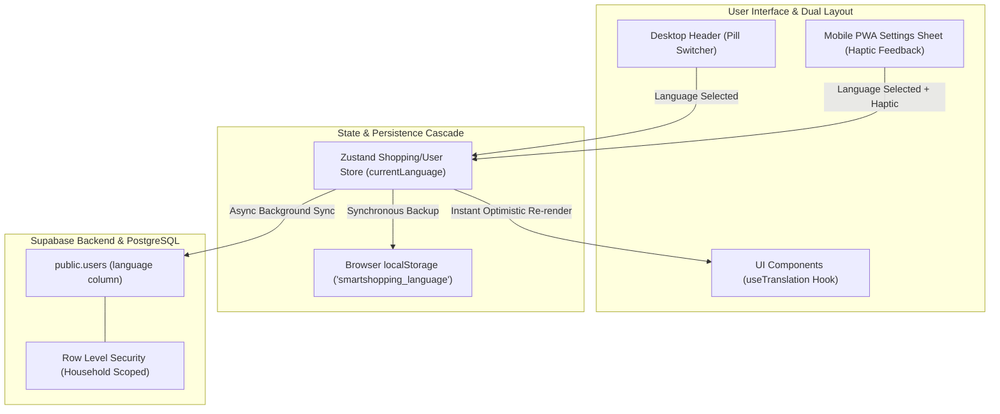

# ADR-003: Internationalization (i18n) Strategy, Codebase English Purity & Multi-Tier Persistence

## 1. Metadata
- **Status:** Accepted
- **Date:** 2026-08-24
- **Decision Drivers:** 100% Codebase English Purity, Type-Safe Zero-Dependency i18n, Dual-Layout UX Duality, Offline Supermarket Reliability, Household Multi-Tenant Multi-Language Isolation
- **Scope:** Full-Stack (Database Schema, TypeScript Types, State Management, Frontend UI & Design System)

---

## 2. Context & Problem Statement

SmartShopping was initially conceptualized with Polish-language UI strings and Polish database enums (e.g. `unit_enum ('g', 'ml', 'szt')`). To ensure long-term code maintainability, engineering excellence, and seamless multi-lingual scaling, the architecture requires a rigorous internationalization framework adhering to strict core requirements:

1. **Strict Codebase & Database English Purity:** Zero Polish words in TypeScript source code, database enums, variable names, functions, type definitions, or schema definitions. All units, categories, and identifiers must be standardized in English (e.g. `unit_enum` values: `'g'`, `'ml'`, `'pcs'`).
2. **Extensible Multi-Language Support (PL Default, EN Secondary):** Polish (`pl`) serves as the initial default active locale for end-users, alongside English (`en`), with straightforward plug-and-play extensibility for future locales (e.g. `de`, `es`, `fr`).
3. **Single Centralized Type-Safe Translation Catalog:** A unified, statically typed translation repository in `src/i18n/` preventing missing keys or typos at compile time (`tsc -b`), avoiding fragmented JSON files and eliminating unnecessary asynchronous network requests.
4. **Preservation of User-Generated DB Content:** User-created entities (meal names, custom ad-hoc products, recipe steps, recipe notes, custom tags) must be stored and displayed verbatim in whatever language the user entered them, while system-defined reference metadata (categories, units, system badges) use canonical translation keys localized at the presentation layer.
5. **Aesthetic Dual-Layout Language Switcher:** A sleek, micro-animated language toggle integrated co-equally across Desktop (`DesktopHeader` & settings dialog) and Mobile PWA (`Sheet` profile/settings drawer with `navigator.vibrate(50)` haptic feedback).
6. **Multi-Tier Persistence Cascade:** User language selection must be instantly applied via optimistic Zustand state, immediately backed up to browser `localStorage` for 100% offline supermarket reliability, and asynchronously synchronized with `public.users.language` in Supabase PostgreSQL.

---

## 3. Market & Technology Benchmarks

| Feature / Dimension | Market Benchmark (AnyList, Paprika, Whisk, Cronometer) | SmartShopping Architecture |
| :--- | :--- | :--- |
| **Codebase & Schema Language** | Pure English domain models and enums across all global apps. | **100% Pure English** in code, types, migrations, and enums (`'pcs'`, `'produce'`, etc.). |
| **Translation Engine** | Often uses heavy external libraries (15–30KB) with runtime JSON fetches. | **Zero-Dependency Lightweight Typed Module (<2KB)** with native `Intl` APIs (`Intl.PluralRules`, `Intl.DateTimeFormat`). |
| **Pluralization Handling** | Key suffix conventions or complex ICU message parser bundles. | Native **`Intl.PluralRules`** handling Slavic plural categories (`one`, `few`, `many`) and Germanic/Romance rules (`one`, `other`). |
| **Offline Resilience** | Remote JSON translations often fail in basement supermarket aisles on poor 3G/E connections. | **Client-Bundled Locales:** All strings bundled directly in app code with `localStorage` cache; 0ms latency, zero network requirement. |
| **Multi-User Households** | Some apps force a single household language. | **Independent Per-User Preference:** Family members share the exact same live list while viewing UI labels, units, and categories in their preferred language. |

---

## 4. Considered Alternatives & Decision Matrix

| Evaluation Criteria | Option A: Heavy `i18next` + `react-i18next` with JSON files | Option B: Flat Key-Value Map in Single File | Option C: TypeScript Centralized Dictionary + Native `Intl` Engine (Selected) |
| :--- | :--- | :--- | :--- |
| **Type Safety & Build Verification** | Partial (requires manual declaration merging or extra CLI tools). | Low (risk of key collisions, no nested domain grouping). | **100% Compile-Time Strict Verification (`tsc -b`)** via inferred schema interface. |
| **Bundle Footprint & Performance** | ~18–25 KB gzipped runtime overhead + async network latency. | <1 KB, but lacks structured pluralization and interpolation. | **<2 KB Zero-Dependency footprint**, instant 0ms execution. |
| **Offline Reliability** | High if bundled, but fragile if using HTTP backend loaders. | High (bundled). | **100% Offline Guaranteed** (all strings compiled in client bundle, cached in `localStorage`). |
| **Pluralization & Formatting** | Comprehensive built-in rules via library. | Custom logic required. | **Full Native Web API Support** using `Intl.PluralRules`, `Intl.NumberFormat`, `Intl.DateTimeFormat`. |
| **Developer Ergonomics** | Verbose setup, string-based keys prone to silent runtime typos. | Flat strings become unwieldy (>500 lines). | **Hierarchical Domain Structure** (`common`, `cookbook`, `draft`, `activeList`, `categories`, `units`) with IDE autocomplete. |
| **Verdict** | Rejected (excessive runtime bloat for PWA) | Rejected (insufficient scaling & pluralization) | **Adopted** |

---

## 5. Technical Decision & Deep Architecture

### 5.1 System & Data Flow



---

### 5.2 Schema & Database Changes

#### 5.2.1 Unit Enum Migration & Database Schema Updates
Migrate PostgreSQL `unit_enum` from Polish `'szt'` to canonical English `'pcs'`, add user language preference, and standardize category slugs matching the exact database IDs:

```sql
-- 1. Migration: Safely rename 'szt' to 'pcs' in unit_enum type
DO $$ 
BEGIN
  IF EXISTS (
    SELECT 1 FROM pg_enum e 
    JOIN pg_type t ON e.enumtypid = t.oid 
    WHERE t.typname = 'unit_enum' AND e.enumlabel = 'szt'
  ) THEN
    ALTER TYPE public.unit_enum RENAME VALUE 'szt' TO 'pcs';
  END IF;
END $$;

-- 2. Add language preference column to public.users table
ALTER TABLE public.users 
ADD COLUMN IF NOT EXISTS language VARCHAR(10) DEFAULT 'pl' NOT NULL;

-- 3. Standardize default product category system keys / slugs (1:1 with DB IDs & sort_order)
-- ID 1: Owoce i Warzywa (sort_order 1)
UPDATE public.product_categories SET name = 'fruits_vegetables' WHERE id = 1;
-- ID 2: Pieczywo (sort_order 2)
UPDATE public.product_categories SET name = 'bakery'            WHERE id = 2;
-- ID 3: Nabiał i Jaja (sort_order 3)
UPDATE public.product_categories SET name = 'dairy'             WHERE id = 3;
-- ID 4: Mięso i Ryby (sort_order 4)
UPDATE public.product_categories SET name = 'meat_fish'         WHERE id = 4;
-- ID 5: Sypkie i Przyprawy (sort_order 5)
UPDATE public.product_categories SET name = 'pantry'            WHERE id = 5;
-- ID 6: Napoje (sort_order 6)
UPDATE public.product_categories SET name = 'beverages'         WHERE id = 6;
-- ID 7: Chemia i Dom (sort_order 7)
UPDATE public.product_categories SET name = 'household'         WHERE id = 7;
-- ID 8: Inne (sort_order 8)
UPDATE public.product_categories SET name = 'other'             WHERE id = 8;

-- 4. Standardize default meal category system keys / slugs (1:1 with DB IDs)
-- ID 1: Śniadanie
UPDATE public.meal_categories SET name = 'breakfast' WHERE id = 1;
-- ID 2: Obiad
UPDATE public.meal_categories SET name = 'lunch'     WHERE id = 2;
-- ID 3: Kolacja
UPDATE public.meal_categories SET name = 'dinner'    WHERE id = 3;
-- ID 4: Przekąska
UPDATE public.meal_categories SET name = 'snack'     WHERE id = 4;
-- ID 5: Deser
UPDATE public.meal_categories SET name = 'dessert'   WHERE id = 5;
```

---

### 5.3 Frontend & Translation Architecture

#### 5.3.1 Directory Layout (`src/i18n/`)
```
src/
├── i18n/
│   ├── index.ts              # Core translator engine, useTranslation hook & formatting utilities
│   ├── types.ts              # Strongly-typed TranslationSchema inferred from English dictionary
│   ├── locales/
│   │   ├── en.ts             # Canonical English translation catalog (Master Schema)
│   │   └── pl.ts             # Polish translation catalog (100% Key Parity with en.ts)
```

#### 5.3.2 Type-Safe Translation Schema Definition (`src/i18n/types.ts`)
```typescript
import type { en } from './locales/en'

export type SupportedLanguage = 'pl' | 'en'

export type PluralForms = {
  one: string
  few?: string
  many?: string
  other: string
}

export type TranslationDictionary = typeof en

export type NestedKeyOf<ObjectType extends object> = {
  [Key in keyof ObjectType & (string | number)]: ObjectType[Key] extends object
    ? ObjectType[Key] extends PluralForms
      ? `${Key}`
      : `${Key}` | `${Key}.${NestedKeyOf<ObjectType[Key]>}`
    : `${Key}`
}[keyof ObjectType & (string | number)]

export type TranslationKey = NestedKeyOf<TranslationDictionary>
```

#### 5.3.3 Pluralization & Native `Intl` Core Engine (`src/i18n/index.ts`)
```typescript
import { create } from 'zustand'
import { en } from './locales/en'
import { pl } from './locales/pl'
import type { SupportedLanguage, TranslationDictionary, PluralForms } from './types'

const translations: Record<SupportedLanguage, TranslationDictionary> = { en, pl }

interface I18nState {
  language: SupportedLanguage
  setLanguage: (lang: SupportedLanguage) => void
}

const STORAGE_KEY = 'smartshopping_language'

const getInitialLanguage = (): SupportedLanguage => {
  const stored = localStorage.getItem(STORAGE_KEY) as SupportedLanguage | null
  if (stored && (stored === 'pl' || stored === 'en')) return stored
  
  if (typeof navigator !== 'undefined' && navigator.language) {
    if (navigator.language.toLowerCase().startsWith('pl')) return 'pl'
  }
  return 'pl' // Polish is the default locale
}

export const useI18nStore = create<I18nState>((set) => ({
  language: getInitialLanguage(),
  setLanguage: (lang) => {
    localStorage.setItem(STORAGE_KEY, lang)
    set({ language: lang })
  },
}))

export const useTranslation = () => {
  const { language, setLanguage } = useI18nStore()
  const dict = translations[language] || translations.en

  const t = (path: string, params?: Record<string, string | number>): string => {
    const keys = path.split('.')
    let current: any = dict

    for (const key of keys) {
      if (current && typeof current === 'object' && key in current) {
        current = current[key]
      } else {
        // Fallback to English dictionary if key is missing in active locale
        let fallback: any = translations.en
        for (const fbKey of keys) {
          if (fallback && typeof fallback === 'object' && fbKey in fallback) {
            fallback = fallback[fbKey]
          } else {
            fallback = path
            break
          }
        }
        current = fallback
        break
      }
    }

    // Handle Pluralization via native Intl.PluralRules
    if (current && typeof current === 'object' && ('one' in current || 'other' in current)) {
      const count = params?.count !== undefined ? Number(params.count) : 0
      const pr = new Intl.PluralRules(language)
      const rule = pr.select(count) as keyof PluralForms
      const pluralForms = current as PluralForms
      current = pluralForms[rule] || pluralForms.other || pluralForms.one || ''
    }

    if (typeof current !== 'string') return path

    // Parameter Interpolation ({count}, {name})
    if (params) {
      return Object.entries(params).reduce(
        (acc, [k, v]) => acc.replace(new RegExp(`\\{${k}\\}`, 'g'), String(v)),
        current
      )
    }

    return current
  }

  const formatUnit = (unit: 'g' | 'ml' | 'pcs', count?: number): string => {
    return t(`units.${unit}`, count !== undefined ? { count } : undefined)
  }

  return { t, language, setLanguage, formatUnit }
}
```

---

### 5.4 UI Switcher Specification (Dual Layout)

#### 5.4.1 Desktop Header Switcher (`DesktopHeader.tsx`)
- **Visual Design:** Sleek compact pill selector with true-black background (`bg-zinc-950 border border-zinc-800`), glowing hover effect (`hover:border-zinc-700`), and smooth spring transition.
- **Display:** Shows active flag and label (e.g. `🇵🇱 PL` / `🇬🇧 EN`) with a dropdown or direct toggle button.
- **Interaction:** One-click instant optimistic switch. Triggers background persistence without page reload.

#### 5.4.2 Mobile PWA Profile Sheet Switcher (`MobileProfileSheet.tsx` / `MobileSettings.tsx`)
- **Visual Design:** Full-width high-contrast segmented control (`bg-zinc-900 rounded-xl p-1 border border-zinc-800`) located within the User Profile / Settings Bottom Sheet.
- **Touch Ergonomics:** Generous touch targets (min 48px height) adhering to thumb-zone standards.
- **Haptics:** Dispatches `navigator.vibrate(50)` on touch tap for tactile physical feedback.

---

## 6. Comprehensive Edge Cases & Mitigation Matrix

| # | Scenario / Edge Case | Failure Risk | Architectural Mitigation |
| :- | :--- | :--- | :--- |
| **1** | **Offline in Supermarket Basement** | Dynamic translation fetch fails, leaving empty UI strings. | **Zero-Network Bundling:** All translations are compiled directly into the client bundle; `localStorage` maintains selected language with 0ms offline availability. |
| **2** | **Multi-User Family List Synchronization** | One partner speaks Polish, the other English. Syncing list might overwrite partner's UI language. | **Strict UI Scoping:** Language preference is strictly stored per `user_id` in `public.users`, not on `public.households`. Shopping list items share universal product references (`product_id`) and English unit enums (`'pcs'`), allowing both users to see the shared list rendered in their personal language. |
| **3** | **User-Entered Custom Recipe / Product** | App tries to translate user's homemade recipe name (e.g. "Kotlet schabowy babci"). | **Raw User Content Passthrough:** User-generated fields (`name`, `description`, `preparation_steps`, `comments`, `tags`) are never passed through the translation dictionary and are rendered verbatim. |
| **4** | **Missing Key in New Future Language** | Untranslated key causes blank string or crash. | **Graceful Cascade Fallback:** Runtime translator attempts lookup in current language -> falls back to English (`en.ts`) -> falls back to raw key path string. TypeScript compile-time checks (`tsc -b`) flag missing keys during CI/CD. |
| **5** | **Complex Slavic Plural Forms (1, 2-4, 5+ in PL)** | Incorrect grammar (e.g. "5 posiłki" instead of "5 posiłków"). | **Native `Intl.PluralRules` Integration:** Accurately maps Slavic `one`, `few`, `many` plural categories in Polish, and `one`, `other` in English. |
| **6** | **Rapid Language Toggling & Network Drop** | Race conditions during Supabase profile update. | **Optimistic Local State First:** Zustand and `localStorage` update immediately. Supabase background update is debounced/queued; if offline, local preference remains active and syncs when connection resumes. |

---

## 7. Security, Privacy & Multi-Tenancy

- **Row Level Security (RLS) Compliance:** 
  - Updating language preference executes an `UPDATE` on `public.users WHERE id = auth.uid()`.
  - Scoped via existing RLS policies: `auth.uid() = id`, completely isolated from other household members.
- **No Data Leakage:** Changing language does not alter or re-encrypt any shared household data in `public.products`, `public.meals`, or `public.shopping_lists`.

---

## 8. Testing & Verification Strategy

### 8.1 Pure Calculation & Unit Tests (`src/i18n/__tests__/`)
1. **Key Parity Verification:** Automated test comparing `Object.keys` recursively between `en.ts` and `pl.ts` ensuring 100% completeness and exact placeholder parity.
2. **Pluralization Accuracy:** Unit tests verifying Polish plural outputs:
   - `1 produkt` (`one`)
   - `2 produkty`, `4 produkty` (`few`)
   - `5 produktów`, `12 produktów`, `25 produktów` (`many`)
   - English plural outputs: `1 item` (`one`), `5 items` (`other`).
3. **Unit Formatting:** Verifying `'pcs'` -> `"szt."` (PL) and `"pcs"` (EN); `'g'` -> `"g"`; `'ml'` -> `"ml"`.

### 8.2 UI Integration & User Flow Tests (Vitest + React Testing Library)
1. **Desktop Switcher User Flow:** Render `DesktopHeader`, click language toggle, verify immediate visual change of navigation labels and store buttons without reload.
2. **Mobile Sheet User Flow:** Open Mobile Settings `Sheet`, toggle language selector, verify `navigator.vibrate` trigger and immediate localized text updates.
3. **Persistence Fallback Flow:** Verify `localStorage` synchronization and initial load resolution cascade (`DB` -> `localStorage` -> `navigator.language` -> `'pl'`).

---

## 9. Rollout, Migration & Rollback Plan

### 9.1 Step-by-Step Implementation Sequence
1. **Database Migration:** Execute SQL migration in Supabase to add `public.users.language` and alter `unit_enum` to include `'pcs'`.
2. **Core i18n Module Scaffold:** Create `src/i18n/types.ts`, `src/i18n/locales/en.ts`, `src/i18n/locales/pl.ts`, and `src/i18n/index.ts`.
3. **Domain Codebase Refactoring:**
   - Update `src/types/supabase.ts` to reflect `unit_enum: 'g' | 'ml' | 'pcs'` and `users.language`.
   - Replace hardcoded Polish strings in views, dialogs, and navigation with `t(...)` keys.
   - Refactor pure calculation algorithms (`macroCalculations.ts`, etc.) to use English unit types.
4. **UI Switcher Component Integration:** Mount language toggles in `DesktopHeader` and mobile profile/settings drawer.
5. **Quality Gates Verification:** Run `npm run test`, `npm run lint`, and `npx tsc -b`.

### 9.2 Rollback Strategy
If any unforeseen regression occurs, the translation module defaults to `en` or `pl` fallback dictionaries in memory with zero database schema rollback required, as the `language` column is strictly additive.

---

## 10. Consequences

### Positive
- **100% Professional English Codebase:** Clean, standardized code and database enums matching international software engineering standards.
- **Zero Runtime Overhead (<2KB):** No heavy third-party localization bundles; pure native Web APIs (`Intl.PluralRules`).
- **Complete Type-Safety:** Compile-time verification (`tsc -b`) guarantees no broken translation keys reach production.
- **Rock-Solid Offline Reliability:** Entire dictionary is packaged in the PWA client bundle, eliminating supermarket basement network failures.
- **Multi-Tenant Flexibility:** Household members freely select their individual language preference without disrupting shared grocery list sync.

### Negative / Accepted Trade-offs
- **One-time Refactoring Requirement:** Requires replacing existing hardcoded strings in components with `t(...)` calls.
- **System Category Translation Mapping:** Seed category names are stored as canonical English slugs (`'fruits_vegetables'`, `'bakery'`, `'dairy'`, etc.) and must be resolved through `t(\`categories.${cat.name}\`)`.
