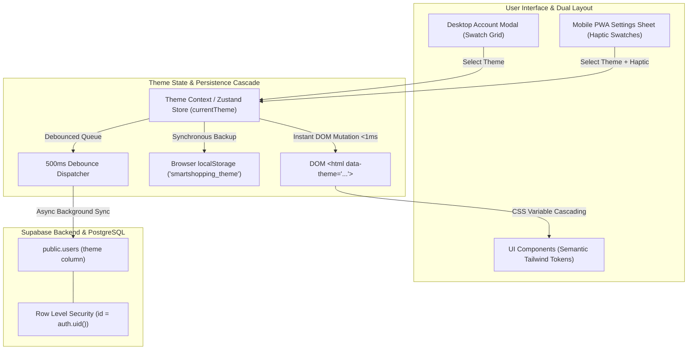

# ADR-004: Theme System, Semantic Design Tokens & Multi-Tier Visual Customization

## 1. Metadata
- **Status:** Accepted
- **Date:** 2026-08-24
- **Decision Drivers:** OLED Battery Optimization, Semantic Token Architecture, Co-Equal Dual Layout UX, Offline Supermarket Resilience, Zero-FOUC Instant Boot, Per-User Personalization Isolation
- **Scope:** Full-Stack (Database Schema, TypeScript Types, State Management, CSS Architecture, Frontend Design System)

---

## 2. Context & Problem Statement

SmartShopping was initially built around a single, fixed True Black (`#000000`) OLED color scheme with hardcoded `zinc-*` and `emerald-*` Tailwind utility classes. While optimal for battery conservation on OLED mobile devices in dark grocery environments, users operate under diverse lighting conditions (e.g., bright sunlight outdoors, dimly lit kitchens, fluorescent supermarket aisles) and possess distinct aesthetic preferences.

To elevate SmartShopping into a premium, world-class household application, the architecture requires an extensible, production-grade theme engine adhering to the following strict requirements:

1. **Curated Multi-Theme System:** A suite of 6 meticulously designed palettes (5 Dark/OLED variants: OLED Emerald [default], Midnight Blue, Forest Sage, Warm Amber, Cyberpunk Violet; plus 1 Clean Light theme for high-glare environments).
2. **Semantic Design Token Architecture:** Replacement of hardcoded color classes (`zinc-900`, `emerald-500`, `text-emerald-400`) with semantic CSS variable tokens (`--background`, `--foreground`, `--card`, `--primary`, `--secondary`, `--muted`, `--accent`, `--border`, `--input`, `--ring`) enabling instant theme switching across all views with 0 layout reflows.
3. **Co-Equal Dual Layout UX Duality:**
   - **Desktop Mode:** Interactive Visual Swatch Cards embedded within the Account Details modal, featuring instant hover/click preview.
   - **Mobile PWA Mode:** Bottom Sheet drawer featuring tactile swatch cards with 44x44px touch targets and `navigator.vibrate(50)` haptic feedback.
4. **Multi-Tier Persistence Cascade:** Instant DOM mutation (`data-theme` attribute on `<html>`), synchronous backup to `localStorage` (`smartshopping_theme`), and asynchronous debounced (500ms) synchronization to PostgreSQL (`public.users.theme`).
5. **Zero-FOUC (Flash of Unstyled/Wrong Content):** Inline synchronous execution script in `index.html` executing before React bundle hydration to guarantee seamless boot with zero visual flicker.
6. **Per-User Multi-Tenant Isolation:** Theme preference is strictly scoped to individual user accounts (`auth.uid()`) rather than household-wide, allowing family members sharing the same live grocery list to use independent visual themes.
7. **Offline Supermarket Resilience:** Guaranteed 100% functionality and theme switching when offline in store basements, with silent queuing and graceful reconnection sync.

---

## 3. Market & Technology Benchmarks

| Feature / Dimension | Market Benchmark (Linear, Raycast, GitHub, Supabase, AnyList) | SmartShopping Architecture |
| :--- | :--- | :--- |
| **Theme Engine** | CSS Variables + `data-theme` attribute on root element. | **Native CSS Variables with HSL channels** injected into Tailwind CSS token pipeline. |
| **Color Palette Depth** | 2–4 basic presets (Dark, Light, System) or arbitrary uncurated color pickers. | **6 Curated Designer Presets** tailored for OLED, ambient lighting, and accessibility contrast. |
| **Switching Latency** | 100–300ms if requiring component re-renders or CSS stylesheet re-downloads. | **<1ms Paint-Only Latency** via single DOM root attribute swap (`document.documentElement.dataset.theme = ...`). |
| **Anti-FOUC Strategy** | Blocking script in `<head>` reading local storage cache. | **Synchronous Head Script (<200 bytes)** applying theme before DOM render. |
| **Offline Resilience** | Themes stored remotely fail to load on cold start without connection. | **Multi-Tier Offline-First:** `localStorage` sync cache guarantees immediate local rendering anywhere. |
| **Multi-User Households** | Some platforms sync UI theme across all members of an account. | **Strict Per-User Scoping:** Independent preferences per `public.users.id` with Supabase RLS isolation. |

---

## 4. Considered Alternatives & Decision Matrix

| Evaluation Criteria | Option A: Dynamic JS Style Injection (`style.setProperty`) | Option B: Multiple External CSS Files (`<link rel="stylesheet">`) | Option C: Centralized CSS Variable Tokens + `data-theme` Root Attribute (Selected) |
| :--- | :--- | :--- | :--- |
| **Performance & Latency** | Moderate (triggers multiple JS calls and style recalculations). | Poor (network waterfall and FOIT/FOUC on theme switch). | **Sub-1ms Paint-Only Execution** (single attribute toggle). |
| **Tailwind CSS Compatibility** | Requires complex config hooks. | Breaks Tailwind compilation pipeline. | **Native 1:1 Integration** with Tailwind `hsl(var(--...))` tokens. |
| **Bundle Footprint** | ~5 KB runtime logic. | Extra network requests per theme. | **0 KB Extra Dependencies** (pure standard CSS & HTML attributes). |
| **Maintainability** | High risk of orphaned styles across components. | Duplicate CSS files hard to maintain. | **Single Centralized Token Repository** in `src/index.css` & `src/theme/themes.ts`. |
| **Anti-FOUC Reliability** | Difficult without flashing defaults. | High risk of flash during download. | **100% Flicker-Free** via synchronous pre-hydration script. |
| **Verdict** | Rejected (runtime JS overhead) | Rejected (network latency & bundling friction) | **Adopted** |

---

## 5. Technical Decision & Deep Architecture

### 5.1 System & Data Flow



---

### 5.2 Schema & Database Changes

#### 5.2.1 Database Migration DDL (`supabase/migrations/20260825000000_add_theme_to_users.sql`)

```sql
-- Migration: Add user visual theme preference to public.users
ALTER TABLE public.users 
ADD COLUMN IF NOT EXISTS theme VARCHAR(30) DEFAULT 'oled-black' NOT NULL;

-- Ensure comment is registered for schema documentation
COMMENT ON COLUMN public.users.theme IS 'User selected visual theme preset (e.g. oled-black, midnight-blue, forest-sage, warm-amber, cyberpunk-violet, clean-light)';
```

#### 5.2.2 Supabase Row Level Security (RLS) Verification
Theme column updates inherit the existing strict user profile RLS policy:
```sql
-- Existing policy on public.users ensures only the authenticated owner can modify their theme:
-- CREATE POLICY "Users can update their own profile" 
--   ON public.users FOR UPDATE 
--   USING (auth.uid() = id) 
--   WITH CHECK (auth.uid() = id);
```

---

### 5.3 Frontend Type Definitions & Theme Catalog

#### 5.3.1 Theme Types (`src/types/theme.ts`)

```typescript
export type ThemeId = 
  | 'oled-black' 
  | 'midnight-blue' 
  | 'forest-sage' 
  | 'warm-amber' 
  | 'cyberpunk-violet' 
  | 'clean-light'

export interface ThemeConfig {
  id: ThemeId
  nameKey: string
  descriptionKey: string
  isDark: boolean
  preview: {
    background: string
    card: string
    primary: string
    accent: string
    border: string
  }
}
```

#### 5.3.2 Curated Theme Catalog (`src/theme/themes.ts`)

```typescript
import { ThemeConfig } from '@/types/theme'

export const THEMES: ThemeConfig[] = [
  {
    id: 'oled-black',
    nameKey: 'themes.oledBlack.name',
    descriptionKey: 'themes.oledBlack.description',
    isDark: true,
    preview: {
      background: '#000000',
      card: '#0d0d0d',
      primary: '#10b981', // Emerald
      accent: '#1e293b',
      border: '#27272a'
    }
  },
  {
    id: 'midnight-blue',
    nameKey: 'themes.midnightBlue.name',
    descriptionKey: 'themes.midnightBlue.description',
    isDark: true,
    preview: {
      background: '#070b14',
      card: '#0f172a',
      primary: '#38bdf8', // Sky Blue
      accent: '#1e293b',
      border: '#1e293b'
    }
  },
  {
    id: 'forest-sage',
    nameKey: 'themes.forestSage.name',
    descriptionKey: 'themes.forestSage.description',
    isDark: true,
    preview: {
      background: '#06100a',
      card: '#0d1f14',
      primary: '#34d399', // Mint Sage
      accent: '#132e1e',
      border: '#1b3b27'
    }
  },
  {
    id: 'warm-amber',
    nameKey: 'themes.warmAmber.name',
    descriptionKey: 'themes.warmAmber.description',
    isDark: true,
    preview: {
      background: '#0d0905',
      card: '#1a130b',
      primary: '#f59e0b', // Amber / Gold
      accent: '#261b0f',
      border: '#382615'
    }
  },
  {
    id: 'cyberpunk-violet',
    nameKey: 'themes.cyberpunkViolet.name',
    descriptionKey: 'themes.cyberpunkViolet.description',
    isDark: true,
    preview: {
      background: '#090514',
      card: '#130d24',
      primary: '#c084fc', // Neon Purple
      accent: '#231545',
      border: '#321c60'
    }
  },
  {
    id: 'clean-light',
    nameKey: 'themes.cleanLight.name',
    descriptionKey: 'themes.cleanLight.description',
    isDark: false,
    preview: {
      background: '#f8fafc',
      card: '#ffffff',
      primary: '#059669', // Deep Emerald
      accent: '#f1f5f9',
      border: '#e2e8f0'
    }
  }
]

export const DEFAULT_THEME: ThemeId = 'oled-black'
```

---

### 5.4 Semantic CSS Variable Architecture (`src/index.css`)

```css
@tailwind base;
@tailwind components;
@tailwind utilities;

@layer base {
  /* 1. OLED TRUE BLACK (Default) */
  :root,
  [data-theme="oled-black"] {
    --background: 0 0% 0%;
    --foreground: 210 40% 98%;
    --card: 0 0% 5%;
    --card-foreground: 210 40% 98%;
    --popover: 0 0% 5%;
    --popover-foreground: 210 40% 98%;
    --primary: 158 64% 52%;
    --primary-foreground: 0 0% 0%;
    --secondary: 240 3.7% 15.9%;
    --secondary-foreground: 210 40% 98%;
    --muted: 240 3.7% 15.9%;
    --muted-foreground: 240 5% 64.9%;
    --accent: 240 3.7% 15.9%;
    --accent-foreground: 210 40% 98%;
    --destructive: 0 62.8% 30.6%;
    --destructive-foreground: 210 40% 98%;
    --border: 240 3.7% 15.9%;
    --input: 240 3.7% 15.9%;
    --ring: 158 64% 52%;
    --radius: 0.75rem;
  }

  /* 2. MIDNIGHT BLUE */
  [data-theme="midnight-blue"] {
    --background: 222 47% 5%;
    --foreground: 210 40% 98%;
    --card: 222 47% 9%;
    --card-foreground: 210 40% 98%;
    --popover: 222 47% 9%;
    --popover-foreground: 210 40% 98%;
    --primary: 199 89% 48%;
    --primary-foreground: 222 47% 5%;
    --secondary: 217 33% 17%;
    --secondary-foreground: 210 40% 98%;
    --muted: 217 33% 17%;
    --muted-foreground: 215 20% 65%;
    --accent: 217 33% 20%;
    --accent-foreground: 210 40% 98%;
    --destructive: 0 62.8% 30.6%;
    --destructive-foreground: 210 40% 98%;
    --border: 217 33% 18%;
    --input: 217 33% 18%;
    --ring: 199 89% 48%;
    --radius: 0.75rem;
  }

  /* 3. FOREST SAGE */
  [data-theme="forest-sage"] {
    --background: 150 40% 4%;
    --foreground: 140 20% 96%;
    --card: 150 35% 8%;
    --card-foreground: 140 20% 96%;
    --popover: 150 35% 8%;
    --popover-foreground: 140 20% 96%;
    --primary: 152 57% 53%;
    --primary-foreground: 150 40% 4%;
    --secondary: 150 25% 15%;
    --secondary-foreground: 140 20% 96%;
    --muted: 150 25% 15%;
    --muted-foreground: 145 15% 60%;
    --accent: 150 25% 18%;
    --accent-foreground: 140 20% 96%;
    --destructive: 0 62.8% 30.6%;
    --destructive-foreground: 140 20% 96%;
    --border: 150 25% 16%;
    --input: 150 25% 16%;
    --ring: 152 57% 53%;
    --radius: 0.75rem;
  }

  /* 4. WARM AMBER */
  [data-theme="warm-amber"] {
    --background: 24 25% 4%;
    --foreground: 35 30% 96%;
    --card: 24 22% 8%;
    --card-foreground: 35 30% 96%;
    --popover: 24 22% 8%;
    --popover-foreground: 35 30% 96%;
    --primary: 38 92% 50%;
    --primary-foreground: 24 25% 4%;
    --secondary: 24 18% 15%;
    --secondary-foreground: 35 30% 96%;
    --muted: 24 18% 15%;
    --muted-foreground: 30 15% 60%;
    --accent: 24 18% 19%;
    --accent-foreground: 35 30% 96%;
    --destructive: 0 62.8% 30.6%;
    --destructive-foreground: 35 30% 96%;
    --border: 24 18% 16%;
    --input: 24 18% 16%;
    --ring: 38 92% 50%;
    --radius: 0.75rem;
  }

  /* 5. CYBERPUNK VIOLET */
  [data-theme="cyberpunk-violet"] {
    --background: 270 35% 4%;
    --foreground: 270 30% 96%;
    --card: 270 30% 9%;
    --card-foreground: 270 30% 96%;
    --popover: 270 30% 9%;
    --popover-foreground: 270 30% 96%;
    --primary: 270 95% 75%;
    --primary-foreground: 270 35% 4%;
    --secondary: 270 25% 18%;
    --secondary-foreground: 270 30% 96%;
    --muted: 270 25% 18%;
    --muted-foreground: 270 15% 65%;
    --accent: 270 25% 22%;
    --accent-foreground: 270 30% 96%;
    --destructive: 0 62.8% 30.6%;
    --destructive-foreground: 270 30% 96%;
    --border: 270 25% 19%;
    --input: 270 25% 19%;
    --ring: 270 95% 75%;
    --radius: 0.75rem;
  }

  /* 6. CLEAN LIGHT */
  [data-theme="clean-light"] {
    --background: 210 40% 98%;
    --foreground: 222 47% 11%;
    --card: 0 0% 100%;
    --card-foreground: 222 47% 11%;
    --popover: 0 0% 100%;
    --popover-foreground: 222 47% 11%;
    --primary: 158 64% 40%;
    --primary-foreground: 0 0% 100%;
    --secondary: 210 40% 96.1%;
    --secondary-foreground: 222 47% 11%;
    --muted: 210 40% 96.1%;
    --muted-foreground: 215.4 16.3% 46.9%;
    --accent: 210 40% 92%;
    --accent-foreground: 222 47% 11%;
    --destructive: 0 84.2% 60.2%;
    --destructive-foreground: 210 40% 98%;
    --border: 214.3 31.8% 91.4%;
    --input: 214.3 31.8% 91.4%;
    --ring: 158 64% 40%;
    --radius: 0.75rem;
  }
}

@layer base {
  * {
    @apply border-border;
  }
  html, body, #root {
    height: 100%;
    height: 100dvh;
    margin: 0;
    padding: 0;
    overflow: hidden;
  }
  body {
    @apply bg-background text-foreground antialiased transition-colors duration-150;
    overscroll-behavior-y: none;
  }
}
```

---

### 5.5 Anti-FOUC Synchronous Head Script (`index.html`)

```html
<script>
  (function() {
    try {
      var savedTheme = localStorage.getItem('smartshopping_theme') || 'oled-black';
      var validThemes = ['oled-black', 'midnight-blue', 'forest-sage', 'warm-amber', 'cyberpunk-violet', 'clean-light'];
      if (validThemes.indexOf(savedTheme) === -1) {
        savedTheme = 'oled-black';
      }
      document.documentElement.setAttribute('data-theme', savedTheme);
    } catch (e) {
      document.documentElement.setAttribute('data-theme', 'oled-black');
    }
  })();
</script>
```

---

### 5.6 Dual-Layout Theme Selector UX

#### 5.6.1 Visual Theme Swatch Card Component (`src/components/ui/ThemeSelector.tsx`)
Renders miniature card previews showcasing the theme's background, card border, primary badge/accent, and active indicator:

```tsx
export const ThemeSelector: React.FC<{ variant?: 'grid' | 'compact' }> = ({ variant = 'grid' }) => {
  const { currentTheme, setTheme } = useTheme()
  const { t } = useTranslation()

  const handleSelect = (themeId: ThemeId) => {
    if (typeof navigator !== 'undefined' && navigator.vibrate) {
      navigator.vibrate(50)
    }
    setTheme(themeId)
  }

  return (
    <div className={variant === 'grid' ? 'grid grid-cols-2 sm:grid-cols-3 gap-2.5' : 'flex gap-2 overflow-x-auto pb-1'}>
      {THEMES.map((theme) => {
        const isSelected = currentTheme === theme.id
        return (
          <button
            key={theme.id}
            type="button"
            onClick={() => handleSelect(theme.id)}
            className={`group relative flex flex-col p-2.5 rounded-xl border text-left transition-all duration-200 cursor-pointer ${
              isSelected 
                ? 'border-primary ring-2 ring-primary/30 shadow-lg scale-[1.02]' 
                : 'border-border/60 hover:border-border hover:scale-[1.01]'
            }`}
            style={{ backgroundColor: theme.preview.card }}
          >
            {/* Color Palette Preview Ribbon */}
            <div className="flex items-center gap-1.5 mb-2">
              <div 
                className="w-4 h-4 rounded-full border border-white/20 shadow-sm" 
                style={{ backgroundColor: theme.preview.primary }} 
              />
              <div 
                className="w-3 h-3 rounded-full border border-white/10" 
                style={{ backgroundColor: theme.preview.background }} 
              />
              <div 
                className="w-3 h-3 rounded-full border border-white/10" 
                style={{ backgroundColor: theme.preview.border }} 
              />
              {isSelected && (
                <div className="ml-auto w-4 h-4 rounded-full bg-primary flex items-center justify-center text-primary-foreground">
                  <Check className="w-2.5 h-2.5 stroke-[3]" />
                </div>
              )}
            </div>

            <div className="text-xs font-semibold text-foreground truncate">
              {t(theme.nameKey)}
            </div>
            <div className="text-[10px] text-muted-foreground line-clamp-1">
              {t(theme.descriptionKey)}
            </div>
          </button>
        )
      })}
    </div>
  )
}
```

---

### 5.7 Modular Plug-and-Play Extensibility Protocol ("Adding a New Theme in 3 Steps")

To ensure the theme engine remains ultra-modular, maintainable, and frictionless for future enhancements, adding a new theme (e.g., `nordic-frost`, `solar-flare`, or `espresso-noir`) is designed as a **3-step plug-and-play workflow**. No UI selector components or state handlers ever need modification.

#### Directory Architecture (`src/theme/`)
```
src/theme/
├── types.ts          # Strongly typed ThemeId, ThemeConfig, and Token definitions
├── themes.ts         # Single Source of Truth: Centralized THEMES registry and helper guards
├── ThemeContext.tsx  # React Context Provider managing DOM mutation & multi-tier persistence
├── useTheme.ts       # Clean consumer hook with full TypeScript autocomplete
└── __tests__/
    └── theme.test.ts # Exhaustive automated validation for all registered themes
```

#### The 3-Step Protocol:

1. **Step 1: Register in Theme Catalog (`src/theme/themes.ts`)**
   Add the new theme definition to the `THEMES` array. TypeScript guarantees all required metadata, preview swatches, and translation keys are strictly provided:
   ```typescript
   export const THEMES: ThemeConfig[] = [
     // ... existing themes
     {
       id: 'nordic-frost',
       nameKey: 'themes.nordicFrost.name',
       descriptionKey: 'themes.nordicFrost.description',
       isDark: true,
       preview: {
         background: '#040d1a',
         card: '#08182b',
         primary: '#60a5fa',
         accent: '#0e2a47',
         border: '#153b61'
       }
     }
   ]
   ```

2. **Step 2: Add CSS Variables Block (`src/index.css`)**
   Define the corresponding HSL color channels for all semantic tokens:
   ```css
   [data-theme="nordic-frost"] {
     --background: 215 70% 6%;
     --foreground: 210 40% 98%;
     --card: 215 65% 10%;
     --card-foreground: 210 40% 98%;
     --primary: 217 91% 68%;
     --primary-foreground: 215 70% 6%;
     --secondary: 215 50% 18%;
     --secondary-foreground: 210 40% 98%;
     --muted: 215 50% 18%;
     --muted-foreground: 215 30% 65%;
     --accent: 215 50% 22%;
     --accent-foreground: 210 40% 98%;
     --border: 215 50% 20%;
     --input: 215 50% 20%;
     --ring: 217 91% 68%;
     --radius: 0.75rem;
   }
   ```

3. **Step 3: Add Localization Keys (`src/i18n/locales/{en,pl}.ts`)**
   Add localized names and descriptions to both language dictionaries:
   ```typescript
   // en.ts & pl.ts
   themes: {
     nordicFrost: {
       name: 'Nordic Frost', // 'Arktyczny Błękit' w pl.ts
       description: 'Glacial navy tones with crisp ice blue highlights'
     }
   }
   ```

#### Automatic Component Propagation & Test Verification:
- **Instant UI Propagation:** The `ThemeSelector` automatically renders the new interactive swatch card across Desktop modals and Mobile PWA sheets with zero component alterations.
- **Dynamic Guard & Anti-FOUC:** `isValidTheme(themeId)` dynamically checks against the runtime `THEMES` registry.
- **Continuous Test Verification:** `src/theme/__tests__/theme.test.ts` dynamically iterates over all items in `THEMES`, enforcing that every theme has matching translation keys in both languages, valid hex preview colors, and complete CSS token coverage.

---

## 6. Comprehensive Edge Cases & Mitigation Matrix

| # | Scenario / Edge Case | Failure Risk | Architectural Mitigation |
| :- | :--- | :--- | :--- |
| **1** | **Offline Supermarket Basement Mode** | User switches theme in basement aisle with 0 cell reception. Remote API hangs or fails. | **Synchronous Multi-Tier Cascade:** Local DOM attribute and `localStorage` update instantly in 0ms. Supabase API write is enqueued and silently catches error without breaking UI. |
| **2** | **Rapid Swatch Clicking (Spam/Throttling)** | User rapidly clicks through 6 swatches in 2 seconds, firing 6 immediate Supabase HTTP PATCH requests. | **500ms Debounce Dispatcher:** DOM & `localStorage` update instantly on every tap; remote Supabase sync fires only once after 500ms of inactivity. |
| **3** | **Corrupted / Invalid Storage Value** | `localStorage` contains legacy, typo'd, or invalid theme string (e.g. `'neon'`). | **Catalog Validation Guard:** If `THEMES.some(t => t.id === stored)` is false, immediately sanitize and fall back to `DEFAULT_THEME ('oled-black')`. |
| **4** | **Multi-Device / Multi-User Household** | Partner on iPhone switches to `clean-light`; user on Android prefers `oled-black`. | **Strict Per-User RLS Scoping:** Theme stored in `public.users.theme` keyed by `auth.uid()`, strictly isolated from household-wide shopping list data. |
| **5** | **Cold Boot Theme Flashing (FOUC)** | Browser renders default white/black background before React loads, flashing the screen. | **Pre-Hydration Synchronous Script in `<head>`:** Reads `localStorage` and sets `data-theme` on `<html>` before body render. |
| **6** | **Unauthenticated / Guest Login Screen** | Guest lands on login screen before profile exists in database. | System reads `localStorage` theme fallback (defaulting to OLED Black) and allows theme switching without requiring auth session. |

---

## 7. Security, Privacy & Multi-Tenancy

1. **Row Level Security (RLS) Integrity:**
   - Reading user theme: `SELECT theme FROM public.users WHERE id = auth.uid()`
   - Updating user theme: `UPDATE public.users SET theme = :theme WHERE id = auth.uid()`
   - Household members have zero permission to overwrite another user's display theme.
2. **Zero Third-Party Tracking / Telemetry:**
   - All theme definitions and palettes are bundled natively in the client application without external CDNs or font requests.

---

## 8. Testing & Verification Strategy

### 8.1 Pure Logic & Unit Tests (`src/theme/__tests__/theme.test.ts`)
- Verify all theme IDs match expected schema.
- Verify every theme configuration provides complete HSL variable definitions for all required semantic tokens.
- Test theme fallback validator for unknown/malformed theme strings.

### 8.2 UI User Flow Integration Tests (`src/components/dialogs/__tests__/AccountDetailsTheme.test.tsx`)
- **Flow 1 (Desktop Account Modal):** Open `AccountDetailsDialog`, assert all 6 swatch cards render, click `midnight-blue`, assert `document.documentElement.dataset.theme === 'midnight-blue'` and `localStorage.getItem('smartshopping_theme') === 'midnight-blue'`.
- **Flow 2 (Mobile PWA Sheet & Haptics):** In Mobile PWA mode, open settings sheet, tap `warm-amber`, verify `navigator.vibrate` is called with `50`, verify DOM attribute updates.
- **Flow 3 (Offline Resilience):** Mock network failure during theme selection, verify UI does not show uncaught errors and state remains updated locally.

---

## 9. Rollout, Migration & Rollback Plan

### 9.1 Step-by-Step Implementation Sequence
1. Execute SQL Migration `20260825000000_add_theme_to_users.sql` on Supabase database.
2. Define TypeScript types in `src/types/theme.ts` and update `src/types/supabase.ts`.
3. Add theme catalog `src/theme/themes.ts` and i18n translation keys in `src/i18n/locales/{en,pl}.ts`.
4. Update `src/index.css` with HSL CSS variables for all 6 themes and transition smoothing.
5. Create `src/context/ThemeContext.tsx` and custom hook `useTheme()`.
6. Add Anti-FOUC synchronous script into `index.html`.
7. Build `ThemeSelector` component and integrate into `AccountDetailsDialog.tsx` and mobile settings.
8. Systematically refactor hardcoded `zinc-*` / `emerald-*` utility classes across existing views to semantic Tailwind tokens.
9. Execute automated test suites (`npm run test`, `npm run lint`, `npx tsc -b`).

### 9.2 Rollback Plan
- If issues arise, fallback default is hardcoded to `'oled-black'` which mirrors the original application styling with 100% fidelity.
- Removing `data-theme` defaults directly to `:root` styling without data loss.

---

## 10. Consequences

### Positive
- **Visual Delight & User Choice:** Users can personalize SmartShopping to match their taste and environment (OLED pitch black, Midnight Navy, Forest Sage, Warm Coffee Amber, Cyberpunk Violet, or Crisp Light).
- **Cleaner Semantic Codebase:** Eliminates brittle hardcoded color classes (`bg-zinc-950`, `border-zinc-800`) in favor of standard semantic design tokens (`bg-background`, `bg-card`, `border-border`, `bg-primary`).
- **Zero-Cost Instant Transitions:** CSS variable attribute switching takes <1ms with 0 React re-renders of heavy lists.
- **100% Offline & Household Resilient:** Fully functions in basement supermarkets and keeps family member views independent.

### Negative / Accepted Trade-offs
- Refactoring existing views to remove hardcoded `zinc-900`/`emerald-500` classes requires careful, comprehensive UI auditing.
