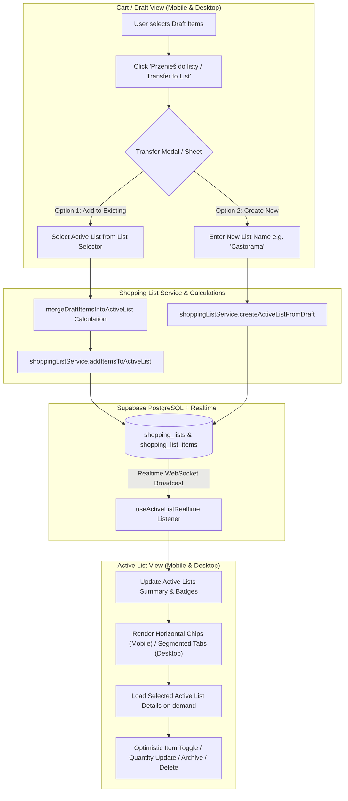

# ADR-005: Multiple Concurrent Active Shopping Lists & Smart Cart Transfer Architecture

## 1. Metadata
- **Status:** Implemented
- **Date:** 2026-08-26
- **Decision Drivers:** Multi-List Domain Modeling, PWA Dual Layout Ergonomics, Real-time Multi-tenant Synchronization, Offline-Resilient Merging Logic
- **Scope:** Full-Stack (PostgreSQL / Supabase RLS, Zustand State, UI Components & Service Layer)

---

## 2. Context & Problem Statement

In the initial implementation of **SmartShopping**, the household model supported only a single active shopping list (`status = 'active'`). When a user transferred items from the Cart (Draft) to an active list via `createActiveListFromDraft`, the system automatically archived any pre-existing active list.

This limitation created friction in real-world household operations:
1. **Diverse Shopping Lifecycles:** Households frequently maintain different types of lists concurrently — for example, a short-term, frequent grocery list (*"Bieżące spożywcze"*) alongside a persistent, long-term household/hardware list (*"Dom / Castorama"* or *"Apteka"*).
2. **Loss of In-Progress Lists:** Transferring a planned meal from the cart forced an involuntary archive of existing active grocery lists.
3. **Inability to Route Cart Items:** When planning meals or adding ad-hoc items, users could not choose whether items should form a new standalone shopping list or be appended/merged into an existing active list.

A modern, robust multi-active list architecture is required to allow households to maintain, switch, and manage multiple concurrent active shopping lists seamlessly across both Mobile PWA and Desktop layouts.

---

## 3. Market & Technology Benchmarks

| Platform | Multi-List Architecture | Cart / Meal Plan Routing | Switching & Navigation UX |
| :--- | :--- | :--- | :--- |
| **AnyList** | Unlimited named lists with customizable categories and default list flag. | User selects target list when exporting from meal planner or recipe catalog. | Sidebar drawer (Mobile) / Left navigation column (Desktop). |
| **Paprika 3** | Separate Grocery List, Pantry, and Custom Wishlists. | Direct export from recipes with prompt to choose or merge into list. | Tabbed views and top dropdown selectors. |
| **Bring!** | Multiple shopping list boards (e.g., "Home", "Office", "Party"). | Shared templates and quick-add into specific boards. | Horizontal swipeable board cards and header switcher. |
| **Todoist** | Project-based task lists with sub-tasks and priority badges. | Quick add with project selector (`#project`). | Sidebar hierarchy with uncompleted count badges. |

**SmartShopping Best-of-Breed Synthesis:** Combine the flexible multi-board paradigm of **AnyList** and **Bring!** with the high-performance ergonomics of **Todoist** (real-time badge counters, horizontal mobile chips, desktop segmented tabs, and smart item merging).

---

## 4. Considered Alternatives & Decision Matrix

| Evaluation Criteria | Option A: Multi-Active Lists with Smart Transfer (Selected) | Option B: Single Active List + Separate Wishlist/Pantry | Option C: Flat Tag-Based Single List with Client Filters |
| :--- | :--- | :--- | :--- |
| **UX & Ergonomics** | ⭐⭐⭐⭐⭐ First-class tabs/chips, intuitive transfer modal in cart. | ⭐⭐⭐ Rigid 2-slot division; cannot create 3+ lists (e.g. Pharmacy, Party). | ⭐⭐ Cluttered single list; confusing checked state mixing grocery & hardware items. |
| **Realtime Sync & Isolation** | ⭐⭐⭐⭐⭐ Scoped per list ID via WebSockets; no cross-list race conditions. | ⭐⭐⭐ Requires distinct sync protocols for grocery vs wishlist. | ⭐⭐ High conflict rate when multiple household members filter/check items. |
| **Item Merging Logic** | ⭐⭐⭐⭐⭐ Automatic quantity summation and `is_checked` reset when appending. | ⭐⭐⭐ No unified merging between meal plan and wishlist. | ⭐⭐⭐ Manual tagging required for every item. |
| **Implementation Cleanliness** | ⭐⭐⭐⭐⭐ Clean extension of existing `shopping_lists` table and service methods. | ⭐⭐ Duplication of schemas, UI views, and service code. | ⭐⭐⭐ Complex client-side filtering and aggregate queries. |
| **Verdict** | **Adopted** | Rejected | Rejected |

---

## 5. Technical Decision & Deep Architecture

### 5.1 System & Data Flow



### 5.2 Schema & Database Changes

The `shopping_lists` table is extended to support default list designation, ordering, and metadata without breaking existing schema contracts:

```sql
-- 1. Add 'is_default' and 'updated_at' columns to shopping_lists
ALTER TABLE shopping_lists 
ADD COLUMN IF NOT EXISTS is_default BOOLEAN NOT NULL DEFAULT FALSE,
ADD COLUMN IF NOT EXISTS updated_at TIMESTAMPTZ NOT NULL DEFAULT NOW();

-- 2. Performance Composite Indexes
CREATE INDEX IF NOT EXISTS idx_shopping_lists_household_status 
ON shopping_lists (household_id, status, is_default DESC, updated_at DESC);

CREATE INDEX IF NOT EXISTS idx_shopping_list_items_list_checked 
ON shopping_list_items (shopping_list_id, is_checked);

-- 3. Row Level Security (RLS) Verification
-- Ensure RLS remains strictly bounded to household members
ALTER TABLE shopping_lists ENABLE ROW LEVEL SECURITY;
ALTER TABLE shopping_list_items ENABLE ROW LEVEL SECURITY;

-- 4. Trigger to automatically bump updated_at on list change
CREATE OR REPLACE FUNCTION public.handle_shopping_list_updated_at()
RETURNS TRIGGER AS $$
BEGIN
  NEW.updated_at = NOW();
  RETURN NEW;
END;
$$ LANGUAGE plpgsql;

DROP TRIGGER IF EXISTS trigger_shopping_lists_updated_at ON shopping_lists;
CREATE TRIGGER trigger_shopping_lists_updated_at
BEFORE UPDATE ON shopping_lists
FOR EACH ROW
EXECUTE FUNCTION public.handle_shopping_list_updated_at();
```

### 5.3 Frontend & State Architecture

#### 5.3.1 Hybrid Zustand Store (`useShoppingStore`)
- **`activeListsSummary`**: Array of `{ id: string, name: string, is_default: boolean, total_items: number, unchecked_items: number, updated_at: string }`.
- **`selectedActiveListId`**: Persisted in `localStorage` per household (`smartshopping_active_list_selection`).
- **Store Actions:**
  - `setSelectedActiveListId(listId: string | null)`
  - `setActiveListsSummary(lists: ShoppingListSummary[])`
  - `updateSummaryItemCount(listId: string, deltaUnchecked: number)`

#### 5.3.2 Service Layer Interfaces (`src/services/shoppingListService.ts`)
```typescript
export interface ShoppingListSummary {
  id: string
  household_id: string
  name: string
  status: 'draft' | 'active' | 'archived'
  is_default: boolean
  target_date: string | null
  created_at: string
  updated_at: string
  total_items: number
  unchecked_items: number
}

export const shoppingListService = {
  // Fetch lightweight summary of all active lists for tabs/chips
  async getActiveListsSummary(householdId: string): Promise<ShoppingListSummary[]>,

  // Fetch full details (with joined products & categories) for the selected list
  async getListWithDetails(listId: string): Promise<ActiveListWithDetails | null>,

  // Create a brand new active list from draft items (does NOT archive existing lists)
  async createActiveListFromDraft(
    householdId: string,
    listName: string,
    draftItems: DraftItem[],
    isDefault?: boolean
  ): Promise<ActiveListWithDetails | null>,

  // Append & merge draft items into an existing active list
  async addItemsToActiveList(
    listId: string,
    householdId: string,
    draftItems: DraftItem[]
  ): Promise<ActiveListWithDetails | null>,

  // Set a specific list as the household default
  async setDefaultActiveList(listId: string, householdId: string): Promise<boolean>,

  // Archive only the specified list
  async archiveActiveList(listId: string, householdId: string): Promise<DraftItem[]>,

  // Delete a list and cascade delete its items
  async deleteShoppingList(listId: string): Promise<boolean>
}
```

#### 5.3.3 Item Merging & Aggregation Math (`src/lib/calculations/mergeDraftItems.ts`)
When appending draft items to an existing active list:
1. Match existing active list items by `product_id` (or normalized ad-hoc `name` + `unit_type`).
2. **Quantity Summation:** `mergedQuantity = Math.round((existing.total_quantity + draft.quantity) * 10) / 10`.
3. **Checked State Reset:** If the item was previously checked (`is_checked = true`), reset `is_checked = false` so the newly requested quantity is visibly pending purchase.
4. **New Insertions:** Unmatched items are inserted as new rows with `is_checked = false`.

---

## 6. UX Duality & User Flows

### 6.1 Mobile PWA Layout
1. **Cart Transfer Flow (`DraftView`):**
   - Tapping *"Przenieś do listy"* opens a Mobile Bottom Sheet (`TransferToActiveListSheet`).
   - Radio/Toggle switcher:
     - **"Dodaj do istniejącej"**: Select from existing active lists (with uncompleted badge preview) + preview of merged items.
     - **"Utwórz nową listę"**: Text input with auto-suggested names (*"Zakupy spożywcze [data]"*, *"Dom / Majsterkowanie"*, *"Apteka"*).
   - Primary action button triggers haptic feedback (`navigator.vibrate([40, 60, 40])`) and navigates to the active list view with the target list pre-selected.
2. **Active List Screen (`ActiveListView`):**
   - **Horizontal Scrollable Chips:** Rendered at top of screen with touch targets $\ge 44\text{px}$.
   - Format: `[ ⭐ Bieżące (3) ] [ Dom (8) ] [ Apteka (1) ] [ + ]`.
   - Active chip highlighted in primary theme color with subtle glow.
   - List Header with quick actions: Rename list, set as default, archive list, delete list.

### 6.2 Desktop Layout
1. **Cart Transfer Flow (`DesktopDraftView`):**
   - Centered modal dialog (`Dialog`) with dual-pane preview or clean radio selection.
   - Keyboard navigation (`Enter` to submit, `Esc` to dismiss).
2. **Active List Screen (`DesktopActiveListView`):**
   - **Segmented Tabs / Navigation Bar** in the desktop header or top action bar.
   - Rich toolbar with list switcher, search filter, item count metrics, and batch actions.

---

## 7. Comprehensive Edge Cases & Mitigation Matrix

| # | Scenario / Edge Case | Failure Risk | Architectural Mitigation |
| :- | :--- | :--- | :--- |
| **1** | **All Active Lists Deleted / Archived** | Blank screen or broken null pointer | UI automatically displays a friendly empty state (*"Brak aktywnych list"* / *"No active lists"*) with a 1-click *"Utwórz pierwszą listę"* CTA. |
| **2** | **Active List Deleted by Another Device in Realtime** | User viewing a deleted list | Realtime listener detects deletion of `selectedActiveListId`, displays info Toast, and falls back to default list or first available list. |
| **3** | **Network Drop During Item Transfer** | Items lost from cart without appearing on list | Optimistic state update rollback: draft items are preserved in store until Supabase confirms successful creation/merge. |
| **4** | **Adding Existing Item That Was Already Checked** | User buys partial amount earlier, needs more now | Merge calculation explicitly forces `is_checked = false` and sums quantities, ensuring item is brought back into active buying view. |
| **5** | **Switching Households** | Stale active list selection from previous household | `setActiveHousehold(householdId)` clears `selectedActiveListId` and re-fetches active lists scoped to the new `household_id`. |
| **6** | **Rapid List Switching During Ongoing Mutex** | Race condition between list detail fetches | AbortController / cancellation token attached to list detail fetches in store/service. |
| **7** | **Zero-Quantity or Negative Values** | Database integrity violation | Pure validation in `mergeDraftItems` ensures `quantity > 0` before emitting DDL mutations. |

---

## 8. Security, Privacy & Multi-Tenancy

- **Row Level Security (RLS):** All queries on `shopping_lists` and `shopping_list_items` continue to be filtered through `public.get_user_household_ids(auth.uid())`.
- **Cross-Household Isolation:** A user from Household A cannot read, append to, or delete active lists belonging to Household B, enforced at the database kernel level.
- **Cascade Deletion:** `shopping_list_items` foreign key enforces `ON DELETE CASCADE` when parent `shopping_lists` record is deleted.

---

## 9. Testing & Verification Strategy

### 9.1 Pure Function Unit Tests (`src/lib/calculations/__tests__/`)
- `mergeDraftItems.test.ts`:
  - Verify exact quantity summation for matching products.
  - Verify `is_checked` reset behavior when merging into checked items.
  - Verify ad-hoc product merging and name normalization.
- `activeListStatusCalculations.test.ts`:
  - Verify calculation of total items, unchecked counts, and completion percentages.
  - Verify default list sorting and fallback selection.

### 9.2 Component & Integration Tests (`src/components/**/__tests__/`)
- **Cart Transfer Modal Tests:**
  - Verify rendering of "Add to existing" vs "Create new list" options.
  - Verify draft clearing / partial selection transfer.
- **Active List Navigation & Dual Layout Tests:**
  - Verify Mobile chip switching and badge rendering.
  - Verify Desktop segmented tab switching.
  - Verify list archival and automatic fallback to remaining active lists.

---

## 10. Rollout, Migration & Backward Compatibility Plan

1. **Phase 1: Database Migration:**
   - Execute migration adding `is_default` and `updated_at` to `shopping_lists`.
   - Backfill existing active lists: mark the newest active list for each household with `is_default = TRUE`.
2. **Phase 2: Service & Math Layer Update:**
   - Introduce `mergeDraftItems` calculation functions with 100% test coverage.
   - Update `shoppingListService` to support multi-list querying without auto-archiving.
3. **Phase 3: UI & Store Enhancement:**
   - Implement `TransferToActiveListSheet` (Mobile) and `TransferToActiveListDialog` (Desktop).
   - Implement horizontal chips in `ActiveListView` and segmented tabs in `DesktopActiveListView`.
4. **Phase 4: Verification & Regression Testing:**
   - Execute test suites (`npm run test`, `npm run lint`, `npx tsc -b`).

---

## 11. Consequences

### Positive
- **Full Household Flexibility:** Supports concurrent daily grocery lists, long-term hardware/home improvement lists, pharmacy lists, and special event lists.
- **Zero Involuntary Archiving:** Planning meals in the cart no longer overwrites or archives in-progress shopping trips.
- **Seamless Real-time Collaboration:** Multiple family members can shop different lists simultaneously in different stores with instant WebSocket updates.

### Negative / Accepted Trade-offs
- **Additional Transfer Step:** Transferring from cart now includes a quick selection sheet/dialog (mitigated with smart 1-tap defaults).
- **Tab Real Estate on Mobile:** Multiple active list chips require horizontal scrolling when a household has $>4$ active lists (mitigated with compact badge chips and smooth touch scrolling).
