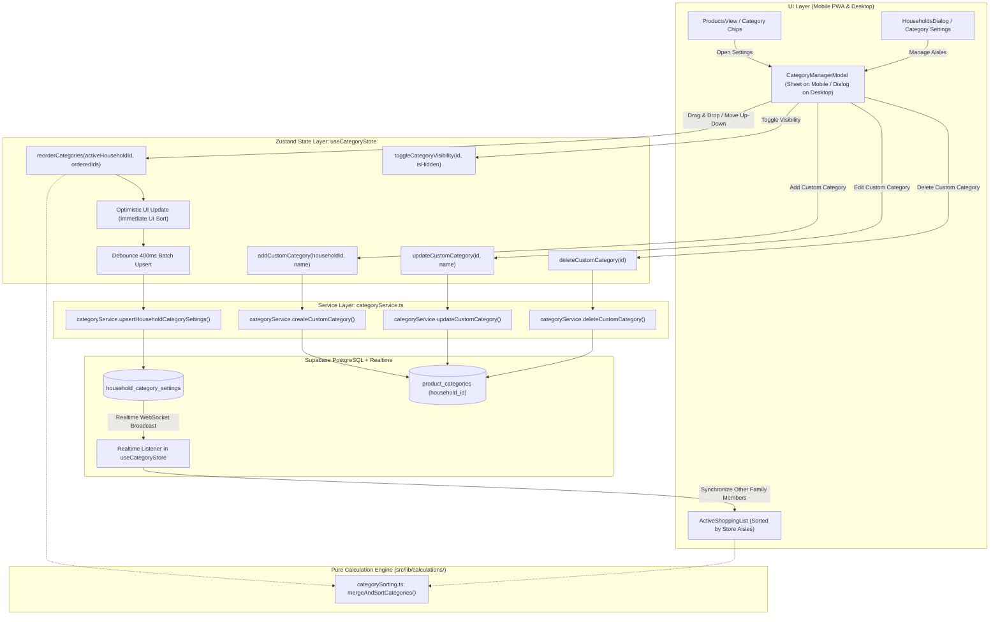

# ADR-006: Custom Product Categories, Household Overrides & Store Aisle Sorting

## 1. Metadata
- **Status:** Accepted
- **Date:** 2026-08-26
- **Decision Drivers:** Household Personalization, Supermarket Aisle Optimization, Multi-Tenant Data Isolation, Non-Destructive Global Catalog, Offline-Resilient Optimistic Reordering
- **Scope:** Full-Stack (PostgreSQL / Supabase RLS, Zustand State, UI Components, Calculation Engine & Service Layer)

---

## 2. Context & Problem Statement

In **SmartShopping**, products and shopping list items have historically been categorized using a static, system-wide table (`public.product_categories` containing 8 predefined global entries: *Fruits & Vegetables, Bakery, Dairy, Meat & Fish, Pantry, Beverages, Household, Other*). 

While a standardized taxonomy simplifies onboarding and provides out-of-the-box internationalization (i18n), real-world grocery shopping introduces friction:
1. **Diverse Household Product Taxonomies:** Individual households frequently require specialized or niche categories (e.g., *"Gluten-Free"*, *"Pet Supplies"*, *"Baby Care"*, *"Bio / Organic"*, or *"Spices & Asian Market"*).
2. **Physical Supermarket Aisle Discrepancies:** The physical layout of supermarket aisles differs significantly between grocery chains and local stores. For example, some stores place bakery immediately at the entrance (Aisle 1) followed by fruits & vegetables, while others place produce first. Inability to reorder categories forces shoppers to scroll up and down or backtrack through the supermarket.
3. **Preservation of Global Defaults:** While advanced households want customized categories and customized aisle paths, new or casual households expect zero setup overhead with a reliable, pre-translated set of system defaults.
4. **Permissions & Data Hygiene:** Global categories must be immutable across tenants (households cannot delete or rename system-wide categories for other users), but households must be empowered to hide global categories they do not use and freely create, edit, reorder, or delete their own custom categories.

A hybrid, multi-tenant category architecture is required to reconcile shared global taxonomy with per-household customizations and store aisle ordering.

---

## 3. Market & Technology Benchmarks

| Platform | Category Model | Custom Categories | Aisle / Order Customization | Global Taxonomy Handling |
| :--- | :--- | :--- | :--- | :--- |
| **AnyList** (Gold Standard) | Hierarchical with store layouts | Users can create custom categories and assign custom icons. | Full drag-and-drop reordering per store layout or global preference. | Default categories remain accessible; user customizations act as overlays. |
| **Paprika 3** | Flat user-managed dictionary | Full CRUD for custom categories. | Manual drag-and-drop sorting in settings. | Seeds initial categories from a static preset; no ongoing global sync. |
| **Bring!** | Grid-based visual boards | Custom categories allowed with custom icons. | Category ordering customized in app settings. | Global icon catalog shared across all users. |
| **Todoist** | Sections & Labels | Custom sections per project. | Manual drag-and-drop section reordering. | Default inbox without initial sections. |

**SmartShopping Best-of-Breed Synthesis:** Combine the aisle reordering and store layout vision of **AnyList** with the lightweight, reactive ergonomics of **Bring!** and **Todoist**:
- Retain global defaults with multi-language i18n support.
- Enable households to create custom categories (`household_id` scoped).
- Enable households to reorder categories to reflect their physical supermarket aisle walk order (using 10-step sparse intervals).
- Allow households to hide unused global categories without destroying them.
- Ensure global categories can only be hidden, while custom categories can be added, edited, deleted, and hidden.

---

## 4. Considered Alternatives & Decision Matrix

| Evaluation Criteria | Option A: Hybrid Model with Override Settings Table (Selected) | Option B: Fork-on-Write (Clone Defaults on First Edit) | Option C: Full Seed per Household on Registration |
| :--- | :--- | :--- | :--- |
| **User Onboarding & Defaults** | ⭐⭐⭐⭐⭐ Zero setup. New households immediately see clean, pre-translated defaults. | ⭐⭐⭐⭐ Clean initial view, but branches into divergent copy upon first edit. | ⭐⭐⭐ Requires database trigger seeding 8+ rows for every household. |
| **System Evolution (New Global Categories)** | ⭐⭐⭐⭐⭐ Future system categories (e.g. "Pharmacy") automatically appear for all households. | ⭐⭐ Cloned households will never receive new system categories unless manually backfilled. | ⭐ Orphaning: households drift completely from platform catalog updates. |
| **Storage & Index Efficiency** | ⭐⭐⭐⭐⭐ High. Settings table only stores sparse delta overrides (`custom_sort_order`, `is_hidden`). | ⭐⭐⭐ Moderate. Full duplicate dictionary rows created for modifying households. | ⭐ Low. Massive table bloat across thousands of households. |
| **Data Integrity & FK Simplicity** | ⭐⭐⭐⭐⭐ Unified `category_id INT` foreign key on `products`. No polymorphic FK complexity. | ⭐⭐⭐ Requires remapping existing `product.category_id` references upon clone. | ⭐⭐⭐ Simple FK, but high duplication and translation loss. |
| **Granular Permissions** | ⭐⭐⭐⭐⭐ Global categories are read-only / hide-only; custom categories are full CRUD. Enforced by PostgreSQL RLS. | ⭐⭐⭐ Once forked, all categories become mutable, complicating global i18n lookup. | ⭐ No distinction between global and local categories. |
| **Verdict** | **Adopted** | Rejected | Rejected |

---

## 5. Technical Decision & Deep Architecture

### 5.1 System & Data Flow



---

### 5.2 Schema & Database Changes

#### 5.2.1 Alter `public.product_categories`
Extend `product_categories` to support tenant-specific custom categories while maintaining existing global categories:

```sql
-- 1. Add household_id column to product_categories
ALTER TABLE public.product_categories
ADD COLUMN IF NOT EXISTS household_id UUID REFERENCES public.households(id) ON DELETE CASCADE NULL;

-- 2. Performance Index for category queries
CREATE INDEX IF NOT EXISTS idx_product_categories_household_id 
ON public.product_categories (household_id);

-- 3. Update Row Level Security (RLS) Policies on product_categories
ALTER TABLE public.product_categories ENABLE ROW LEVEL SECURITY;

-- Allow authenticated users to view all global categories OR custom categories belonging to their household
DROP POLICY IF EXISTS "Authenticated users can read product categories" ON public.product_categories;
CREATE POLICY "Users can read global and household product categories"
ON public.product_categories
FOR SELECT
TO authenticated
USING (
  household_id IS NULL 
  OR household_id IN (SELECT public.get_user_household_ids(auth.uid()))
);

-- Only allow inserting custom categories scoped to the user's active household (never global)
DROP POLICY IF EXISTS "Users can insert household product categories" ON public.product_categories;
CREATE POLICY "Users can insert household product categories"
ON public.product_categories
FOR INSERT
TO authenticated
WITH CHECK (
  household_id IS NOT NULL 
  AND household_id IN (SELECT public.get_user_household_ids(auth.uid()))
);

-- Only allow updating custom categories belonging to the user's household (global categories are IMMUTABLE)
DROP POLICY IF EXISTS "Users can update household product categories" ON public.product_categories;
CREATE POLICY "Users can update household product categories"
ON public.product_categories
FOR UPDATE
TO authenticated
USING (
  household_id IS NOT NULL 
  AND household_id IN (SELECT public.get_user_household_ids(auth.uid()))
)
WITH CHECK (
  household_id IS NOT NULL 
  AND household_id IN (SELECT public.get_user_household_ids(auth.uid()))
);

-- Only allow deleting custom categories belonging to the user's household (global categories CANNOT be deleted)
DROP POLICY IF EXISTS "Users can delete household product categories" ON public.product_categories;
CREATE POLICY "Users can delete household product categories"
ON public.product_categories
FOR DELETE
TO authenticated
USING (
  household_id IS NOT NULL 
  AND household_id IN (SELECT public.get_user_household_ids(auth.uid()))
);
```

#### 5.2.2 Create `public.household_category_settings`
This table captures per-household aisle ordering, visibility overrides, and future store profile extensions:

```sql
CREATE TABLE IF NOT EXISTS public.household_category_settings (
  id UUID PRIMARY KEY DEFAULT gen_random_uuid(),
  household_id UUID NOT NULL REFERENCES public.households(id) ON DELETE CASCADE,
  category_id INT NOT NULL REFERENCES public.product_categories(id) ON DELETE CASCADE,
  custom_sort_order INT NOT NULL,
  is_hidden BOOLEAN NOT NULL DEFAULT FALSE,
  custom_name TEXT NULL,
  store_profile_id UUID NULL, -- Future-proof hook for multi-store layouts (AnyList model)
  created_at TIMESTAMPTZ NOT NULL DEFAULT NOW(),
  updated_at TIMESTAMPTZ NOT NULL DEFAULT NOW(),
  CONSTRAINT uq_household_category UNIQUE (household_id, category_id)
);

-- Performance Indexes
CREATE INDEX IF NOT EXISTS idx_household_category_settings_lookup 
ON public.household_category_settings (household_id, category_id);

CREATE INDEX IF NOT EXISTS idx_household_category_settings_order 
ON public.household_category_settings (household_id, custom_sort_order ASC);

-- Row Level Security (RLS)
ALTER TABLE public.household_category_settings ENABLE ROW LEVEL SECURITY;

CREATE POLICY "Users can view household category settings"
ON public.household_category_settings
FOR SELECT
TO authenticated
USING (
  household_id IN (SELECT public.get_user_household_ids(auth.uid()))
);

CREATE POLICY "Users can insert household category settings"
ON public.household_category_settings
FOR INSERT
TO authenticated
WITH CHECK (
  household_id IN (SELECT public.get_user_household_ids(auth.uid()))
);

CREATE POLICY "Users can update household category settings"
ON public.household_category_settings
FOR UPDATE
TO authenticated
USING (
  household_id IN (SELECT public.get_user_household_ids(auth.uid()))
)
WITH CHECK (
  household_id IN (SELECT public.get_user_household_ids(auth.uid()))
);

CREATE POLICY "Users can delete household category settings"
ON public.household_category_settings
FOR DELETE
TO authenticated
USING (
  household_id IN (SELECT public.get_user_household_ids(auth.uid()))
);

-- Realtime Publication for collaborative family shopping
DO $$
BEGIN
  IF NOT EXISTS (
    SELECT 1 FROM pg_publication_tables 
    WHERE pubname = 'supabase_realtime' 
    AND schemaname = 'public' 
    AND tablename = 'household_category_settings'
  ) THEN
    ALTER PUBLICATION supabase_realtime ADD TABLE public.household_category_settings;
  END IF;
END $$;
```

---

### 5.3 Frontend & State Architecture

#### 5.3.1 Domain Model & Types (`src/types/category.ts`)
```typescript
import type { Database } from '@/types/supabase'

export type RawCategoryRow = Database['public']['Tables']['product_categories']['Row']
export type HouseholdCategorySettingRow = Database['public']['Tables']['household_category_settings']['Row']

export interface ResolvedCategory {
  id: number
  name: string
  is_global: boolean
  household_id: string | null
  sort_order: number
  is_hidden: boolean
  has_active_items?: boolean
  assigned_products_count?: number
}
```

#### 5.3.2 Pure Calculation Engine (`src/lib/calculations/categorySorting.ts`)
All sorting, fallback resolution, and interval assignments are implemented as pure, testable functions without side effects:
- `resolveCategoryList(categories: RawCategoryRow[], settings: HouseholdCategorySettingRow[], activeCategoryIdsWithItems?: Set<number>): ResolvedCategory[]`
  - Merges raw categories with per-household settings.
  - Resolved `sort_order` = `setting?.custom_sort_order ?? category.sort_order * 10`.
  - Resolved `is_hidden` = `setting?.is_hidden ?? false`.
  - **Critical Fallback:** If `is_hidden === true` but `activeCategoryIdsWithItems.has(category.id)` is true, the category is retained in the resolved shopping view so shoppers never lose sight of items they need to buy in the store.
- `calculateReorderedIntervals(orderedCategoryIds: number[]): { category_id: number; custom_sort_order: number }[]`
  - Generates sparse 10-step sequences (`10, 20, 30, 40...`), avoiding floating-point precision flaws while allowing easy single-item swaps.

#### 5.3.3 Service Layer (`src/services/categoryService.ts`)
Responsible for all PostgREST interactions and error mapping:
- `getCategoriesWithSettings(householdId: string): Promise<{ categories: RawCategoryRow[], settings: HouseholdCategorySettingRow[] }>`
- `createCustomCategory(householdId: string, name: string): Promise<RawCategoryRow>`
- `updateCustomCategory(categoryId: number, name: string): Promise<RawCategoryRow>`
- `deleteCustomCategory(categoryId: number): Promise<void>`
- `batchUpsertCategorySettings(householdId: string, updates: Array<{ category_id: number; custom_sort_order: number; is_hidden?: boolean }>): Promise<void>`

#### 5.3.4 Reactive Zustand Store (`src/store/useCategoryStore.ts`)
Decoupled from `useShoppingStore` to avoid monolithic file bloat:
- **State:** `categoriesByHousehold: Record<string, ResolvedCategory[]>`, `isLoading: boolean`, `error: string | null`.
- **Optimistic Mutation:**
  - When reordering categories, the store updates `categoriesByHousehold` instantly.
  - Dispatches debounced (400ms) call to `categoryService.batchUpsertCategorySettings`.
  - If network fails, automatically rolls back to previous snapshot and triggers an error toast.
- **Realtime Listener:** Subscribes to changes in `household_category_settings` and `product_categories`, automatically refreshing other family members' active views via WebSocket.

#### 5.3.5 Co-Equal Dual Layout UX
- **Mobile PWA Layout:**
  - Rendered inside `CategoryManagerSheet` (Bottom Sheet).
  - Drag handle (`GripVertical`) with touch support + explicit Move Up / Move Down buttons (`ChevronUp`, `ChevronDown`) conforming to thumb-zone standards (minimum 44x44px target).
  - Haptic feedback (`navigator.vibrate?.(40)`) on item drop or order change.
  - Global categories display a badge `Global` and toggle switch for `Visible / Hidden`; edit and delete icons are omitted/disabled.
  - Custom categories display edit (pencil) and delete (trash) buttons.
- **Desktop Layout:**
  - Rendered inside `CategoryManagerDialog` (Centered Radix Dialog).
  - Multi-column table layout with keyboard accessibility (arrow key reordering support).
  - Search/filter input within category manager.
  - Direct quick-add input with inline Enter-key submission.

---

## 6. Comprehensive Edge Cases & Mitigation Matrix

| # | Scenario / Edge Case | Failure Risk | Architectural Mitigation |
| :- | :--- | :--- | :--- |
| 1 | **Shopper in supermarket basement loses internet while reordering aisles** | Loss of state or frozen UI | Optimistic state update in Zustand reflects immediately in UI. Offline mutation queue retries; persistent failure rolls back with a visible toast and retry action. |
| 2 | **Deleting a custom category that has products assigned to it** | Foreign key violation or missing products | PostgreSQL FK constraint `ON DELETE SET NULL` on `products.category_id`. Assigned products safely fallback to unassigned (`category_id = NULL`), displayed under *"Inne / Other"*. |
| 3 | **Hiding a category that currently has items on the active shopping list** | Shopper misses buying products in the store because category section disappeared | Pure function `categorySorting.ts` inspects active list items. If an item belongs to a hidden category, a temporary fallback overrides `is_hidden = false` in active shopping view with an informative banner. |
| 4 | **Attempting to rename or delete a global category** | Unauthorized catalog mutation or security breach | Dual protection: UI disables edit/delete actions for `is_global` items; PostgreSQL RLS strictly denies UPDATE/DELETE where `household_id IS NULL`. |
| 5 | **Duplicate category name created (e.g. "Nabiał" when "nabiał" already exists)** | Confusing duplicate filter chips and split shopping lists | Client-side and server-side case-insensitive validation (`LOWER(name)`) prevents duplicate category names within the same household. |
| 6 | **Simultaneous reordering by two family members in the same supermarket** | Conflicting sort orders or stale UI | Supabase Realtime channel on `household_category_settings` broadcasts updates. Last-write-wins at PostgreSQL level, and other clients re-render smoothly with fresh server order. |
| 7 | **Rapid drag-and-drop actions firing dozens of network requests** | Database connection exhaustion & rate limiting | 400ms debounce buffer aggregates successive drag events into a single atomic batch upsert. |
| 8 | **Custom category creation with empty or whitespace-only name** | Corrupted empty category chip | Trim input, enforce `min(2)` and `max(40)` character validation, and show inline form feedback. |
| 9 | **Household with 50+ custom categories** | Performance lag in mobile sheet rendering | Virtualized or lightweight list rendering; dense index recalculation avoids heavy relational scans. |
| 10 | **Switching active households** | Data leakage or displaying previous household's aisle settings | `useCategoryStore` keys category state by `activeHouseholdId`. Household change triggers clean store hydration. |

---

## 7. Security, Privacy & Multi-Tenancy

1. **Strict Multi-Tenant Isolation:**
   - Every custom category row has a non-null `household_id` validated against `public.get_user_household_ids(auth.uid())`.
   - No household can view, edit, or delete another household's custom categories.
2. **Global Immutability Guarantee:**
   - Global categories have `household_id = NULL`.
   - RLS policies explicitly reject any `INSERT`, `UPDATE`, or `DELETE` on rows with `household_id IS NULL`.
   - Global categories can only be customized via the per-tenant `household_category_settings` table.
3. **Cascading Household Cleanup:**
   - If a household is deleted, all related rows in `household_category_settings` and custom rows in `product_categories` are automatically purged via PostgreSQL `ON DELETE CASCADE`.

---

## 8. Testing & Verification Strategy

### 8.1 Pure Calculations Unit Tests (`src/lib/calculations/__tests__/categorySorting.test.ts`)
- Verify merging of global categories with household settings.
- Verify fallback to default `sort_order` when no custom setting exists.
- Verify custom sorting overrides order correctly (`10, 20, 30...`).
- Verify hidden categories are filtered out of normal views.
- Verify hidden categories with active shopping list items are preserved in active list view.
- Verify case-insensitive duplicate name detection.

### 8.2 Service & Store Integration Tests
- **`categoryService.test.ts`:** Mock PostgREST client to verify correct query formulation (`household_id.is.null,household_id.eq.${householdId}`) and error handling.
- **`useCategoryStore.test.ts`:**
  - Verify optimistic reordering updates state immediately.
  - Verify rollback to previous state when API returns an error.
  - Verify Realtime subscription message handler updates store.

### 8.3 UI User Flow Tests (`@testing-library/react`)
- **Mobile User Flow:**
  - Open `CategoryManagerSheet` from Products view.
  - Reorder item using Move Down button (verify haptic trigger and updated list order).
  - Add new custom category *"Bezglutenowe"* (verify input validation and appearance in list).
  - Verify global category *"Pieczywo"* has no delete or edit button, only visibility switch.
- **Desktop User Flow:**
  - Open `CategoryManagerDialog` from Household settings.
  - Reorder categories and verify immediate reflection in `ActiveListView` aisle groupings.

---

## 9. Rollout, Migration & Rollback Plan

### 9.1 Migration Steps
1. **Step 1 (Zero-Downtime DDL):** Execute migration adding nullable `household_id` to `product_categories` and creating `household_category_settings` with indexes and RLS policies. Existing application queries continue functioning normally without modification.
2. **Step 2 (Code Deployment):** Deploy `categoryService`, `useCategoryStore`, `categorySorting.ts`, and UI components (`CategoryManagerSheet`, `CategoryManagerDialog`).
3. **Step 3 (Realtime Publication):** Verify `household_category_settings` is added to `supabase_realtime`.

### 9.2 Rollback Plan
- If issues occur in the frontend, revert UI deployment. The database schema additions (`household_id` and `household_category_settings`) are non-destructive and fully backward-compatible with legacy code.
- To completely revert the database migration:
  ```sql
  DROP TABLE IF EXISTS public.household_category_settings CASCADE;
  ALTER TABLE public.product_categories DROP COLUMN IF EXISTS household_id CASCADE;
  ```

---

## 10. Consequences

### Positive
- **Physical Aisle Optimization:** Shoppers can arrange grocery list categories to match the physical walk path of their favorite supermarkets, reducing shopping time.
- **Personalized Household Catalogs:** Households can categorize niche products (e.g. baby food, pets, Asian market) without polluting the global platform dictionary.
- **Zero Onboarding Friction:** New households automatically start with clean, pre-translated default categories.
- **Bulletproof Security & Immutability:** Global taxonomy cannot be vandalized or deleted by end users.
- **Realtime Family Sync:** All family members see aisle reordering and custom categories update live on their mobile screens.

### Negative / Accepted Trade-offs
- **Relational Complexity:** Category queries require joining or merging `product_categories` with `household_category_settings`.
  - *Mitigation:* Pure calculation engine in TypeScript with in-memory caching and B-tree indexes maintains sub-millisecond query execution.
- **Aisle Order Single-Store Scope:** Initially, households have one active aisle order rather than unlimited store-specific profiles (e.g. Lidl vs Biedronka).
  - *Mitigation:* The `household_category_settings` table includes a `store_profile_id UUID NULL` column, making future multi-store layout expansion trivial without schema migrations.
